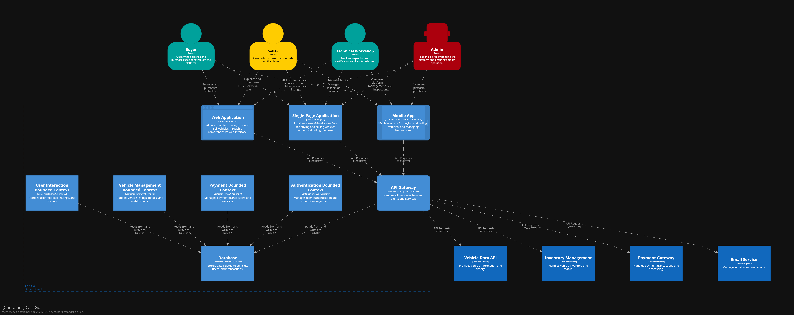
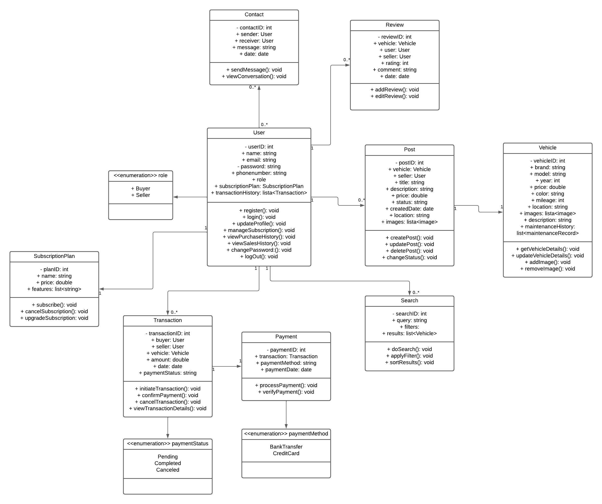
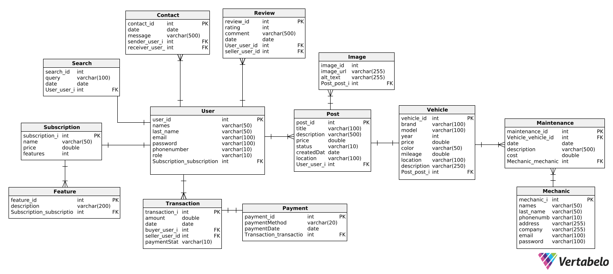

# <center>COURSE PROJECT</center>

<p align="center">
    <strong>Universidad Peruana de Ciencias Aplicadas</strong><br>
<br>
    <br>
<br>
    <strong>Ingeniería de Software - 5to Ciclo</strong><br>
<br>
    <strong>Desarrollo de Aplicaciones Open Source - WX51</strong><br>  
<br>
    <strong>Profesor: Alberto Wilmer Sanchez Seña</strong><br>
    <br> <strong>INFORME DE TRABAJO FINAL - TB1 </strong> 
</p>


<p align="center">
    <strong>Startup: Viajeros del cibersofá </strong><br>
    <strong>Producto:  Car2Go </strong>
</p>

<h3 align="center" >Team Members:</h3>
<div>
    <table>
        <tr>
            <th style="text-align:center;">Member</th>
            <th style="text-align:center;">Code</th>
        </tr>
        <tr>
                <td>Barrionuevo Reto, Jean Franco Joel</td>
            <td>U202219284</td>
        </tr>
        <tr>
            <td>Carranza Tesen, Joaquin Enrique</td>
            <td>U20191B935</td>
        </tr>
        <tr>
                <td>Mayta López, Harold</td>
            <td>U202114851</td>
        </tr>
        <tr>
            <td>Medina Chocce, Karito Dianeth</td>
            <td>U20221C769</td>
        </tr>
        <tr>
            <td>Serrano Uchuya, Gerald Patricio</td>
            <td>U202122876</td>
        </tr>
    </table>

<tr>
    <td><b>Mes y año: </b> 23/08/2024</td>
</tr>
</div>

# Registro de Versiones del Informe

<div align="center">


| Version | Fecha      | Autor         | Descripcion de Modificacion                                                                                             |
|---------|------------|---------------|-------------------------------------------------------------------------------------------------------------------------|
| 1.0 | 23/08/2024 | | creación del informe |


</div>

# Project Report Collaboration Insights
<tr>
    <td><b> TB1 </b> 24/08/2024</td>
</tr>
</img>  
<tr>

# Contenido
## Tabla de Contenidos
### [Registro de versiones del informe](#registro-de-versiones-del-informe)
### [Project Report Collaboration Insights](#project-report-collaboration-insights)
### [Contenido](#contenido)
### [Student Outcome](#student-outcome-1)
### [Capítulo I: Introducción](#capc3adtulo-i-introduccic3b3n-1)
- [1.1. Startup Profile](#11-startup-profile)
    - [1.1.1. Descripción de la Startup](#111-description-de-la-startup)
    - [1.1.2. Perfiles de integrantes del equipo](#112-perfiles-de-integrantes-del-equipo)
- [1.2. Solution Profile](#12-solution-profile)
    - [1.2.1 Antecedentes y problemática](#121-antecedentes-y-problemática)
    - [1.2.2 Lean UX Process](#122-lean-ux-process)
        - [1.2.2.1. Lean UX Problem Statements](#1221-lean-ux-problem-statements)
        - [1.2.2.2. Lean UX Assumptions](#1222-lean-ux-assumptions)
        - [1.2.2.3. Lean UX Hypothesis Statements](#1223-lean-ux-hypothesis-statements)
        - [1.2.2.4. Lean UX Canvas](#1224-lean-ux-canvas)
- [1.3. Segmentos objetivo](#13-segmentos-objetivo)

### [Capítulo II: Requirements Elicitation & Analysis](#capc3adtulo-ii-requirements-elicitation--analysis-1)
- [2.1. Competidores](#21-competidores)
    - [2.1.1. Análisis competitivo](#211-análisis-competitivo)
    - [2.1.2. Estrategias y tácticas frente a competidores](#212-estrategias-y-tácticas-frente-a-competidores)
- [2.2. Entrevistas](#22-entrevistas)
    - [2.2.1. Diseño de entrevistas](#221-diseño-de-entrevistas)
    - [2.2.2. Registro de entrevistas](#222-registro-de-entrevistas)
    - [2.2.3. Análisis de entrevistas](#223-análisis-de-entrevistas)
- [2.3. Needfinding](#23-needfinding)
    - [2.3.1. User Personas](#231-user-personas)
    - [2.3.2. User Task Matrix](#232-user-task-matrix)
    - [2.3.3. User Journey Mapping](#233-user-journey-mapping)
    - [2.3.4. Empathy Mapping](#234-empathy-mapping)
    - [2.3.5. As-is Scenario Mapping](#235-as-is-scenario-mapping)

### [Capítulo III: Requirements Specification](#capc3adtulo-iii-requirements-specification-1)
- [3.1. To-Be Scenario Mapping](#31-to-be-scenario-mapping)
- [3.2. User Stories](#32-user-stories)
- [3.3. Impact Mapping](#33-impact-mapping)
- [3.4. Product Backlog](#34-product-backlog)

### [Capítulo IV: Product Design](#capc3adtulo-iv-product-design-1)
- [4.1. Style Guidelines](#41-style-guidelines)
    - [4.1.1. General Style Guidelines](#411-general-style-guidelines)
    - [4.1.2. Web Style Guidelines](#412-web-style-guidelines)
- [4.2. Information Architecture](#42-information-architecture)
    - [4.2.1. Organization Systems](#421-organization-systems)
    - [4.2.2. Labeling Systems](#422-labeling-systems)
    - [4.2.3. SEO Tags and Meta Tags](#423-seo-tags-and-meta-tags)
    - [4.2.4. Searching Systems](#424-searching-systems)
    - [4.2.5. Navigation Systems](#425-navigation-systems)
- [4.3. Landing Page UI Design](#43-landing-page-ui-design)
    - [4.3.1. Landing Page Wireframe](#431-landing-page-wireframe)
    - [4.3.2. Landing Page Mock-up](#432-landing-page-mock-up)
- [4.4. Web Applications UX/UI Design](#44-web-applications-uxui-design)
    - [4.4.1. Web Applications Wireframes](#441-web-applications-wireframes)
    - [4.4.2. Web Applications Wireflow Diagrams](#442-web-applications-wireflow-diagrams)
    - [4.4.3. Web Applications Mock-ups](#443-web-applications-mock-ups)
    - [4.4.4. Web Applications User Flow Diagrams](#444-web-applications-user-flow-diagrams)
- [4.5. Web Applications Prototyping](#45-web-applications-prototyping)
- [4.6. Domain-Driven Software Architecture](#46-domain-driven-software-architecture)
    - [4.6.1. Software Architecture Context Diagram](#461-software-architecture-context-diagram)
    - [4.6.2. Software Architecture Container Diagrams](#462-software-architecture-container-diagrams)
    - [4.6.3. Software Architecture Components Diagrams](#463-software-architecture-components-diagrams)
- [4.7. Software Object-Oriented Design](#47-software-object-oriented-design)
    - [4.7.1. Class Diagrams](#471-class-diagrams)
    - [4.7.2. Class Dictionary](#472-class-dictionary)
- [4.8. Database Design](#48-database-design)
    - [4.8.1. Database Diagram](#481-database-diagram)

### [Capítulo V: Product Implementation, Validation & Deployment](#capc3adtulo-v-product-implementation-validation--deployment-1)
- [5.1. Software Configuration Management](#51-software-configuration-management)
    - [5.1.1. Software Development Environment Configuration](#511-software-development-environment-configuration)
    - [5.1.2. Source Code Management](#512-source-code-management)
    - [5.1.3. Source Code Style Guide & Conventions](#513-source-code-style-guide--conventions)
    - [5.1.4. Software Deployment Configuration](#514-software-deployment-configuration)
- [5.2. Landing Page, Services & Applications Implementation](#52-landing-page-services--applications-implementation)
    - [5.2.1. Sprint 1](#521-sprint-1)
        - [5.2.1.1. Sprint Planning 1](#5211-sprint-planning-1)
        - [5.2.1.2. Sprint Backlog 1](#5212-sprint-backlog-1)
        - [5.2.1.3. Development Evidence for Sprint Review](#5213-development-evidence-for-sprint-review)
        - [5.2.1.4. Testing Suite Evidence for Sprint Review](#5214-testing-suite-evidence-for-sprint-review)
        - [5.2.1.5. Execution Evidence for Sprint Review](#5215-execution-evidence-for-sprint-review)
        - [5.2.1.6. Services Documentation Evidence for Sprint Review](#5216-services-documentation-evidence-for-sprint-review)
        - [5.2.1.7. Software Deployment Evidence for Sprint Review](#5217-software-deployment-evidence-for-sprint-review)
        - [5.2.1.8. Team Collaboration Insights during Sprint](#5218-team-collaboration-insights-during-sprint)

### [Conclusiones](#conclusiones-1)
- [Conclusiones y recomendaciones](#conclusiones-y-recomendaciones)

### [Bibliografía](#bibliografc3ada-1)
### [Anexos](#anexos-1)

<br><br>

# Student Outcome
En el siguiente cuadro se describe las acciones realizadas y enunciados de
conclusiones cual por parte del grupo, que permiten sustentar el haber alcanzado el logro del ABET – EAC - Student Outcome 5.

<table>
  <tr>
    <td><b>Criterio específico</b></td>
    <td><b>Acciones realizadas</b></td>
    <td><b>Conclusiones</b></td>
  </tr>
  <tr>
    <td><b>Participa en equipos multidisciplinarios con eficacia, eficiencia y objetividad, en el marco de un proyecto en soluciones de ingeniería de software.</b></td>
    <td> TB1<br><br>
         
   </td>
    <td>TB1<br><br>


</tr>


<br><br>
 

  <tr>
    <td><b>Conoce al menos un sector empresarial o dominio de aplicación de soluciones de software.</b></td>

<td> 
TB1<br><br>


<br><br>

   </td>
    <td>TB1<br><br>


</tr>
<br><br>


</table>

<br><br>

# Capítulo IV: Product Design
## [4.1. Style Guidelines.]((#41-style-guidelines))

### [4.1.1. General Style Guidelines](#411-general-style-guidelines)

**Branding:**

 * Logo representativo de _Car2Go_


**Typography:**

* La tipografía de nuestro logotipo adoptará el elegante estilo Roboto, reconocido por su modernidad y su atractivo visual para nuestros usuarios. Este estilo no solo refleja la innovación y la creatividad que caracterizarán a nuestra aplicación, sino que también resalta la vanguardia que buscamos transmitir.


---


**Colors:**
* Hemos seleccionado el color #F4C23D como color primario porque transmite confianza y amabilidad, cualidades esenciales para crear una plataforma donde los usuarios se sientan bienvenidos y seguros al interactuar. Este tono dorado, cálido y acogedor, invita a la participación y genera un ambiente positivo para las transacciones.

* Como color secundario, hemos elegido #2959AD por su asociación con el profesionalismo y la seriedad. Este azul oscuro añade un toque de credibilidad y formalidad a la plataforma, asegurando a los usuarios que están realizando sus transacciones en un entorno confiable y bien gestionado.


### [4.1.2. Web Style Guidelines](#422-labeling-systems)

_Icons:_

* Cuando se trata de diseñar una página web, los íconos juegan un papel crucial en la creación de una interfaz de usuario intuitiva y fácil de usar. Estos elementos visuales pequeños tienen el poder de mejorar la comprensión de los usuarios sobre la funcionalidad de diferentes partes de nuestra página. Los íconos permiten a los usuarios entender rápidamente la función de cada elemento y su simplicidad y claridad los hacen fácilmente comprensibles. Mantener una consistencia en el uso de íconos en toda la página ayuda a evitar confusiones entre los usuarios.


_Breackpoints_

* Los breakpoints más conocidos en **ANGULAR** son los siguientes:

<table>
  <thead>
    <tr>
      <th style="text-align:center;">Breakpoint</th>
      <th style="text-align:center;">Class infix</th>
      <th style="text-align:center;">Dimensions</th>
    </tr>
  </thead>
  <tbody>
    <tr>
      <td style="text-align:center;">X-Small</td>
      <td style="text-align:center;">None</td>
      <td style="text-align:center;">&lt;576px</td>
    </tr>
    <tr>
      <td style="text-align:center;">Small</td>
      <td style="text-align:center;">sm</td>
      <td style="text-align:center;">≥576px</td>
    </tr>
    <tr>
      <td style="text-align:center;">Medium</td>
      <td style="text-align:center;">md</td>
      <td style="text-align:center;">≥768px</td>
    </tr>
    <tr>
      <td style="text-align:center;">Large</td>
      <td style="text-align:center;">lg</td>
      <td style="text-align:center;">≥992px</td>
    </tr>
    <tr>
      <td style="text-align:center;">Extra large</td>
      <td style="text-align:center;">xl</td>
      <td style="text-align:center;">≥1200px</td>
    </tr>
    <tr>
      <td style="text-align:center;">Extra extra large</td>
      <td style="text-align:center;">xxl</td>
      <td style="text-align:center;">≥1400px</td>
    </tr>
  </tbody>
</table>


* Y los que usaremos en el proyecto principalmente son los de 768px y 1024px, ya que son los más comunes en los dispositivos móviles y de escritorio.

## 4.2. Information Architecture
### 4.2.1. Organization Systems
El sitio web se dividirá en las siguientes secciones:
- Home: Aquí se ubicará el eslogan de la marca y un botón para dirigir a los usuarios a la aplicación web. <br><br/>
- Services: Se muestran las principales características que ofrece la aplicación. <br><br/>
- Plans: Se ubican los planes de suscripción para los segmentos objetivos y las ventajas de cada uno. <br><br/>
- About us: Descripción de la plataforma, misión, visión y los integrantes del proyecto<br><br/>
- Contact us: Formulario para enviar dudas de los usuarios por correo más información de contacto.<br><br/>

La aplicación web tendrá las siguientes secciones según el segmento objetivo:
- Vendedor: "Home", "Plans", "Car Listing", "My Cars" y "Profile"
- Comprador: "Home","Favorites", "Car Listing" y "Profile"
- Mecánico: "Home", "Uninspected Cars", "Reviewed Cars"

Con relación al sistema secuencial, se tienen 2 procesos principales:
- Compra de vehículo: Seleccionar, contactar, pagar y confirmar. <br><br/>
- Publicación de venta: Añadir fotos, detalles del vehículo, información adicional y publicar la oferta. 

### 4.2.2. Labeling Systems
Colocar las etiquetas adecuadas en las secciones, botones y otros elementos en el landing page y la aplicación web permiten que los usuarios comprendan rápidamente las funcionalidades y contenido de la plataforma.
A continuación, se listarán las principales etiquetas según las principales funcionalidades:
- Navegación Principal: "Home", "Favorites", "Car Listing", "Profile"
<br></br> 
- Listado de autos: "My Cars", "Sell Car", "Price", "Filters"
<br></br>
- Detalle del vehículo: "Year", "Colors", "Mileage", "Location", "Add Offer"
<br></br>
- Publicación de oferta: "Brand", "Model", "Color", "Description", "Contact Data"
<br></br>
- Proceso de compra : "Add Offer", "Review here", "Send", "Data"
<br></br>
- Perfil del usuario: "Name", "Last Name", "Birthdate", "Identity document", "Address", "PHOTO URL"
<br></br>

### 4.2.3. SEO Tags and Meta Tags

Con el fin de mejorar la prioridad en los motores de búsqueda, facilitar la llegada de nuevas usuarios y brindarles información relevante del landing page y la aplicación web, se añadirán los siguientes "Meta tags" como etiquetas HTML en las principales páginas de nuestra plataforma:

````
<title>Car2Go - Compra y Venta de Autos de Segunda Mano</title>
<meta name="description" content="Car2Go es tu plataforma ideal para comprar y vender autos de segunda mano de manera rápida y segura. Explora vehículos, publica anuncios y coordina sin complicaciones.">
<meta name="keywords" content="compra autos segunda mano, venta autos usados, plataforma autos, anuncios vehículos, comprar coches">
<meta name="author" content="Car2Go Team">
````

### 4.2.4. Searching Systems
Es importante facilitar la búsqueda y el filtro de información para los usuarios con el fin de que puedan utilizar la plataforma sin problemas. Se dispondrá de una barra de búsqueda en la sección "Car Listing" y los usuarios podrán guardar en favoritos los autos de su preferencia. Sumado a esto, se podrán aplicar una variedad de filtros (marca, modelo, rango de precio, año de fabricación, etc.) a los resultados de la búsqueda para que cada usuario encuentre el auto de su preferencia. <br><br/> 
Los resultados de la búsqueda se mostrarán en una cuadrícula, donde cada vehículo incluirá una foto, su precio, marca, modelo, ubicación, entre otros datos.Finalmente, al hacer clic en un resultado específico, se mostrarán más imágenes y detalles del vehículo, junto con un botón para contactar al vendedor.

### 4.2.5. Navigation Systems 
Navegar por nuestra plataforma debe ser lo suficientemente intuitivo para que los usuarios puedan cumplir satisfactoriamente sus objetivos. Con esto en mente, la principal forma desplazarse en el contenido será una barra de navegación ubicada en la parte superior de todas las páginas. Esta contendrá las siguientes secciones: Home, Car Listing, Profile, Plans, etc. Además, se incluirán "call to action" en distintas partes de cada sección. Por ejemplo, "Sell Car" en "Car Listing" y "Add Offer" en los ofertas publicadas. <br><br/>
Por otro lado, se agregará la paginación en la parte inferior de la cuadrícula de los resultados. Finalmente, el footer contendrá secciones como "About Us", "Terms and conditions" y "Privacy Policy", así como información de contacto.
 
## 4.3. Landing Page UI Design

### 4.3.1. Landing Page Wireframe

 

**Hero alterno 1**:
 
---
**Hero alterno 2**:
 

### 4.3.2. Landing Page Mock-up


**Hero alterno 1**:

---
**Hero alterno 2**:


# 4.4. Web Applications UX/UI Design.
### 4.4.1. Web Applications Wireframes


---

---

---

---

---

---

---

---

---

---

---

---

---

---

---

---

---

---

---

---


### 4.4.2. Web Applications Wireflow Diagrams.


---

---

---

---

---

---

---

---

---


### 4.4.3. Web Applications Mock-ups

#### Login


### Vista del vendedor


### Vista del comprador


### Vista del mecánico


### 4.4.4. Web Applications User Flow Diagrams.


# 4.5. Web Applications Prototyping.
Para poder elaborar los prototipos de la interfaz de usuario destinados a Desktop se siguieron una serie
de criterios fundamentales, entre ellos:

1. Claridad y Facilidad: El enfoque fue lograr que la navegación en la aplicación sea intuitiva y comprensible, con el objetivo
   de que los usuarios puedan comprender plenamente las funciones de la aplicación.
   visualización de reportes estadísticos.
2. Diseño Responsive: Se ha tenido en cuenta la importancia del diseño "responsive" para garantizar que la aplicación web
   sea compatible con una variedad tamaños de pantalla, de tal manera que los usuarios no se vean limitados por el dispositivo que utilicen.
3. Priorización de Información Relevante: El diseño de la aplicación se enfoca en mostrar únicamente la información más importante para los usuarios pertenecientes al segmento objetivo.

# 4.6. Domain-Driven Software Architecture

El Domain Driven Design (DDD) tiene como objetivo llegar a un entendimiento compartido del dominio que abarca el espacio del problema. En el caso de **Car2Go**, este dominio es la gestión de la compra y venta de vehículos de segunda mano y la interacción con los vendedores, compradores y talleres mecánicos. Gracias a la perspectiva brindada por este enfoque, es posible mejorar la colaboración entre los desarrolladores y los expertos del dominio.

## 4.6.1. Software Architecture Context Diagram

El diagrama de contexto muestra una vista de alto nivel de las relaciones entre el sistema de software **Car2Go**, los usuarios y, si es el caso, de otros sistemas externos.

<div align="center">
    
</div>

## 4.6.2. Software Architecture Container Diagram

El diagrama de contenedores muestra una vista de alto nivel de las relaciones entre las aplicaciones y fuentes de datos que son parte de la ejecución del sistema de software **Car2Go**.

<div align="center">
    
</div>

## 4.6.3. Software Architecture Components Diagrams

Los diagramas de componentes muestran una vista de las relaciones de los componentes principales del sistema de software **Car2Go**. Estos componentes detallan la implementación de los respectivos módulos en el programa.

### - Authentication Bounded Context

<div align="center">
    
</div>

### - Payment Bounded Context

<div align="center">
    
</div>

### - User Interaction Bounded Context

<div align="center">
    
</div>

### - Vehicle Management Bounded Context

<div align="center">
    
</div>


## 4.7. Software Object-Oriented Design
### 4.7.1. Class Diagrams


### 4.7.2. Class Dictionary

Clase User

| Atributo  | Tipo  | Descripción |
| ------------ | ------------ |------------ |
| userID  | int | Identificador único del usuario
|  names  | string  | Nombres del usuario
| last_name  | string | Apellidos del usuario
| phone_number  | string | Número telefónio del usuario
| email  | string | Correo del usuario |
| password  | string  | Contraseña del usuario
| role |string| Rol del usuario
| subscriptionPlan | string | Plan de subscripción
| transactionHistory| list | Historial de transacciones

<br><br/>
Clase SubscriptionPlan

| Atributo  | Tipo  | Descripción |
| ------------ | ------------ |------------ |
| planID  | int | Identificador único del plan de subscripción
| name | string | Nombre del plan
| price | double | Precio del plan
| features | list | Características del plan

<br><br/>
Clase Transaction

| Atributo  | Tipo  | Descripción |
| ------------ | ------------ |------------ |
| transactionID  | int | Identificador único de la transacción
| buyer | User | Comprador del auto
| seller | User | Vendedor del auto
| vehicle | Vehicle| Vehículo vendido
| amount | double | Precio de venta
| date | date| Fecha de la transacción
| paymentStatus | string | Estado del pago de la transacción

<br><br/>
Clase Payment

| Atributo  | Tipo  | Descripción |
| ------------ | ------------ |------------ |
| paymentID  | int | Identificador único del pago
| transaction | Transaction | Transación perteniente al pago
| paymentMethod | string | Método de pago
| paymentDate | date | Fecha del pago

<br><br/>
Clase Search

| Atributo  | Tipo  | Descripción |
| ------------ | ------------ |------------ |
| searchID  | int | Identificador único de la búsqueda
| query | string | Términos de la búsqueda
| filters | list | Filtros de búsqueda
| results | list | Resultados de la búsqueda

<br><br/>
Clase Post

| Atributo  | Tipo  | Descripción |
| ------------ | ------------ |------------ |
| postID  | int | Identificador único del post
| vehicle | Vehicle | Vehículo en venta
| seller | User | Vendedor
| title | string | Título del post
| description | string | Descripción del post
| price | double | Precio del vehículo
| status | string | Status del post
| createdDate | date | Fecha de creación del post
| location | string | Ubicación del vehículo
| images | list | Imágenes del vehículo

<br><br/>
Clase Vehicle

| Atributo  | Tipo  | Descripción |
| ------------ | ------------ |------------ |
| vehicleID  | int | Identificador único del vehículo
| brand | string | Marca del vehículo
| model | string | Modelo
| year | int | Año de fabricación
| price | double | Precio del vehículo
| color | string | Color principal del vehículo
| mileage | double | Kilometraje
| location | string | Ubicación del vehículo
| images | list | Imágenes del vehículo
| description | string | Descripción
| maintenanceHistory | list | Historial de mantenimiento

<br><br/>
Clase Contact

| Atributo  | Tipo  | Descripción |
| ------------ | ------------ |------------ |
| contactID  | int | Identificador único del contacto entre comprador y vendedor
| sender | User | Usuario interesado en el vehículo
| receiver | User | Usuario dueño del vehículo
| message | string | Mensaje enviado
| date | date | Fecha del mensaje

<br><br/>
Clase Review

| Atributo  | Tipo  | Descripción |
| ------------ | ------------ |------------ |
| reviewID  | int | Identificador único de la reseña de un vendedor
| user | User | Usuario que publicó la reseña
| seller | User | Vendedor que recibe las reseñas
| rating | int | Calificación del vendedor
| comment | string | Comentarios de la reseña
| date | date | Fecha de publicación

<br><br/>
Clase Maintenance

| Atributo  | Tipo  | Descripción |
| ------------ | ------------ |------------ |
| maintenanceID  | int | Identificador único del mantenimiento
| vehicle | Vehicle | Vehículo objetivo del mantenimiento
| date | date | Fecha del mantenimiento
| description | string | Descripción del mantenimiento
| cost | double | Costo del mantenimiento
| mechanic | Mechanic | Mecánico a cargo del mantenimiento

<br><br/>
Clase Mechanic

| Atributo  | Tipo  | Descripción |
| ------------ | ------------ |------------ |
| mechanicID  | int | Identificador único del mecánico
| names | string | Nombres
| last_name | string | Apellidos
| phonenumber | string | Número telefónico
| address | string | Dirección del taller automotriz
| company | string | Nombre del taller automotriz
| email | string | Correo del mecánico
|password| string| Contraseña de la cuenta del mecánico


## 4.8 Database Design
El sistema de gestión de bases de datos relacional (RDBMS) que utilizaremos para generar las tablas y establecer sus relaciones en nuestra plataforma será MySQL. Hemos elegido MySQL por su facilidad de uso y por su integración con MySQL Workbench, que nos proporciona una herramienta visual eficiente para la administración de la base de datos.

### 4.8.1 Database Diagram



    


