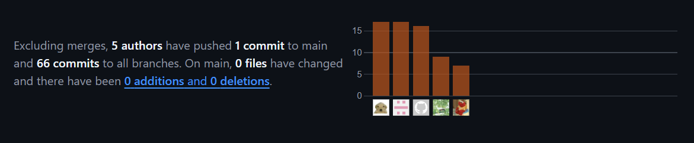

# 
COURSE PROJECT

    <strong>Universidad Peruana de Ciencias Aplicadas</strong> 
 
     
 
    <strong>Ingeniería de Software - 5to Ciclo</strong> 
 
    <strong>Desarrollo de Aplicaciones Open Source - WX51</strong>   
 
    <strong>Profesor: Alberto Wilmer Sanchez Seña</strong> 
      <strong>INFORME DE TRABAJO FINAL - TB1 </strong> 

    <strong>Startup: Viajeros del cibersofá </strong> 
    <strong>Producto:  Car2Go </strong>

<h3 align="center" >Team Members:</h3>

    <table>
        <tr>
            <th style="text-align:center;">Member</th>
            <th style="text-align:center;">Code</th>
        </tr>
        <tr>
                <td>Barrionuevo Reto,  Jean Franco Joel</td>
            <td>U202219284</td>
        </tr>
        <tr>
            <td>Carranza Tesen, Joaquin Enrique</td>
            <td>U20191B935</td>
        </tr>
        <tr>
                <td>Mayta López, Harold</td>
            <td>U202114851</td>
        </tr>
        <tr>
            <td>Medina Chocce, Karito Dianeth</td>
            <td>U20221C769</td>
        </tr>
        <tr>
            <td>Serrano Uchuya, Gerald Patricio</td>
            <td>U202122876</td>
        </tr>
    </table>

<tr>

    <td><b>Mes y año: </b> 23/08/2024</td>

</tr>

# Registro de Versiones del Informe

| Version | Fecha      | Autor         | Descripcion de Modificacion                                                                                             |
|---------|------------|---------------|-------------------------------------------------------------------------------------------------------------------------|
| 1.0 | 23/08/2024 | | creación del informe |

# Project Report Collaboration Insights
<tr>
    <td><b> TB1 </b> 24/08/2024</td>
</tr>
</img>  
<tr>

# Contenido
## Tabla de Contenidos
### [Registro de versiones del informe](#registro-de-versiones-del-informe)
### [Project Report Collaboration Insights](#project-report-collaboration-insights)
### [Contenido](#contenido)
### [Student Outcome](#student-outcome-1)
### [Capítulo I: Introducción](#capc3adtulo-i-introduccic3b3n-1)
- [1.1. Startup Profile](#11-startup-profile)
    - [1.1.1. Descripción de la Startup](#111-description-de-la-startup)
    - [1.1.2. Perfiles de integrantes del equipo](#112-perfiles-de-integrantes-del-equipo)
- [1.2. Solution Profile](#12-solution-profile)
    - [1.2.1 Antecedentes y problemática](#121-antecedentes-y-problemática)
    - [1.2.2 Lean UX Process](#122-lean-ux-process)
        - [1.2.2.1. Lean UX Problem Statements](#1221-lean-ux-problem-statements)
        - [1.2.2.2. Lean UX Assumptions](#1222-lean-ux-assumptions)
        - [1.2.2.3. Lean UX Hypothesis Statements](#1223-lean-ux-hypothesis-statements)
        - [1.2.2.4. Lean UX Canvas](#1224-lean-ux-canvas)
- [1.3. Segmentos objetivo](#13-segmentos-objetivo)

### [Capítulo II: Requirements Elicitation & Analysis](#capc3adtulo-ii-requirements-elicitation--analysis-1)
- [2.1. Competidores](#21-competidores)
    - [2.1.1. Análisis competitivo](#211-análisis-competitivo)
    - [2.1.2. Estrategias y tácticas frente a competidores](#212-estrategias-y-tácticas-frente-a-competidores)
- [2.2. Entrevistas](#22-entrevistas)
    - [2.2.1. Diseño de entrevistas](#221-diseño-de-entrevistas)
    - [2.2.2. Registro de entrevistas](#222-registro-de-entrevistas)
    - [2.2.3. Análisis de entrevistas](#223-análisis-de-entrevistas)
- [2.3. Needfinding](#23-needfinding)
    - [2.3.1. User Personas](#231-user-personas)
    - [2.3.2. User Task Matrix](#232-user-task-matrix)
    - [2.3.3. User Journey Mapping](#233-user-journey-mapping)
    - [2.3.4. Empathy Mapping](#234-empathy-mapping)
    - [2.3.5. As-is Scenario Mapping](#235-as-is-scenario-mapping)

### [Capítulo III: Requirements Specification](#capc3adtulo-iii-requirements-specification-1)
- [3.1. To-Be Scenario Mapping](#31-to-be-scenario-mapping)
- [3.2. User Stories](#32-user-stories)
- [3.3. Impact Mapping](#33-impact-mapping)
- [3.4. Product Backlog](#34-product-backlog)

### [Capítulo IV: Product Design](#capc3adtulo-iv-product-design-1)
- [4.1. Style Guidelines](#41-style-guidelines)
    - [4.1.1. General Style Guidelines](#411-general-style-guidelines)
    - [4.1.2. Web Style Guidelines](#412-web-style-guidelines)
- [4.2. Information Architecture](#42-information-architecture)
    - [4.2.1. Organization Systems](#421-organization-systems)
    - [4.2.2. Labeling Systems](#422-labeling-systems)
    - [4.2.3. SEO Tags and Meta Tags](#423-seo-tags-and-meta-tags)
    - [4.2.4. Searching Systems](#424-searching-systems)
    - [4.2.5. Navigation Systems](#425-navigation-systems)
- [4.3. Landing Page UI Design](#43-landing-page-ui-design)
    - [4.3.1. Landing Page Wireframe](#431-landing-page-wireframe)
    - [4.3.2. Landing Page Mock-up](#432-landing-page-mock-up)
- [4.4. Web Applications UX/UI Design](#44-web-applications-uxui-design)
    - [4.4.1. Web Applications Wireframes](#441-web-applications-wireframes)
    - [4.4.2. Web Applications Wireflow Diagrams](#442-web-applications-wireflow-diagrams)
    - [4.4.3. Web Applications Mock-ups](#443-web-applications-mock-ups)
    - [4.4.4. Web Applications User Flow Diagrams](#444-web-applications-user-flow-diagrams)
- [4.5. Web Applications Prototyping](#45-web-applications-prototyping)
- [4.6. Domain-Driven Software Architecture](#46-domain-driven-software-architecture)
    - [4.6.1. Software Architecture Context Diagram](#461-software-architecture-context-diagram)
    - [4.6.2. Software Architecture Container Diagrams](#462-software-architecture-container-diagrams)
    - [4.6.3. Software Architecture Components Diagrams](#463-software-architecture-components-diagrams)
- [4.7. Software Object-Oriented Design](#47-software-object-oriented-design)
    - [4.7.1. Class Diagrams](#471-class-diagrams)
    - [4.7.2. Class Dictionary](#472-class-dictionary)
- [4.8. Database Design](#48-database-design)
    - [4.8.1. Database Diagram](#481-database-diagram)

### [Capítulo V: Product Implementation, Validation & Deployment](#capc3adtulo-v-product-implementation-validation--deployment-1)
- [5.1. Software Configuration Management](#51-software-configuration-management)
    - [5.1.1. Software Development Environment Configuration](#511-software-development-environment-configuration)
    - [5.1.2. Source Code Management](#512-source-code-management)
    - [5.1.3. Source Code Style Guide & Conventions](#513-source-code-style-guide--conventions)
    - [5.1.4. Software Deployment Configuration](#514-software-deployment-configuration)
- [5.2. Landing Page, Services & Applications Implementation](#52-landing-page-services--applications-implementation)
    - [5.2.1. Sprint 1](#521-sprint-1)
        - [5.2.1.1. Sprint Planning 1](#5211-sprint-planning-1)
        - [5.2.1.2. Sprint Backlog 1](#5212-sprint-backlog-1)
        - [5.2.1.3. Development Evidence for Sprint Review](#5213-development-evidence-for-sprint-review)
        - [5.2.1.4. Testing Suite Evidence for Sprint Review](#5214-testing-suite-evidence-for-sprint-review)
        - [5.2.1.5. Execution Evidence for Sprint Review](#5215-execution-evidence-for-sprint-review)
        - [5.2.1.6. Services Documentation Evidence for Sprint Review](#5216-services-documentation-evidence-for-sprint-review)
        - [5.2.1.7. Software Deployment Evidence for Sprint Review](#5217-software-deployment-evidence-for-sprint-review)
        - [5.2.1.8. Team Collaboration Insights during Sprint](#5218-team-collaboration-insights-during-sprint)

### [Conclusiones](#conclusiones-1)
- [Conclusiones y recomendaciones](#conclusiones-y-recomendaciones)

### [Bibliografía](#bibliografc3ada-1)
### [Anexos](#anexos-1)

  

# Student Outcome
En el siguiente cuadro se describe las acciones realizadas y enunciados de
conclusiones cual por parte del grupo, que permiten sustentar el haber alcanzado el logro del ABET – EAC - Student Outcome 5.

<table>
  <tr>
    <td><b>Criterio específico</b></td>
    <td><b>Acciones realizadas</b></td>
    <td><b>Conclusiones</b></td>
  </tr>
  <tr>
    <td><b>Participa en equipos multidisciplinarios con eficacia, eficiencia y objetividad, en el marco de un proyecto en soluciones de ingeniería de software.</b></td>
    <td> TB1  

   </td>
    <td>TB1  

</tr>

  

  <tr>
    <td><b>Conoce al menos un sector empresarial o dominio de aplicación de soluciones de software.</b></td>

<td> 
TB1  

  

   </td>
    <td>TB1  

</tr>
  

</table>

  

# Capítulo I: Introducción
## 1.1. StartUp Profile
En esta sección describiremos el perfil de nuestra Startup.

### 1.1.1. Description de la StartUp

Car2Go es una startup creada en 2024 por un grupo de estudiantes de Ingeniería de Software.
Nuestra plataforma está dedicada a transformar el mercado de autos de segunda mano,
ofreciendo una solución innovadora y accesible para personas que desean comprar o vender vehículos usados.

- Misión: Nuestra misión es facilitar la compra y venta de autos de segunda mano mediante
  una plataforma intuitiva y eficiente, proporcionando a nuestros usuarios todas
  las herramientas necesarias para que el proceso sea sencillo, seguro y confiable.

- Visión: Aspiramos a convertirnos en la principal plataforma Nacional para la compra y
  venta de autos de segunda mano, impulsando la confianza y
  la satisfacción de nuestros usuarios en cada transacción.

### 1.1.2. Perfiles de integrantes del equipo

<table align="center"  border="1" width="70%" style="text-align:center;">
     <tr align="center">
        <td rowspan="3">

        </td>
        <td align="left">
            <b>Nombre y Apellido:</b>
                         
Jean Franco Barrionuevo Reto
        </td>
    </tr>
    <tr>
        <td align="left">
        <b>Carrera:</b>
         
        Ing. de Software
        </td>
    </tr>
    <tr>
        <td align="left">
        <b>Acerca de:</b>
         
        Soy Franco Barrionuevo, estudiante de la carrera de Ingeniería de Software en la Universidad Peruana de Ciencias Aplicadas. Me considero una persona proactiva, responsable y con muchas ganas de aprender. Me gusta trabajar en equipo y aportar ideas para el desarrollo de proyectos.
        </td>
    </tr>
    <tr align="center">
        <td rowspan="3">

        </td>
        <td align="left">
            <b>Nombre y Apellido:</b>
                         
Karito Dianeth Medina Chocce
        </td>
    </tr>
    <tr>
        <td align="left">
        <b>Carrera:</b>
         
        Ing. de Software
        </td>
    </tr>
    <tr>
        <td align="left">
        <b>Acerca de:</b>
         
        Hola, soy Karito Medina, actualmente estudio Ingeniería de Software en la Universidad de Ciencias Aplicadas (UPC). Me considero una persona responsable, respetuosa y con una fuerte habilidad para trabajar en equipo. Me esfuerzo por contribuir positivamente a cada proyecto en el que participo, buscando siempre mejorar los resultados grupales y alcanzar los objetivos comunes. Estoy entusiasmada por aplicar mis conocimientos y habilidades para enfrentar nuevos desafíos y seguir creciendo en el campo de la tecnología.
        </td>
    </tr>
<tr align="center">
        <td rowspan="3">

        </td>
        <td align="left">
            <b>Nombre y Apellido:</b>
                         
Gerald Patricio Serrano Uchuya
        </td>
    </tr>
    <tr>
        <td align="left">
        <b>Carrera:</b>
         
        Ing. de Software
        </td>
    </tr>
    <tr>
        <td align="left">
        <b>Acerca de:</b>
         
        Soy Gerald Serrano. Estoy en 6to ciclo de Ingeniería de software. Me enfoco en las tecnologías web como React, ASP.net y Spring. Soy alguien muy entusiasta al momento de aprender nuevas tecnologías y me gusta cumplir lo mejor que pueda mis responsibilidades en un grupo de trabajo.
        </td>
    </tr>
    <tr align="center">
        <td rowspan="3">

        </td>
        <td align="left">
            <b>Nombre y Apellido:</b>
                         
Harold Jaime Mayta Lopez
        </td>
    </tr>
    <tr>
        <td align="left">
        <b>Carrera:</b>
         
        Ing. de Software
        </td>
    </tr>
    <tr>
        <td align="left">
        <b>Acerca de:</b>
         
        Hola, soy Harold Mayta, actualmente estudio Ingeniería de Software en la Univerisidad Peruana de Ciencias Aplicadas. Considero que soy una persona que es capaz de trabajar bajo presión, además de ser responsable y perseverante.Asi mismo, considero que puedo aportar al grupo con soluciones optimas a futuros porblemas.
        </td>
    </tr>
    <tr align="center">
        <td rowspan="3">

        </td>
        <td align="left">
            <b>Nombre y Apellido:</b>
                         
Joaquín Enrique Carranza Tesén
        </td>
    </tr>
    <tr>
        <td align="left">
        <b>Carrera:</b>
         
        Ing. de Software
        </td>
    </tr>
    <tr>
        <td align="left">
        <b>Acerca de:</b>
         
        Soy Joaquín Carranza, estudiante de la carrera de ingeniería de software. Me considero una persona responsable y comunicativa. Me gusta hacer deporte así como los videojuegos. Soy proactivo a la hora de proponer soluciones y me gusta trabajar en equipo.
        </td>
    </tr>
</table>

## 1.2. Solution Profile

En esta sección se detallan los aspectos claves de nuestra solución de software, incluyendo sus
características distintivas, propuestas de valor y estrategias de monetización.

**Nombre del producto:** Car2Go

**Descripción:** Car2Go es una plataforma innovadora diseñada para facilitar la compra y
venta de autos de segunda mano, conectando de manera eficiente a compradores y vendedores.
La plataforma ofrece una experiencia fluida y sin problemas, permitiendo a los usuarios explorar vehículos,
gestionar sus publicaciones y comunicarse de manera efectiva. Car2Go proporciona herramientas de seguimiento
en tiempo real para las transacciones y opciones de personalización que garantizan una experiencia óptima y segura.

**Monetización:**  Car2Go generará ingresos mediante una combinación de planes de suscripción y
comisiones por venta. Los vendedores podrán elegir entre diferentes planes de suscripción,
que ofrecen acceso a funciones avanzadas como la destacación de anuncios, herramientas de marketing
y análisis detallados. Además, se aplicará una comisión básica por cada transacción completada.
Los compradores realizarán el pago a través de transferencia bancaria, subiendo una captura de pantalla
del comprobante para que el vendedor confirme la transacción. Esta estrategia mixta asegura que tanto los usuarios que opten por un plan de
suscripción como aquellos que prefieran pagar por transacción puedan beneficiarse de la plataforma.

### 1.2.1. Antecedentes y problemática
La industria de compra y venta de autos de segunda mano enfrenta desafíos significativos 
en términos de seguridad, eficiencia y accesibilidad. Los compradores y vendedores se encuentran 
bajo presión debido a la creciente demanda de vehículos usados, pero enfrentan obstáculos como la falta
de plataformas seguras, la dificultad para verificar la autenticidad de los pagos,
y la escasez de herramientas tecnológicas que faciliten transacciones confiables y sin fricciones.

-   **What?**   
La industria automotriz de segunda mano enfrenta desafíos importantes en la 
gestión eficiente de las transacciones y la seguridad de las mismas, 
debido a la falta de plataformas tecnológicas adecuadas que garanticen procesos transparentes y seguros.
    
- **When?**                      
Este problema se ha intensificado en los últimos años, especialmente con el crecimiento del mercado de autos usados, 
impulsado por el aumento de la demanda y la necesidad de opciones más accesibles para los consumidores.
  
-   **Where?**                         
Este problema es global y afecta a compradores y vendedores en diversas regiones del mundo, tanto en mercados desarrollados como en desarrollo.
  
-   **Who?**           
Los compradores y vendedores de autos usados, desde individuos hasta concesionarios pequeños, están directamente involucrados en estas dificultades,
ya que son responsables de realizar transacciones seguras y exitosas en un mercado competitivo.
  
- **Why?**             
Es crucial abordar esta problemática porque la compra y venta de autos de segunda mano es una parte esencial de la economía global, ofreciendo opciones 
asequibles para los consumidores y contribuyendo al desarrollo económico de muchos países.
  
-   **How?**                    
Se necesitan soluciones tecnológicas innovadoras que ayuden a los usuarios a realizar transacciones de manera más segura, eficiente y confiable, optimizando
la experiencia de compra y venta y garantizando la transparencia en cada paso del proceso.
  
-   **How much?**                         
El costo de implementar estas soluciones tecnológicas puede variar según la escala de la plataforma y los 
recursos disponibles para la adopción de tecnología en el mercado de autos de segunda mano.
  
### 1.2.2. Lean UX Process
#### 1.2.2.1. Lean UX Problem Statements
- En la industria de compra y venta de autos de segunda mano, existe
una falta de plataformas tecnológicas integradas que permitan a los compradores y vendedores realizar 
transacciones de manera segura y eficiente. Este vacío tecnológico dificulta la confianza entre las partes y
la optimización del proceso de compra-venta, lo que conduce a una experiencia frustrante y puede limitar el crecimiento de este mercado. 
Además, mejorar la colaboración entre compradores, vendedores y talleres técnicos es crucial para garantizar transacciones transparentes y 
satisfactorias para todas las partes involucradas.

#### 1.2.2.2. Lean UX Assumptions

**Business Outcomes:**

- Lograr un crecimiento mensual del 20% en el número de usuarios activos de la plataforma, medido por el número de transacciones realizadas a través de Car2Go.
    
- Tener al menos 200 vehículos vendidos a través de la plataforma en el primer año de lanzamiento.
    
- Alcanzar una tasa de satisfacción del 85% entre los usuarios al final del primer año, lo que indicará una alta retención y confianza en la plataforma.

**Users Assumptions :**

**1. ¿Quien es el usuario?**
- Compradores de autos usados
   
- Vendedores de autos usados
  
- Talleres técnicos

**2. ¿Donde entra nuestro producto en su trabajo o su vida?**
- Car2Go se integra directamente en la vida de los compradores y vendedores al facilitar el proceso de transacción, haciéndolo más seguro y accesible.

**3. ¿Cual es el problema que nuestro producto soluciona?**
- Falta de transparencia y confianza en las transacciones de autos usados.

- Dificultades en la verificación del estado del vehículo y la confirmación de pagos.

- Complejidad en la comunicación entre compradores, vendedores y talleres técnicos.

**4. ¿Como y cuando nuestro producto es usado?**
- La plataforma será utilizada durante todo el proceso de compra y venta, desde la búsqueda del vehículo hasta
la confirmación del pago. Los talleres técnicos usarán aquella información para ofrecer sus servicios.

**5. ¿Que caracteristicas son importantes?**
- Sistema de filtrado y verificación de vehículos
- Transacciones seguras mediante verificación de pago.
- Organización y seguimiento del proceso de compra-venta.
- Información detallada y transparente sobre los vehículos
- Comunicación eficiente entre compradores y vendedores

**6. ¿Como deberia nuestro producto verse o comportarse?**
-  El producto debe verse con una interfaz simple, interactiva, atractiva e inclusiva. Debe poder comportarse correctamente, ser capaz de llamar la atención de quien la use, pero tambien otorgar una experiencia innovadora y acogedora a nuestro segmento objetivo.

**User Outcomes:**
- **Compradores de Autos Usados:** Establecer como objetivo aumentar la confianza en el proceso de compra de vehículos usados, logrando una reducción del 30% en el número de incidencias críticas reportadas por compradores durante el primer año de uso de Car2Go. 
- **Vendedores de Autos Usados:** Mejorar la tasa de conversión de ventas en un 25% durante el primer año, garantizando que solo los vehículos verificados y aprobados sean listados en la plataforma. Esto reducirá los problemas relacionados con la venta y aumentará la satisfacción del vendedor.
- **Talleres Técnicos:** Incrementar el número de inspecciones y certificaciones realizadas en un 40% durante el primer año, facilitando una mayor colaboración con Car2Go. Este aumento se logrará mediante la integración eficiente de sus servicios en la plataforma y la generación de más oportunidades de verificación.

¿Que está intentando conseguir el usuario?
- **Compradores:** Quiero encontrar un auto confiable y realizar la compra de manera segura.
- **Vendedores:** Quiero vender mis autos de manera rápida y segura.
- **Talleres Técnicos:** Quiero ofrecer mis servicios de inspección y certificación de vehículos de manera eficiente y confiable.

¿Como se quiere sentir el usuario?
- **Compradores de autos usados:** Quiero sentir confianza y seguridad al momento de realizar mi compra.
- **Vendedores de autos usados:** Quiero sentirme respaldado y protegido durante el proceso de venta.
- **Talleres Técnicos:** Quiero sentirme valorado y reconocido por mi trabajo en la plataforma.

¿Como nuestro producto lo acerca a su objetivo?

- **Compradores de autos usados:** Les proporciona una plataforma segura para encontrar y comprar vehículos usados.
- **Vendedores de autos usados:** Les facilita el proceso de venta, asegurando la transacción y reduciendo riesgos.
- **Talleres Técnicos:** Les conecta con clientes potenciales, incrementando la demanda de sus servicios.

¿Por que nuestros usuarios se interesarian por nuestro producto? ¿Que beneficio podrian obtener?

- **Compradores de autos usados:** Acceso a una plataforma segura y confiable para comprar autos usados.
- **Vendedores de autos usados:** Capacidad de vender sus vehículos de manera rápida y sin riesgos.
- **Talleres Técnicos:** Oportunidad de ofrecer servicios a un mercado específico y creciente.

¿Que cambio en su comportamiento veremos que nos dira que nuestro objetivo ha sido logrado?

- **Compradores y Vendedores:** Esperamos que la plataforma se utilice de manera constante para todas las transacciones
de autos usados, lo que indicará un aumento en la confianza y la seguridad en el proceso. Un incremento en el número de
transacciones realizadas a través de Car2Go, junto con una reducción en las quejas o disputas relacionadas con la transparencia 
y la verificación, nos indicará que la plataforma está cumpliendo su objetivo de mejorar la confianza en el mercado de autos usados.

- **Talleres Técnicos:** Esperamos que los talleres técnicos vean un aumento en la demanda de sus servicios a través de la plataforma,
lo que indicará que los usuarios confían en su trabajo y están dispuestos a pagar por sus servicios. Un incremento en el número de inspecciones
y certificaciones realizadas a través de Car2Go demostrará que los talleres técnicos están obteniendo beneficios significativos de su colaboración con la plataforma.

**Feature Assumptions**

- **Creemos que** el producto debe contar con planes estándar y premium que se adapten a las necesidades del usuario, ofreciendo flexibilidad y valor agregado.
    
- **Creemos que** el producto debe poder proporcionar opciones de valoración y revisión de autos por parte de los talleres técnicos.
    
- **Creemos que** el producto debe ofrecer un sistema de verificación de pagos y transacciones seguras.
    
- **Creemos que** el producto debe facilitar la comunicación directa entre compradores y vendedores para mejorar la transparencia y la confianza.

#### 1.2.2.3. Lean UX Hypothesis Statements

- Creemos que al implementar un proceso riguroso de verificación para cada vehículo antes de su inclusión en la plataforma, podemos aumentar la confianza de los compradores en la calidad y la transparencia de las ofertas, lo que resultará en una mayor seguridad en las transacciones y una reducción en las disputas.
    
- Creemos que al integrar un sistema de inspecciones y certificaciones realizadas por talleres técnicos a través de Car2Go, podemos incrementar la demanda de servicios técnicos, lo que beneficiará a los talleres y garantizará la calidad de los vehículos disponibles en la plataforma.
    
- Creemos que al ofrecer una plataforma exclusiva sin freemium y con un filtro de calidad para los vehículos, podemos mejorar la eficiencia del proceso de compra-venta, aumentando la satisfacción del cliente y optimizando las transacciones al asegurar que solo los vehículos que cumplen con los estándares de calidad sean mostrados.
    
- Creemos que al proporcionar una interfaz intuitiva y amigable, podemos mejorar la experiencia general del usuario en la plataforma, resultando en una mayor satisfacción y un aumento en el uso continuo de Car2Go.
    
- Creemos que al implementar un sistema de verificación de pagos y transacciones seguras, podemos reducir los riesgos de fraude y estafas, lo que aumentará la confianza de los usuarios en la plataforma y fomentará la realización de transacciones seguras y confiables.
#### 1.2.2.4. Lean UX Canvas

    

## 1.3. Segmentos Objetivo
**Compradores de Autos Usados:**
- Personas interesadas en adquirir un vehículo de segunda mano, que buscan opciones asequibles y confiables en el mercado.
- Buscan una plataforma que garantice la calidad y transparencia de los vehículos.
- Interesados en un proceso de compra sencillo, con acceso a vehículos certificados y con historial claro.

**Vendedores de Autos Usados:**
- Individuos que desean vender sus vehículos de manera rápida y segura.
- Buscan una plataforma que les permita listar sus vehículos de forma eficiente y atraer a compradores potenciales.
- Interesados en un proceso de venta transparente y sin complicaciones, con opciones de verificación y pagos seguros.

**Talleres Técnicos:**
- Empresas y profesionales que ofrecen servicios de inspección y certificación de vehículos.
- Buscan una plataforma que les permita promocionar sus servicios y colaborar con compradores y vendedores.
- Interesados en una mayor visibilidad y demanda de sus servicios, con la posibilidad de ofrecer valor agregado a los usuarios.

# Capítulo II: Requirements Elicitation & Analysis

## 2.1. Competidores

Nuestros competidores abarcan una variedad de empresas en el mercado de autos de segunda mano, que se han ido fortaleciendo a lo largo del tiempo en plataformas digitales. Esto abarca grandes sitios webs de venta de vehículos usados.

Aquí unos competidores directos que proporcionan servicios similares al nuestro:

- **NeoAuto**: [NeoAuto](https://neoauto.com/venta-de-autos-usados-en-lima?gad_source=1&gclid=Cj0KCQjw_sq2BhCUARIsAIVqmQtS4NTpmRTLgjG9aqoxczpnBP_zQPfrGnqWX53OOE22ruL_N90cup8aAvHuEALw_wcB)

  NeoAuto es una plataforma en línea disponible para web y dispositivos móviles que facilita la compra y venta de autos de segunda mano. Fundada por un equipo de innovadores peruanos, NeoAuto ha logrado posicionarse como uno de los líderes en el mercado automotriz de segunda mano en Perú. La plataforma permite a los usuarios acceder a una amplia variedad de vehículos usados, todos verificados para garantizar su calidad y confiabilidad. Gracias a su gran aceptación, NeoAuto se ha expandido y ahora es un referente en el sector automotriz en el país, ayudando a miles de peruanos a encontrar su auto ideal.
 
  
- **AUTOLAND Perú**: [AutoLand Perú](https://autoland.com.pe/seminuevos/)

  AutoLand Perú es un portal en línea especializado en la compra y venta de vehículos de segunda mano, accesible tanto desde su sitio web como desde su aplicación móvil. Fundado por un grupo de expertos en el sector automotriz peruano, AutoLand Perú se ha destacado por ofrecer una plataforma confiable y segura para transacciones de autos usados. La plataforma permite a los usuarios explorar una extensa selección de vehículos, todos sometidos a rigurosas inspecciones para asegurar su calidad. Gracias a su enfoque en la satisfacción del cliente, AutoLand Perú se ha consolidado como una de las opciones preferidas en el mercado de autos de segunda mano en el país.

  
- **Autopia.pe**: [Autopia.pe](https://www.autopia.pe)

  Autopia.pe es una plataforma digital especializada en la compra y venta de autos de segunda mano, diseñada para brindar a los usuarios una experiencia simple y segura. Fundada por un equipo de emprendedores peruanos apasionados por el sector automotriz, Autopia.pe se ha posicionado rápidamente como una opción confiable para quienes buscan vehículos usados en Perú. La plataforma ofrece una amplia gama de autos, todos inspeccionados y certificados para garantizar su estado y calidad. Gracias a su enfoque en la transparencia y la satisfacción del cliente, Autopia.pe se ha convertido en una referencia clave en el mercado automotriz de segunda mano en el país.

## 2.1.1. Análisis competitivo
<table>
 <tr>
    <th colspan="6">Competitive Analysis Landscape</th>
  </tr>
  <tr>
  <th>¿Por qué llevar a cabo este análisis?</th>
    <td colspan="6"> Realizaremos un análisis competitivo porque es muy importante identificar oportunidades de diferenciación, entender las fortalezas y debilidades de los competidores, y adaptar la estrategia para posicionar mejor la plataforma en el mercado.</td>
  </tr>
  <tr>
    <th></th>
    <th></th>
    <th>Car2Go</th>
    <th>NeoAuto</th>
    <th>AutoLand Perú</th>
    <th>Autopia.pe</th>
  </tr>
  <tr>
    <th rowspan="2">Perfil</th>
    <td><strong>Overview</strong></td>
    <td>Plataforma de compra y venta de autos de segunda mano con un fuerte énfasis en la verificación y certificación de datos.</td>
    <td>Plataforma en línea para la compra y venta de autos de segunda mano en Perú, con una sólida presencia en el mercado.</td>
    <td>Plataforma especializada en la compra y venta de vehículos usados, con un énfasis en la confiabilidad y seguridad de las transacciones.</td>
    <td>Plataforma digital enfocada en la simplicidad y seguridad de la compra y venta de autos de segunda mano.</td>
  </tr>
  <tr>
    <td><strong>Ventaja competitiva ¿Qué valor ofrece a los clientes?</strong></td>
    <td>Seguridad y confianza al comprar, sabiendo que todos los datos y fotos están verificados y actualizados regularmente. Ahorran tiempo al evitar pasos adicionales de verificación.</td>
    <td>Acceso a una gran cantidad de opciones y confianza en una plataforma bien establecida.</td>
    <td>Tranquilidad al saber que los autos han pasado por un proceso de inspección.</td>
    <td>Proceso de compra sencillo y seguro, con una selección de vehículos que han sido inspeccionados.</td>
  </tr>
  <tr>
    <th rowspan="2">Perfil de Marketing</th>
    <td><strong>Mercado objetivo</strong></td>
    <td>Compradores y vendedores de autos de segunda mano que buscan seguridad y confianza en su adquisición.</td>
    <td>Consumidores peruanos interesados en comprar o vender autos usados a través de una plataforma confiable.</td>
    <td>Consumidores peruanos que priorizan la seguridad y confiabilidad en la compra de un auto de segunda mano.</td>
    <td>Usuarios que buscan una plataforma fácil de usar para comprar o vender autos usados, con énfasis en la transparencia y satisfacción del cliente.</td>
  </tr>
  <tr>
    <td><strong>Estrategias de marketing</strong></td>
    <td>Campañas focalizadas en redes sociales y Google ads, orientadas a personas que buscan comprar un auto usado.</td>
    <td>Campañas de branding en televisión, radio y redes sociales para mantener la visibilidad de la marca a nivel nacional.</td>
    <td>Anuncios en prensa, radio y televisión local que resalten la confiabilidad y las rigurosas inspecciones de los autos en venta.</td>
    <td>Campañas en redes sociales enfocadas a un público más joven, destacando la facilidad de uso y la transparencia de la plataforma.</td>
  </tr>
  <tr>
    <th rowspan="3">Perfil de Producto</th>
    <td><strong>Productos & Servicios</strong></td>
    <td>Autos verificados y certificados mensualmente, con asesoría personalizada.</td>
    <td>Amplio catálogo de autos usados, con servicios adicionales como financiamiento y seguros.</td>
    <td>Autos usados con inspecciones rigurosas y garantía limitada.</td>
    <td>Autos seleccionados con inspección única al momento de la publicación, enfocados en la transparencia.</td>
  </tr>
  <tr>
    <td><strong>Precios & Costos</strong></td>
    <td>Precios medio-altos debido a las certificaciones mensuales; costos operativos elevados por las inspecciones regulares.</td>
    <td>Variedad de precios, desde opciones económicas hasta de alta gama; costos moderados por verificación básica.</td>
    <td>Precios competitivos con un enfoque en el valor a través de la calidad; costos relacionados con inspecciones detalladas.</td>
    <td>Precios variados con enfoque en la transparencia; costos de mantenimiento digital y una única certificación inicial.</td>
  </tr>
  <tr>
    <td><strong>Canales de distribución (Web y/o Móvil)</strong></td>
    <td>Distribución digital a través de web y app, con apoyo de talleres asociados.</td>
    <td>Distribución principal en su sitio web y aplicación móvil, con apoyo de socios financieros.</td>
    <td>Distribución en línea y en puntos de venta físicos.</td>
    <td>Distribución digital a través de su sitio web y app, con atención al cliente en línea.</td>
  </tr>
  <tr>
    <th rowspan="4">Análisis SWOT</th>
    <td><strong>Fortalezas</strong></td>
    <td>Verificación y certificación mensual de vehículo, lo que garantiza alta confianza y seguridad para el comprador.</td>
    <td>Amplia oferta de vehículos y sólida presencia en el mercado, con servicios adicionales como financiamiento.</td>
    <td>Inspecciones rigurosas y garantía limitada que refuerzan la calidad y seguridad de los autos vendidos.</td>
    <td>Transparencia en la información del vehículo y proceso de compra simplificado.</td>
  </tr>
  <tr>
    <td><strong>Debilidades</strong></td>
    <td>Costos operativos altos debido a las inspecciones mensuales, lo que puede traducirse en precios más altos para los usuarios.</td>
    <td>Menor enfoque en la verificación continua de datos, lo que puede generar dudas sobre la autenticidad de la información.</td>
    <td>Dependencia de puntos de venta físicos puede limitar el alcance y la comodidad en comparación con plataformas digitales puras.</td>
    <td>Inspección única puede no ofrecer el mismo nivel de garantía continua que la verificación mensual de Car2Go.</td>
  </tr>
  <tr>
    <td><strong>Oportunidades</strong></td>
    <td>Expansión de otros mercados que valoren la verificación continua y el valor añadido de vehículos certificados.</td>
    <td>Expansión de servicios adicionales como seguros y financiamiento para atraer a más compradores.</td>
    <td>Potencial para integrar más tecnología y herramientas digitales para mejorar la experiencia del usuario.</td>
    <td>Ampliar la oferta de servicios adicionales y mejorar la frecuencia de inspección para competir con plataformas que ofrezcan verificación continua.</td>
  </tr>
  <tr>
    <td><strong>Amenazas</strong></td>
    <td>Competencia de plataformas con menores costos operativos y precios más bajos que no ofrecen verificación continua.</td>
    <td>Riesgo de pérdida de credibilidad si no se mejora la verificación de datos frente a competidores más transparentes.</td>
    <td>Competencia creciente de plataformas digitales que ofrecen una experiencia más ágil y moderna.</td>
    <td>Riesgo de quedar atrás si no se actualizan las prácticas de verificación y certificación para igualar a competidores con procesos más exhaustivos.</td>
  </tr>
</table>

## 2.1.2. Estrategias y tácticas frente a competidores

<table style="width:100%">
  <thead>
    <tr>
      <th>Categoría</th>
      <th>Estrategias y Tácticas</th>
    </tr>
  </thead>
  <tbody>
    <tr>
      <td><strong>Oportunidades</strong></td>
      <td>- O1: Verificación continua - O2: Expansión de mercado - O3: Alianzas estratégicas - O4: Valor añadido de servicios adicionales</td>
    </tr>
    <tr>
      <td><strong>Amenazas</strong></td>
      <td>- A1: Competencia de precios bajos - A2: Plataforma digital de competencia - A3: Mayor alcance y visibilidad</td>
    </tr>
    <tr>
      <td><strong>Fortalezas</strong></td>
      <td>- F1: Garantía de calidad - F2: Seguridad al comprador - F3: Proceso de compra simplificado - F4: Credibilidad de información</td>
    </tr>
    <tr>
      <td><strong>Estrategias FO (Ofensivas)</strong></td>
      <td>- FO1: Promoción de verificación continua - FO2: Expansión a nuevos mercados</td>
    </tr>
    <tr>
      <td><strong>Estrategias FA (Defensivas)</strong></td>
      <td>- FA1: Fortalecimiento de la experiencia del usuario - FA2: Mejora continua en el proceso de verificación - FA3: Mantenimiento de precios competitivos</td>
    </tr>
    <tr>
      <td><strong>Debilidades</strong></td>
      <td>- D1: Costos operativos - D2: Menor flexibilidad - D3: Menor alcance de mercado</td>
    </tr>
    <tr>
      <td><strong>Estrategias DO (Reorientación)</strong></td>
      <td>- DO1: Optimización de costos operativos - DO2: Expansión digital</td>
    </tr>
    <tr>
      <td><strong>Estrategias DA (Supervivencia)</strong></td>
      <td>- DA1: Ajuste de precios - DA2: Reducción de costos - DA3: A</td>
    </tr>
  </tbody>
</table>

## 2.2. Entrevistas

### 2.2.1. Diseño de entrevistas

#### Segmento 1: Compradores de Autos de Segunda Mano
1. ¿Cuáles son los factores más importantes para ti al comprar un auto de segunda mano?
2. ¿Qué tipo de información consideras imprescindible antes de decidirte a comprar un vehículo?
3. ¿Cómo sueles verificar la credibilidad del vendedor y el estado del vehículo?
4. ¿Te sentirías más seguro si el auto tuviera un historial de revisiones verificadas por talleres?
5. ¿Qué tan importante es para ti la transparencia en la información del vehículo (kilometraje, accidentes previos, etc.)?
6. ¿Estarías dispuesto a pagar más por un auto con datos verificables y reportes de un taller confiable?
7. ¿Qué dificultades has enfrentado en el pasado al intentar comprar un auto usado?
8. ¿Qué tan cómodo te sientes utilizando aplicaciones o plataformas en línea para comprar vehículos?
9. ¿Qué funciones adicionales te gustaría ver en una plataforma que te conecte con vendedores de autos usados?
10. ¿Confías más en un vendedor particular o en concesionarios al comprar autos de segunda mano? ¿Por qué?

#### Segmento 2: Vendedores de Autos de Segunda Mano
11. ¿Cuáles son los principales desafíos que enfrentas al vender un auto de segunda mano?
12. ¿Cómo sueles garantizar la credibilidad y confiabilidad de la información que proporcionas a los compradores?
13. ¿Qué tan dispuesto estarías a someter tu vehículo a una revisión en un taller para obtener un reporte verificable?
14. ¿Crees que la existencia de un historial de revisiones ayudaría a vender más rápido tu vehículo?
15. ¿Qué información consideras clave para atraer a compradores potenciales?
16. ¿Qué tan cómodo te sentirías subiendo y compartiendo datos detallados y verificados del vehículo en una plataforma en línea?
17. ¿Cómo evalúas el impacto de una plataforma que asegure la veracidad de los datos en el proceso de venta de tu vehículo?
18. ¿Cuáles son tus expectativas en cuanto al tiempo que te toma vender un auto? ¿Crees que esta plataforma podría acelerarlo?
19. ¿Qué tan dispuesto estarías a pagar una tarifa adicional por servicios que aumenten la confianza del comprador?
20. ¿Qué características o servicios adicionales te gustaría que ofreciera una plataforma dedicada a la venta de autos de segunda mano?

#### Segmento 3: Talleres mecánicos encargados de revisiones
21. ¿Cuál es tu nivel de experiencia en realizar inspecciones y revisiones para la venta de autos de segunda mano?
22. ¿Qué tipos de revisiones crees que son esenciales para garantizar la calidad y seguridad de un vehículo usado?
23. ¿Qué tan interesado estarías en asociarte con una plataforma que te conecte con vendedores que buscan revisiones pagadas?
24. ¿Qué tipo de certificaciones o informes sueles emitir después de realizar una inspección completa?
25. ¿Cómo garantizarías la precisión y objetividad en los datos que proporcionas sobre un vehículo?
26. ¿Qué tipos de revisiones o servicios adicionales te gustaría ofrecer a través de una plataforma de venta de autos?
27. ¿Cómo gestionarías la demanda de revisiones si el volumen de solicitudes aumenta debido a la asociación con la plataforma?
28. ¿Qué tan importante es para ti mantener una buena reputación y confianza entre compradores y vendedores?
29. ¿Cómo valorarías la oportunidad de aumentar tus ingresos a través de estas revisiones pagadas?
30. ¿Qué consideraciones adicionales tendrías al integrarte en una plataforma que busca asegurar la credibilidad de los autos en venta?

## 2.2.2. Registro de entrevistas.

### **Segmento 1: Compradores de Autos de Segunda Mano**

### **Entrevistado 1:**
- **Nombre y Apellido:** Gabriel Martel
- **Edad:** 24 años
- **Tiempo de la entrevista:** 00:00 - 17:19
- **Evidencia de la reunión:**
    

 

    

  

- **URL del video:** [Entrevista Gabriel Martel](https://upcedupe-my.sharepoint.com/personal/u202219284_upc_edu_pe/_layouts/15/stream.aspx?id=%2Fpersonal%2Fu202219284%5Fupc%5Fedu%5Fpe%2FDocuments%2FEntrevistas%20TB1%20%2D%20Car2Go%2Emp4&nav=eyJyZWZlcnJhbEluZm8iOnsicmVmZXJyYWxBcHAiOiJTdHJlYW1XZWJBcHAiLCJyZWZlcnJhbFZpZXciOiJTaGFyZURpYWxvZy1MaW5rIiwicmVmZXJyYWxBcHBQbGF0Zm9ybSI6IldlYiIsInJlZmVycmFsTW9kZSI6InZpZXcifX0&ga=1&referrer=StreamWebApp%2EWeb&referrerScenario=AddressBarCopied%2Eview%2E75317dcc%2De611%2D4257%2D9159%2D8dce69a6ca2a)
    

- **Informe de Resumen sobre la entrevista:**

  Gabriel Martel, de 24 años, es un estudiante de ingeniería de software interesado en adquirir un auto de segunda mano. Durante la entrevista, mencionó que sus principales preocupaciones al comprar un auto incluyen el estado estético del vehículo, especialmente la pintura, ya que considera que este aspecto refleja el cuidado que el propietario le ha dado al automóvil. También evalúa el kilometraje como un indicador clave del uso del vehículo. Además, Gabriel destacó la importancia de verificar los antecedentes del auto, tales como multas y reparaciones previas, para evitar futuros problemas. Comentó que prefiere comprar un auto que tenga una clara documentación y que haya pasado revisiones técnicas confiables.

---

### **Entrevistado 2:**
- **Nombre y Apellido:** Anatoly Noriega
- **Edad:** 22 años
- **Tiempo de la entrevista:** 17:20 - 23:33
- **Evidencia de la reunión:**
    

  

    
  

  

- **URL del video:** [Entrevista Anatoly Noriega](https://upcedupe-my.sharepoint.com/personal/u202219284_upc_edu_pe/_layouts/15/stream.aspx?id=%2Fpersonal%2Fu202219284%5Fupc%5Fedu%5Fpe%2FDocuments%2FEntrevistas%20TB1%20%2D%20Car2Go%2Emp4&nav=eyJyZWZlcnJhbEluZm8iOnsicmVmZXJyYWxBcHAiOiJTdHJlYW1XZWJBcHAiLCJyZWZlcnJhbFZpZXciOiJTaGFyZURpYWxvZy1MaW5rIiwicmVmZXJyYWxBcHBQbGF0Zm9ybSI6IldlYiIsInJlZmVycmFsTW9kZSI6InZpZXcifX0&ga=1&referrer=StreamWebApp%2EWeb&referrerScenario=AddressBarCopied%2Eview%2E75317dcc%2De611%2D4257%2D9159%2D8dce69a6ca2a)
  
- **Informe de Resumen sobre la entrevista:**

  Anatoly Noriega, de 22 años, es un comprador que ya ha adquirido autos de segunda mano en el pasado. En la entrevista, mencionó que lo más importante para ella al comprar un auto es la transparencia del vendedor, especialmente en cuanto a las reparaciones y el historial de mantenimiento del vehículo. Considera fundamental que el auto haya pasado revisiones técnicas recientes, ya que le proporciona seguridad sobre su estado. También mencionó que preferiría un proceso de compra más digitalizado y que incluya certificaciones verificadas por plataformas o talleres mecánicos de confianza.

---

### **Segmento 2: Vendedores de Autos de Segunda Mano**

### **Entrevistado 1:**
- **Nombre y Apellido:** Mijael Yen
- **Edad:** 22 años
- **Tiempo de la entrevista:** 23:34 - 32:18
- **Evidencia de la reunión:**
    

  

    
  

  

- **URL del video:** [Entrevista Mijael Yen](https://drive.google.com/file/d/1cH2Qm0MXNg0-eg08rE_p2YE1JoY2oTh0/view?usp=drive_link)
    
- **Informe de Resumen sobre la entrevista:**

  Mijael Yen, de 22 años, es analista de ciberseguridad y vendedor ocasional de autos junto a su padre. Explicó que uno de los mayores desafíos al vender autos de segunda mano es generar confianza con los compradores, ya que la venta implica una inversión significativa. Por ello, Mijael enfatiza la importancia de proporcionar toda la documentación del auto, incluyendo certificados de revisión técnica y detalles sobre reparaciones. Comentó que un comprador informado y que tiene acceso a los antecedentes del auto es más probable que confíe en la venta, lo que agiliza el proceso.

---

### **Entrevistado 2:**
- **Nombre y Apellido:** Jefrey Sanchez
- **Edad:** 22 años
- **Tiempo de la entrevista:** 32:19 - 44:28
- **Evidencia de la reunión:**
    

  

    
  

  

- **URL del video:** [Entrevista Jefrey Sanchez](https://upcedupe-my.sharepoint.com/personal/u202219284_upc_edu_pe/_layouts/15/stream.aspx?id=%2Fpersonal%2Fu202219284%5Fupc%5Fedu%5Fpe%2FDocuments%2FEntrevistas%20TB1%20%2D%20Car2Go%2Emp4&nav=eyJyZWZlcnJhbEluZm8iOnsicmVmZXJyYWxBcHAiOiJTdHJlYW1XZWJBcHAiLCJyZWZlcnJhbFZpZXciOiJTaGFyZURpYWxvZy1MaW5rIiwicmVmZXJyYWxBcHBQbGF0Zm9ybSI6IldlYiIsInJlZmVycmFsTW9kZSI6InZpZXcifX0&ga=1&referrer=StreamWebApp%2EWeb&referrerScenario=AddressBarCopied%2Eview%2E75317dcc%2De611%2D4257%2D9159%2D8dce69a6ca2a)
    

- **Informe de Resumen sobre la entrevista:**

  Jefrey Sanchez, de 22 años, estudiante de ingeniería de software, habló sobre su experiencia al intentar vender su auto de segunda mano. Mencionó que, en su experiencia, la desconfianza de los compradores es el principal obstáculo en la venta de autos usados. Para él, uno de los puntos clave es establecer un precio justo para que el vehículo se venda rápidamente. Jefrey comentó que muchas veces la espera para vender un auto puede ser larga debido a la negociación constante sobre el precio y las preocupaciones de los compradores sobre el estado del vehículo.

---

### **Segmento 3: Talleres mecánicos**

### **Entrevistado 1:**
- **Nombre y Apellido:** Maomed Chocce
- **Edad:** 29 años
- **Tiempo de la entrevista:** 44:29 - 54:03
- **Evidencia de la reunión:**
    

  

    
  

  

- **URL del video:** [Entrevista Maomed Chocce](https://upcedupe-my.sharepoint.com/personal/u202219284_upc_edu_pe/_layouts/15/stream.aspx?id=%2Fpersonal%2Fu202219284%5Fupc%5Fedu%5Fpe%2FDocuments%2FEntrevistas%20TB1%20%2D%20Car2Go%2Emp4&nav=eyJyZWZlcnJhbEluZm8iOnsicmVmZXJyYWxBcHAiOiJTdHJlYW1XZWJBcHAiLCJyZWZlcnJhbFZpZXciOiJTaGFyZURpYWxvZy1MaW5rIiwicmVmZXJyYWxBcHBQbGF0Zm9ybSI6IldlYiIsInJlZmVycmFsTW9kZSI6InZpZXcifX0&ga=1&referrer=StreamWebApp%2EWeb&referrerScenario=AddressBarCopied%2Eview%2E75317dcc%2De611%2D4257%2D9159%2D8dce69a6ca2a)
    

- **Informe de Resumen sobre la entrevista:**

  Maomed Chocce, de 29 años, trabaja en un taller mecánico especializado en la revisión y reparación de autos usados. Durante la entrevista, explicó que su equipo se enfoca en la revisión integral de los componentes más importantes del auto, como los frenos, el motor y la batería. También mencionó que el estado de la carrocería es una prioridad, ya que, según su experiencia, los compradores tienden a fijarse mucho en la estética del vehículo. Además, Maomed resaltó la importancia de ofrecer un informe claro y detallado después de la inspección, para que el vendedor pueda mostrarlo a potenciales compradores.

---

### **Entrevistado 2:**
- **Nombre y Apellido:** Oscar Román
- **Edad:** 26 años
- **Tiempo de la entrevista:** 54:04 - 1:00:50
- **Evidencia de la reunión:**
    

  

    
  

  

- **URL del video:** [Entrevista Oscar Román](https://upcedupe-my.sharepoint.com/personal/u202219284_upc_edu_pe/_layouts/15/stream.aspx?id=%2Fpersonal%2Fu202219284%5Fupc%5Fedu%5Fpe%2FDocuments%2FEntrevistas%20TB1%20%2D%20Car2Go%2Emp4&nav=eyJyZWZlcnJhbEluZm8iOnsicmVmZXJyYWxBcHAiOiJTdHJlYW1XZWJBcHAiLCJyZWZlcnJhbFZpZXciOiJTaGFyZURpYWxvZy1MaW5rIiwicmVmZXJyYWxBcHBQbGF0Zm9ybSI6IldlYiIsInJlZmVycmFsTW9kZSI6InZpZXcifX0&ga=1&referrer=StreamWebApp%2EWeb&referrerScenario=AddressBarCopied%2Eview%2E75317dcc%2De611%2D4257%2D9159%2D8dce69a6ca2a)
    

- **Informe de Resumen sobre la entrevista:**

  Oscar Román, de 26 años, trabaja en una concesionaria de autos y tiene amplia experiencia en la revisión de vehículos de segunda mano. Mencionó que el kilometraje es uno de los factores más importantes para determinar el estado general de un auto. Según él, un kilometraje bajo generalmente indica menos desgaste, lo cual es un atractivo para los compradores. Oscar también expresó su interés en utilizar aplicaciones tecnológicas que le permitan encontrar clientes interesados en revisiones técnicas, ya que cree que le ayudaría a ampliar su red de contactos y aumentar sus ingresos.

### Resumen de entrevistas

## 2.2.3. Análisis de entrevistas
**Segmento objetivo: Compradores de Autos de Segunda Mano**

En las entrevistas con Gabriel Martel y Anatoly Noriega, encontramos que ambos coinciden en la importancia de la transparencia por parte del vendedor, así como en la necesidad de contar con revisiones técnicas recientes para garantizar el estado del auto. Ambos compradores también priorizan el kilometraje como un factor clave en su decisión de compra. Sin embargo, mientras Gabriel se fija en aspectos estéticos como la pintura, Anatoly pone mayor énfasis en la digitalización del proceso de compra y la obtención de certificaciones verificadas. Este análisis revela que los compradores buscan confianza y seguridad en sus transacciones, siendo la transparencia y la documentación los elementos más valorados.

**Segmento objetivo: Vendedores de Autos de Segunda Mano**

Mijael Yen y Jefrey Sanchez coincidieron en que la desconfianza de los compradores es el principal desafío al intentar vender autos de segunda mano. Ambos destacaron la importancia de proporcionar documentación que garantice la autenticidad del estado del vehículo. Mijael ve en la transparencia una oportunidad para generar confianza con el comprador, mientras que Jefrey considera que establecer un precio justo es clave para acelerar la venta. El análisis muestra que la confianza y una comunicación clara sobre el estado del auto son factores determinantes en el éxito de una venta.

**Segmento objetivo: Talleres Mecánicos**

Tanto Maomed Chocce como Oscar Román destacaron la importancia de revisar los componentes clave del vehículo, como los frenos, el motor y la batería, antes de ponerlos a la venta. Ambos coincidieron en que el kilometraje es uno de los factores más importantes para evaluar el estado del auto. Además, ambos ven en las plataformas tecnológicas una oportunidad para atraer más clientes interesados en revisar autos antes de comprarlos, lo que mejoraría la seguridad en las transacciones.

## 2.3. Needfinding.
## 2.3.1. User Personas.

### Compradores de segunda mano:

### Vendedores de segunda mano:

### Talleres mecánicos:

## 2.3.2. User Task Matrix.

A continuación, presentaremos los User Task Matrix de los segmentos objetivos que encontramos.

<table>
 <tr>
    <th>Task Matrix</th>
    <th colspan="2">Vendedor de autos</th>
    <th colspan="2">Comprador de autos</th>
    <th colspan="2">Talleres Mecánicos</th>
  </tr>
  <tr>
    <th></th>
    <th>Frecuencia</th>
    <th>Importancia</th>
    <th>Frecuencia</th>
    <th>Importancia</th>
    <th>Frecuencia</th>
    <th>Importancia</th>
  </tr>
  <tr>
    <th>Inspeccionar la pintura del vehículo</th>
    <th>Alta</th>
    <th>Alta</th>
    <th>Alta</th>
    <th>Alta</th>
    <th>Media</th>
    <th>Media</th>
  </tr>
  <tr>
    <th>Revisar el kilometraje</th>
    <th>Alta</th>
    <th>Alta</th>
    <th>Alta</th>
    <th>Alta</th>
    <th>Alta</th>
    <th>Alta</th>
  </tr>
  <tr>
    <th>Revisar el historial de mantenimiento</th>
    <th>Media</th>
    <th>Alta</th>
    <th>Alta</th>
    <th>Alta</th>
    <th>Alta</th>
    <th>Alta</th>
  </tr>
  <tr>
    <th>Evaluar el interior del vehículo</th>
    <th>Alta</th>
    <th>Media</th>
    <th>Alta</th>
    <th>Media</th>
    <th>Media</th>
    <th>Baja</th>
  </tr>
  <tr>
    <th>Verificar el funcionamiento del motor</th>
    <th>Media</th>
    <th>Alta</th>
    <th>Alta</th>
    <th>Alta</th>
    <th>Alta</th>
    <th>Alta</th>
  </tr>
  <tr>
    <th>Comprobar el sistema de frenos</th>
    <th>Media</th>
    <th>Alta</th>
    <th>Alta</th>
    <th>Alta</th>
    <th>Alta</th>
    <th>Alta</th>
  </tr>
  <tr>
    <th>Verificar los documentos legales</th>
    <th>Alta</th>
    <th>Alta</th>
    <th>Alta</th>
    <th>Alta</th>
    <th>Alta</th>
    <th>Alta</th>
  </tr>
  <tr>
    <th>Revisar el estado de la batería</th>
    <th>Media</th>
    <th>Media</th>
    <th>Media</th>
    <th>Media</th>
    <th>Alta</th>
    <th>Alta</th>
  </tr>
  <tr>
    <th>Verificar las llantas y la suspensión</th>
    <th>Media</th>
    <th>Alta</th>
    <th>Alta</th>
    <th>Alta</th>
    <th>Alta</th>
    <th>Alta</th>
  </tr>
  <tr>
    <th>Revisar posibles fugas de fluidos</th>
    <th>Baja</th>
    <th>Media</th>
    <th>Media</th>
    <th>Alta</th>
    <th>Alta</th>
    <th>Alta</th>
  </tr>
</table>

Podemos ver que hay muchas actividades que comparten los 3 segmentos sin embargo se diferencian en ciertas partes técnicas, como el mecánico, y estética, en cuanto a los vendedores y compradores.

## 2.3.3. User Journey Mapping.

### Compradores de segunda mano:

### Vendedores de segunda mano:

### Talleres mecánicos:

## 2.3.4. Empathy Mapping.

### Compradores de segunda mano:

### Vendedores de segunda mano:

### Talleres mecánicos:

## 2.3.5. As-is Scenario Mapping

### Segmento Objetivo #1:  Compradores de autos de segunda mano (25-45 años)

### Segmento Objetivo #2: Vendedores de autos de segunda mano (25-55 años)

### Segmento Objetivo #3:  Talleres mecánicos

[MIRO](https://miro.com/app/board/uXjVMm70eUI=/?share_link_id=313743584808)

## 2.4 Ubiquitous Language
1. **Comprador:** Persona que está interesada en adquirir un auto de segunda mano.

2. **Vendedor:** Persona que ofrece su auto para la venta en la plataforma.

3. **Auto Verificado:** Vehículo que ha pasado por una inspección técnica realizada por un taller mecánico asociado.

5. **Taller Mecánico:** Entidad o empresa encargada de revisar y certificar el estado de los autos listados en la plataforma.

6. **Transacción Segura:** Proceso de compra-venta en el que se utiliza el sistema de pagos de la plataforma para asegurar que ambas partes cumplan con sus compromisos.

7. **Anuncio Destacado:** Publicación que aparece en la parte superior de los resultados de búsqueda para mejorar la visibilidad del auto que está en venta.

8. **Inspección Técnica:** Proceso mediante el cual un taller verifica el estado del auto en términos de mecánica, carrocería, y documentación.

9. **Historial del Auto:** Registro de los eventos relevantes asociados al vehículo, como reparaciones, multas o accidentes anteriores.

10. **Kilometraje:** Distancia total recorrida por el auto, un indicador clave del desgaste del vehículo.
 

# Chapter V: Product Implementation, Validation & Deployment

## 5.1. Software Configuration Management

A continuación, se describe el proceso por el cual organizamos, gestionamos y controlamos los cambios en el desarrollo de **Car2Go**.

### 5.1.1. Software Development Environment Configuration

**Requirements Management**

- **Trello:** Es una herramienta utilizada para gestionar el flujo de trabajo de proyectos principalmente basados en marcos de trabajos ágiles. Será empleado para visualizar y actualizar el estado actual de las tareas e historias de usuario pertenecientes al sprint a desarrollar.
    - Ruta de referencia: https://trello.com/es

**Product UX/UI Design**

- **Figma:**  Plataforma de elaboración de prototipos y edición gráfica, principalmente utilizado para el diseño digital. En el caso del proyecto, será utilizado para el prototipado de la aplicación y sus versiones de Desktop y Mobile Web Browser.
  - Ruta de referencia: https://www.figma.com/login

- **Lucidchart:** Aplicación para diagramar flujos. Será empleado para el diseño de wireflows, user-flows y el diagrama de clases asociado a la aplicación.
    - Ruta de referencia: https://www.lucidchart.com/

**Software Development**

- **Visual Studio Code:**  Entorno de desarrollo integrado elegido para la elaboración y compilación del código por motivos de dominio por parte de los integrantes del equipo de trabajo. Utilizar este IDE supone de valor para el desarrollo del proyecto puesto que incluye la posibilidad de agregar extensiones de utilidad, soporte de edición de texto en múltiples lenguajes de programación, disponibilidade en múltiples sistemas operativos, entre otros beneficios.
    - Ruta de referencia: https://code.visualstudio.com/

- **HTML5:** HyperText Markup Language, o por sus siglas HTML, es un lenguaje de etiquetado para páginas web. Será empleado en el desarrollo del proyecto para la presentación del contenido en la aplicación.
    - Ruta de referencia: https://www.w3schools.com/html/html5_syntax.asp

- **CSS:** Cascading Style Sheets es un lenguaje que maneja el diseño y presentación de las páginas web, el cual va de la mano con HTML.
    - Ruta de referencia: https://google.github.io/styleguide/htmlcssguide.html
    - 
- **Bootstrap:** Framework CSS que permitirá crear componentes web de manera rápida y eficiente. Bootstrap se utilizará para la creación de la interfaz responsiva, asegurando que la plataforma funcione correctamente en distintos dispositivos.
    - Ruta de referencia: https://getbootstrap.com/

- **Next.js:** Este framework basado en React es utilizado para optimizar el desarrollo del frontend. Next.js proporciona funcionalidades como el renderizado del lado del servidor (SSR), rutas dinámicas, y la generación estática de sitios (SSG), lo cual mejora la experiencia del usuario y el SEO de la página.
    - Ruta de referencia: https://nextjs.org/
     
     
  
**Software Deployment**
    
    
-  Git: Una herramienta de control de versiones que facilita el registro y la gestión de las distintas versiones del programa. Su propósito es mantener un historial de cambios y simplificar la corrección de errores. Los integrantes del equipo
   accederán a través de la línea de comandos en sus sistemas locales.

   Ruta de referencia: https://git-scm.com/
    
    
   **Software Documentation and Project Management**
    
    
-  Github: Una plataforma en la nube que hospedará los repositorios de código del proyecto. Permitirá la colaboración en
   tiempo real y la revisión de contribuciones de cada miembro del equipo. Los integrantes del equipo podrán acceder a través de sus navegadores web.

   Ruta de referencia: https://github.com/

#### 5.1.2. Source Code Management.
El proyecto seguirá las convenciones del flujo de trabajo establecido por el modelo GitFlow para el control de versiones, empleando GitHub como plataforma y sistema de control de versiones. A continuación, se describirá la implementación de GitFlow como un flujo de trabajo para el control de versiones, junto con el enlace del Landing Page.

**Repositorio de GitHub:**
- Enlace para acceder a la [organización](https://github.com/UPC-PRE-SI729-2402-WX51-G3-Cibersofa)
- Enlace para acceder al repositorio de la [landing page](https://github.com/UPC-PRE-SI729-2402-WX51-G3-Cibersofa/Landing-page)
- Enlace para acceder al repositorio del [informe](https://github.com/UPC-PRE-SI729-2402-WX51-G3-Cibersofa/project-report)

**Flujo de trabajo GitFlow**

El flujo de trabajo a ser implementado para el desarrollo del proyecto se basará en el modelo propuesto por Vincent Driessen en "A successful Git branching model".

Gitflow es un modelo de ramificación para Git que se centra en la organización de las ramas de un proyecto de software. El modelo de Gitflow define una serie de ramas estándar y reglas para su uso, lo que facilita la colaboración y la gestión del código en un equipo de desarrollo. En UniRider, utilizamos el modelo de Gitflow para organizar y gestionar las ramas de nuestro proyecto, lo que nos permite trabajar de forma eficiente y colaborativa en el desarrollo de nuestra aplicación web.

La rama **main** es la rama principal de nuestro proyecto, que contiene la versión estables, operativas y listas para implementar de UniRider. Estas variantes han sido previamente evaluadas y se ha verificado la total funcionalidad de estas tras su implementación. Emplearemos etiquetas para identificar cada variante estable y lista para implementar, lo que nos permitirá tener un seguimiento preciso de las variantes y simplificar la administración de futuras actualizaciones.

La rama **develop** es la rama de desarrollo de nuestro proyecto, que contiene la versión en desarrollo de UniRider que aún no han sido sometidas a pruebas, aunque están completadas al 100% y contienen todas las características que se esperan hasta ese momento. Este canal se emplea para cargar la versión y llevar a cabo pruebas finales con el fin de corregir cualquier inconveniente antes de la publicación final en la rama main.
 
La rama **feature** es la rama de características de nuestro proyecto, que contiene las nuevas características y funcionalidades que se están desarrollando para UniRider. Cada nueva característica se desarrolla en una rama de características separada, lo que permite a los miembros del equipo trabajar de forma independiente en diferentes aspectos de la aplicación y facilita la integración de las nuevas características en la rama de desarrollo.

#### 5.1.3. Source Code Style Guide & Conventions

Para asegurar la coherencia y mantenibilidad del código en **Car2Go**, se seguirán las siguientes convenciones de estilo:

**HTML:**
- Todos los elementos deben estar correctamente cerrados.
- Declarar el tipo de documento en la primera línea como `<!DOCTYPE html>`.
- Utilizar comillas en los atributos que contengan espacios.
- Especificar los atributos `alt`, `width`, y `height` en las imágenes para garantizar la accesibilidad y el rendimiento de la página.

**CSS:**
- Sangría de 2 espacios para mantener el código legible.
- Todo el código en minúsculas.
- Usar comentarios explicativos y eliminar espacios en blanco innecesarios.
- Nombres de clase deben ser descriptivos, reflejando la función o propósito del elemento.

**Bootstrap:**
- Usar las utilidades predefinidas de Bootstrap para componentes y grillas responsivas.
- Evitar la sobrecarga de estilos personalizados y priorizar el uso de las clases estándar de Bootstrap.

**Next.js:**
- Seguir las convenciones de componentes funcionales de React.
- Utilizar hooks cuando sea necesario y modularizar el código en componentes reutilizables.

### 5.1.4. Software Deployment Configuration

Para desplegar la landing page es necesario contar con una serie de requisitos, entre ellos, es necesario contar con una cuenta personal, una organización y un repositorio al cual cargar los documentos. A partir de lo anterior, es posible comenzar el despliegue de la landing page. A continuación se enuncian los pasos a seguir:

1. Crear una carpeta llamada "docs" para alojar la Landing Page.
2. Asegurarse de que los archivos sigan las nomenclaturas "index.html", para la landing page; "input.css" y "output.css" para poder utilizar Tailwind y una carpeta llamada "img" que contenga las imágenes.
3. Cargar los archivos al repositorio mediante un commit.
4. Dirigirse a **Settings > Pages** y seleccionar el branch correspondiente, en nuestro caso es el "main".
5. Especificar la carpeta "docs" como la fuente de la página.
6. Esperar a que GitHub realice las comprobaciones necesarias. Una vez culminado el proceso, se obtendrá un enlace que llevará al Landing Page desplegado.
   
Link de la landing page desplegada: [Car2Go](https://upc-pre-si729-2402-wx51-g3-cibersofa.github.io/Landing-page/)

# 5.2. Landing Page, Services \& Applications Implementation
## 5.2.1. Sprint 1
### 5.2.1.1. Sprint Planning 1
 

| Sprint 1                        | Implementación de funcionalidades y diseño de la aplicación.                                                                                                                                        |
| ------------------------------- |-----------------------------------------------------------------------------------------------------------------------------------------------------------------------------------------------------|
| Sprint Planning Background      |
| Date                            | 01/09/2024                                                                                                                                                                                          |
| Time                            | 22:00 horas (GMT-5)                                                                                                                                                                                 |
| Location                        | Reunión realizada mediante Discord                                                                                                                                                                  |
| Prepared By                     | Barrionuevo Reto, Jean Franco                                                                                                                                                                       |
| Attendees (to planning meeting) | <li>Barrionuevo Reto, Jean Franco</li> <li>Carranza Tesen, Joaquin Enrique</li> <li>Mayta López, Harold</li> <li>Medina Chocce, Karito Dianeth</li> <li>Serrano Uchuya, Gerald Patricio</li> |
|Sprint n -1 Review|
|Resumen| Se creará la organización de Car2Go en Github y el repositorio de la organización.                                                                                                               |
|Sprint n -1 Retrospective|
|Resumen| La landing page fue desarrollada utilizando HTML, CSS, Bootstrap y Next.js.                                                                                                              |
| **Sprint Goal & User Stories**  |
| Sprint 1 Velocity               | 21 points                                                                                                                                                                                           |
| Sum of Story Points             | 21 points                                                                                                                                                                                           |

### 5.2.1.2. Sprint Backlog 1.

| id   | Título                  | Id  | Título                                                    | Descripción                                                                                                   | Estimaciones(Horas) | Asignado a         | Estado (To-do/InProcess/ToReview/Done) |
| ---- | ----------------------- | --- | -------------------------------------------------------- |---------------------------------------------------------------------------------------------------------------| ------------------ |--------------------| -------------------------------------- |
| CW01 | Apartado del Header      | C01 | Header responsivo (Desarrollado en HTML y CSS)             | Desarrollo e implementación de los estilos que corresponden al encabezado (Header). Debe ser responsive.      | 3                  | Franco Barrionuevo   | Done        |
| CW02 | Apartado del Footer      | C02 | Footer responsivo (Desarrollado en HTML y CSS)             | Desarrollo e implementación de los estilos que corresponden al pie de página (Footer). Debe ser responsive.   | 2                  | Karito Medina      | Done                                     |
| CW03 | Apartado Home            | C03 | Home (Desarrollado en HTML y CSS)                          | Desarrollo e implementación de los estilos que corresponden a la sección What we offer. Debe ser responsive.  | 3                  | Harold Mayta       | Done                                     |
| CW04 | Apartado Producto        | C04 | Producto (Desarrollado en HTML y CSS)                      | Desarrollo e implementación de los estilos que corresponden a la sección . Debe ser responsive.               | 2                  | Gerald Serrano     | Done                                     |
| CW05 | Apartado Contacto        | C05 | Sección "Contacto" (Desarrollado en HTML y CSS)            | Desarrollo e implementación de los estilos que corresponden a la sección Contacto. Debe ser responsive.       | 3                  | Franco Barrionuevo     | Done                                     |
| CW06 | Sección Sobre el Equipo  | C06 | Información del Equipo (Desarrollado en HTML y CSS)        | Desarrollo e implementación de los estilos que corresponden a la información del equipo. Debe ser responsive. | 3                  | Joaquin Carranza   | Done                                     |
| CW07 | Apartado Planes          | C07 | Planes (Desarrollado en HTML y CSS)                        | Desarrollo e implementación de los estilos que corresponden a la sección Planes .      | 3                  | Karito Medina      | Done                                     |
| CW08 | Responsividad Completa   | C08 | Desarrollo responsive de toda la página                    | Desarrollo e implementación de un estilo responsive en toda la página.                                        | 2                  | Franco Barrionuevo | Done                                     |

### 5.2.1.3. Evidencia de Desarrollo para la Revisión del Sprint.

| Repository	   | Branch	                                        | Commit Id | Commit Message	                           | Commit Message Body | Committed on (Date) |
| ------------ | ------------------------------------------- | --------- | --------------------------------------------- | ------------------- |---------------------|
| landing-page | feature/index.html                      | 759cc14   | feat: (Landing page) Header                    | -                   | 1/09/2024           |
| landing-page | feature/index.html                      | 40c7f15   | feat: (Landing page) agregué Header y Navbar   | -                   | 1/09/2024           |
| landing-page | feature/index.html                        | abdd069   | feat: Agregar sección Home                    | -                   | 1/09/2024           |
| landing-page | feature/index.html                       | ea53c5f   | feat: (Landing page) agregar sección Sobre Nosotros | -                | 1/09/2024           |
| landing-page | feature/index.html                     | f269ea5   | feat: (Landing Page) implementar sección Producto | -                | 1/09/2024           |
| landing-page | feature/index.html                       | 076717c   | feat: (Landing page) agregar sección de Planes | -                   | 1/09/2024           |
| landing-page | feature/index.html                        | bc1bc4a   | feat: (Landing Page) agregar sección Equipo    | -                   | 1/09/2024           |
| landing-page | feature/index.html                     | 166d6a4   | feat: (Landing Page) agregar sección de Contacto | -                 | 1/09/2024           |
| landing-page | feature/index.html                      | 6371146   | feat: (Landing page) agregar Footer            | -                   | 1/09/2024           |
| landing-page | feature/index.html                  | 02f2eld   | feat: (Landing Page) implementar responsividad | -                   | 1/09/2024           |

#### 5.2.1.4. Testing Suite Evidence for Sprint Review

Para la entrega del Sprint 1, logramos completar el desarrollo, la implementación y el despliegue del Landing Page. Por esta razón, nos enfocamos en la sección de "acceptance-tests" en la implementación de los archivos feature que componen nuestro landing page. Estos features se basan en las Historias de Usuario especificadas en el sprint backlog, detallando cada uno de los escenarios que planeamos desarrollar.

<table>
  <tr>
    <th>Repository</th>
    <th >Branch</th>
    <th>Commit</th>
    <th>Author</th>
    <th>Message</th>
    <th>Date</th>
  </tr>
  <tr>
    <td>landing-page</td>
    <td>Features_testing</td>
    <td>07fa8d6</td>
    <td>Franco Barrionuevo</td>
    <td>doc: add acceptance tests</td>
    <td>3/09/2024</td>
  </tr>
</table>

### 5.2.1.4. Testing Suite Evidence for Sprint Review

Para la entrega del Sprint 1 se buscó alcanzar el desarrollo completo, implementación y despliegue de la landing page. La sección de "Testing" se centró en la implementación y prueba de los archivos feature que contienen las funcionalidades de la landing page de Car2Go.

#### 5.2.1.5. Execution Evidence for Sprint Review

En el sprint 1 se alcanzó un desarrollo parcial en la implementación del despliegue de la landing page. La página muestra varias secciones en las que el usuario puede encontrar información relevante sobre los servicios, planes y equipo de Car2Go. A continuación se presentan evidencias del progreso logrado:

- **Sección What We Offer**: El usuario puede ver las características clave que ofrecemos, como transacciones seguras, verificación de calidad, talleres especializados y pagos seguros.

  
- **Sección Planes**: En la sección de planes, el usuario puede visualizar e interactuar con los diferentes planes disponibles, eligiendo la opción que mejor se adapte a sus necesidades.
  
    
- **Sección About Us**: En esta sección, el usuario puede conocer más sobre la misión y visión de Car2Go, así como entender nuestro compromiso con la seguridad y el servicio al cliente.
  
    
- **Sección Our Team**: El usuario puede conocer a los miembros clave del equipo de Car2Go y leer sus testimonios.
  
    
- **Sección Contacto**: El usuario puede enviar sus consultas directamente a través de un formulario de contacto, o utilizar las opciones de contacto directo proporcionadas.
  

#### 5.2.1.6. Services Documentation Evidence for Sprint Review

Este primer Sprint solo trata la implementación del landing page, por lo que no se empleó ningún servicio adicional.

#### 5.2.1.7. Software Deployment Evidence for Sprint Review
Para la entrega del Sprint número 1, se desplego el landing page parcialmente completa.

https://upc-pre-si729-2402-wx51-g3-cibersofa.github.io/Landing-page/

Para el presente sprint se ha desarrollado la landing page. Para el despliegue se emplearon las siguientes herramientas:

Git: Sistema de control de versiones el cual empleamos para trabajar de manera colaborativa y monitorear las versiones de la landing page en un repositorio remoto.

Gitflow: Flujo de trabajo colaborativo. Nos permitió dividir el trabajo por ramas dentro de nuestro repositorio con la finalidad de facilitar la colaboración en el desarrollo.

GitHub: Plataforma que nos brindo la herramienta de crear nuestro repositorio para almacenar las versiones de nuestro proyecto.

Vercel: Plataforma que automatiza webs que nos permitió alojar y desplegar nuestra el landing page.

#### 5.2.1.8. Team Collaboration Insights during Sprint

Para la realización de los commits de nuestro primer Sprint, hemos hecho uso de la herramienta Visual Studio Code, además del uso de Git. Uno de los integrantes realizó un primer commit para la creación del repositorio, luego utilizando Git clonamos el repositorio, para luego realizar los cambios en Visual Code y crear los branches correspondientes a dichos cambios, para finalmente realizar el commit, el cual deberá ser revisado dentro del repositorio de Github.

https://github.com/UPC-PRE-SI729-2402-WX51-G3-Cibersofa/project-report/pulse/monthly
  

# VI. Conclusiones y recomendaciones.
## Conclusiones

5. **Conclusiones técnicas:**

## Recomendaciones

# VII. Bibliografía.

# VIII. Anexos.
