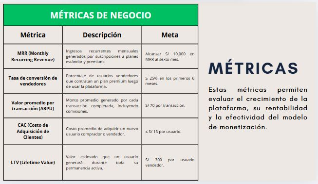
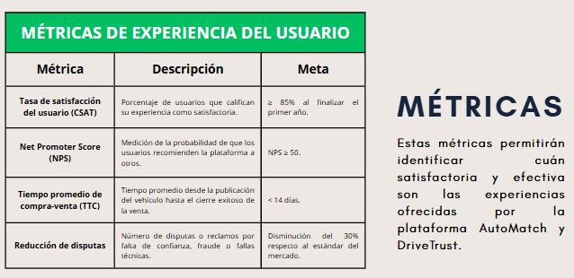
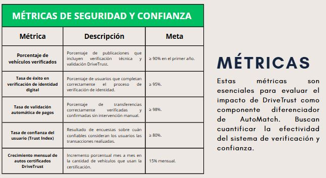
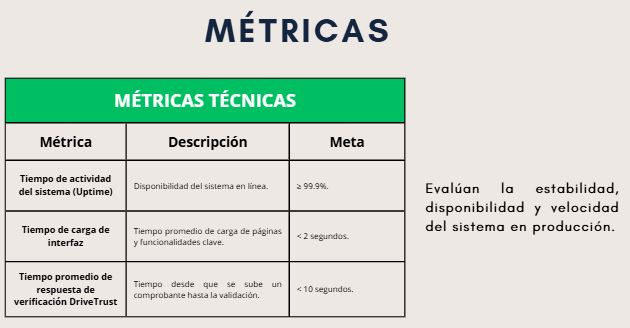
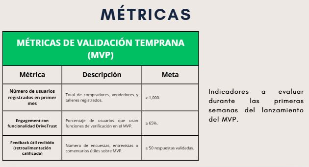
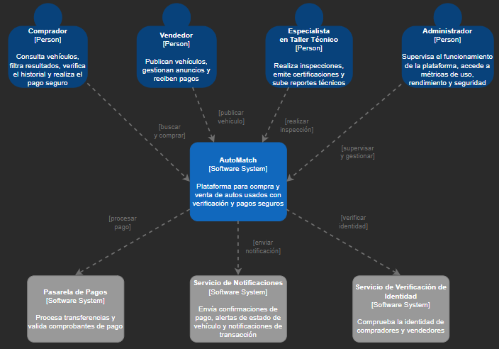

<!-- # 
COURSE PROJECT
 -->

    <strong>Universidad Peruana de Ciencias Aplicadas</strong> 
 
     
 
    <strong>Ingeniería de Software - 7mo Ciclo</strong> 
 
    <strong>Fundamentos de Arquitectura de Software - 6339</strong>   
 
    <strong>Profesor: Ernesto Ocampo Tello</strong> 
      <strong>INFORME DE TRABAJO FINAL - TF </strong> 

    <strong>Startup: DriveTrust </strong> 
    <strong>Producto: AutoMatch </strong>

<h3 align="center" >Relación de integrantes:</h3>
<table align="center">
  <tr>
      <th style="text-align:center;">Integrante</th>
      <th style="text-align:center;">Codigo</th>
  </tr>
  <tr>
      <td>Vera Nuñez, Nicolas Alejandro</td>
      <td>U202214869</td>
  </tr>
  <tr>
      <td>Chávarri Zarzosa, Daniel Jhared</td>
      <td>U202211108</td>
  </tr>
  <tr>
      <td>Sihuar Ccotarma Ttito, Eduardo Eusebio</td>
      <td>U20211c736</td>
  </tr>
</table>

    <strong>Setiembre, 2025</strong>

# Registro de Versiones del Informe

|Versión|Fecha|Autor|Descripción de modificación|
|-------|-----|-----|---------------------------|
|V0.1|03/09/2025|Daniel y Eduardo|Capítulo 1|
|V0.2|03/09/2025|Nicolas| Capitulo 2|
|V0.3|03/09/2025|Daniel Eduardo Nicolas|Capítulo 3|

**Project Report Collaboration Insights**
URL del repositorio de GitHub de la organización: [[https://github.com/Cibersofa](https://github.com/UPC-PRE-SI729-2402-WX51-G3-Cibersofa](https://github.com/upc-pre-202502-2520-6339-cibersofa)

Avance 1

Para el desarrollo del Avance 1, se optó por dividir el trabajo de la siguiente forma:

| Integrante                          | Actvidades Asignadas                                                                                                                                                |
|-------------------------------------|---------------------------------------------------------------------------------------------------------------------------------------------------------------------|
| Chávarri Zarzosa, Daniel Jhared  | - Capitulo 1   - Capitulo 3
| Sihuar Ccotarma Ttito, Eduardo Eusebio     | - Capitulo 1   - Capítulo 3                                                                                                     |
| Vera Nuñez, Nicolas Alejandro                 | - Capitulo 2   - Capítulo 3                                                                                                                                                                                                                                           
# Contenido
## Tabla de Contenidos
### [Registro de versiones del informe](#registro-de-versiones-del-informe)
### [Project Report Collaboration Insights](#project-report-collaboration-insights)
### [Contenido](#contenido)
### [Student Outcome](#student-outcome-1)
### [Capítulo I: Introducción](#capítulo-i-introducción)
- [1.1. Startup Profile](#11-startup-profile)
  - [1.1.1. Descripción de la Startup](#111-descripcion-de-la-startup)
  - [1.1.2. Perfiles de integrantes del equipo](#112-perfiles-de-integrantes-del-equipo)
- [1.2. Solution Profile](#12-solution-profile)
  -[1.2.1. Nombre del producto](#121-nombre-del-producto)
  - [1.2.2 Antecedentes y problemática](#122-antecedentes-y-problemática)
  - [1.2.3 Lean UX Process](#123-lean-ux-process)
    - [1.2.3.1. Lean UX Problem Statements](#1231-lean-ux-problem-statements)
    - [1.2.3.2. Lean UX Assumptions](#1232-lean-ux-assumptions)
    - [1.2.3.3. Lean UX Hypothesis Statements](#1233-lean-ux-hypothesis-statements)
    - [1.2.3.4. Lean UX Canvas](#1234-lean-ux-canvas)
- [1.3. Segmentos objetivo](#13-segmentos-objetivo)

### [Capítulo II: Requirements & Analysis](#capítulo-ii-requirements-&-analysis)
- [2.1. Competidores](#21-competidores)
  - [2.1.1. Análisis competitivo](#211-análisis-competitivo)
  - [2.1.2. Estrategias y tácticas frente a competidores](#212-estrategias-y-tácticas-frente-a-competidores)
- [2.2. Entrevistas](#22-entrevistas)
  - [2.2.1. Diseño de entrevistas](#221-diseño-de-entrevistas)
  - [2.2.2. Registro de entrevistas](#222-registro-de-entrevistas)
  - [2.2.3. Análisis de entrevistas](#223-análisis-de-entrevistas)
- [2.3. Needfinding](#23-needfinding)
  - [2.3.1. User Personas](#231-user-personas)
  - [2.3.2. User Task Matrix](#232-user-task-matrix)
  - [2.3.3. Empathy Mapping](#233-empathy-mapping)
  - [2.3.4. As-is Scenario Mapping](#234-as-is-scenario-mapping)

### [Capítulo III: Requirements Specification](#capítulo-iii-requirements-specification)
- [3.1. To-Be Scenario Mapping](#31-to-be-scenario-mapping)
- [3.2. User Stories](#32-user-stories)
- [3.3. Impact Mapping](#33-impact-mapping)
- [3.4. Alcance](#34-alcance)
- [3.5. Product Backlog](#35-product-backlog)

### [Chapter IV: Product Design](#chapter-iv-product-design)
- [4.1. Style Guidelines](#41-style-guidelines)
  - [4.1.1. General Style Guidelines](#411-general-style-guidelines)
  - [4.1.2. Web Style Guidelines](#412-web-style-guidelines)
- [4.2. Information Architecture](#42-information-architecture)
  - [4.2.1. Organization Systems](#421-organization-systems)
  - [4.2.2. Labeling Systems](#422-labeling-systems)
  - [4.2.3. SEO Tags and Meta Tags](#423-seo-tags-and-meta-tags)
  - [4.2.4. Searching Systems](#424-searching-systems)
  - [4.2.5. Navigation Systems](#425-navigation-systems)
- [4.3. Landing Page UI Design](#43-landing-page-ui-design)
  - [4.3.1. Landing Page Wireframe](#431-landing-page-wireframe)
  - [4.3.2. Landing Page Mock-up](#432-landing-page-mock-up)
- [4.4. Web Applications UX/UI Design](#44-web-applications-uxui-design)
  - [4.4.1. Web Applications Wireframes](#441-web-applications-wireframes)
  - [4.4.2. Web Applications Wireflow Diagrams](#442-web-applications-wireflow-diagrams)
  - [4.4.3. Web Applications Mock-ups](#443-web-applications-mock-ups)
  - [4.4.4. Web Applications User Flow Diagrams](#444-web-applications-user-flow-diagrams)
- [4.5. Web Applications Prototyping](#45-web-applications-prototyping)
- [4.6. Domain-Driven Software Architecture](#46-domain-driven-software-architecture)
  - [4.6.1. Software Architecture Context Diagram](#461-software-architecture-context-diagram)
  - [4.6.2. Software Architecture Container Diagrams](#462-software-architecture-container-diagrams)
  - [4.6.3. Software Architecture Components Diagrams](#463-software-architecture-components-diagrams)
- [4.7. Software Object-Oriented Design](#47-software-object-oriented-design)
  - [4.7.1. Class Diagrams](#471-class-diagrams)
  - [4.7.2. Class Dictionary](#472-class-dictionary)
- [4.8. Database Design](#48-database-design)
  - [4.8.1. Database Diagram](#481-database-diagram)

### [Chapter V: Product Implementation, Validation & Deployment](#chapter-v-product-implementation-validation--deployment)
- [5.1. Software Configuration Management](#51-software-configuration-management)
  - [5.1.1. Software Development Environment Configuration](#511-software-development-environment-configuration)
  - [5.1.2. Source Code Management](#512-source-code-management)
  - [5.1.3. Source Code Style Guide & Conventions](#513-source-code-style-guide--conventions)
  - [5.1.4. Software Deployment Configuration](#514-software-deployment-configuration)
- [5.2. Landing Page, Services & Applications Implementation](#52-landing-page-services--applications-implementation)
  - [5.2.1. Sprint 1](#521-sprint-1)
    - [5.2.1.1. Sprint Planning 1](#5211-sprint-planning-1)
    - [5.2.1.2. Sprint Backlog 1](#5212-sprint-backlog-1)
    - [5.2.1.3. Development Evidence for Sprint Review](#5213-development-evidence-for-sprint-review)
    - [5.2.1.4. Testing Suite Evidence for Sprint Review](#5214-testing-suite-evidence-for-sprint-review)
    - [5.2.1.5. Execution Evidence for Sprint Review](#5215-execution-evidence-for-sprint-review)
    - [5.2.1.6. Services Documentation Evidence for Sprint Review](#5216-services-documentation-evidence-for-sprint-review)
    - [5.2.1.7. Software Deployment Evidence for Sprint Review](#5217-software-deployment-evidence-for-sprint-review)
    - [5.2.1.8. Team Collaboration Insights during Sprint](#5218-team-collaboration-insights-during-sprint)
  - [5.2.2. Sprint 2](#522-sprint-2)
    - [5.2.2.1. Sprint Planning 2](#5221-sprint-planning-2)
    - [5.2.2.2. Sprint Backlog 2](#5222-sprint-backlog-2)
    - [5.2.2.3. Development Evidence for Sprint Review](#5223-development-evidence-for-sprint-review)
    - [5.2.2.4. Testing Suite Evidence for Sprint Review](#5224-testing-suite-evidence-for-sprint-review)
    - [5.2.2.5. Execution Evidence for Sprint Review](#5225-execution-evidence-for-sprint-review)
    - [5.2.2.6. Services Documentation Evidence for Sprint Review](#5226-services-documentation-evidence-for-sprint-review)
    - [5.2.2.7. Software Deployment Evidence for Sprint Review](#5227-software-deployment-evidence-for-sprint-review)
    - [5.2.2.8. Team Collaboration Insights during Sprint](#5228-team-collaboration-insights-during-sprint)
  - [5.2.3. Sprint 3](#523-sprint-3)
    - [5.2.3.1. Sprint Planning 3](#5231-sprint-planning-3)
    - [5.2.3.2. Sprint Backlog 3](#5232-sprint-backlog-3)
    - [5.2.3.3. Development Evidence for Sprint Review](#5233-development-evidence-for-sprint-review)
    - [5.2.3.4. Testing Suite Evidence for Sprint Review](#5234-testing-suite-evidence-for-sprint-review)
    - [5.2.3.5. Execution Evidence for Sprint Review](#5235-execution-evidence-for-sprint-review)
    - [5.2.3.6. Services Documentation Evidence for Sprint Review](#5236-services-documentation-evidence-for-sprint-review)
    - [5.2.3.7. Software Deployment Evidence for Sprint Review](#5237-software-deployment-evidence-for-sprint-review)
    - [5.2.3.8. Team Collaboration Insights during Sprint](#5238-team-collaboration-insights-during-sprint)
  - [5.2.4. Sprint 4](#524-sprint-4)
    - [5.2.4.1. Sprint Planning 4](#5241-sprint-planning-4)
    - [5.2.4.2. Sprint Backlog 4](#5242-sprint-backlog-4)
    - [5.2.4.3. Development Evidence for Sprint Review](#5243-development-evidence-for-sprint-review)
    - [5.2.4.4. Testing Suite Evidence for Sprint Review](#5244-testing-suite-evidence-for-sprint-review)
    - [5.2.4.5. Execution Evidence for Sprint Review](#5245-execution-evidence-for-sprint-review)
    - [5.2.4.6. Services Documentation Evidence for Sprint Review](#5246-services-documentation-evidence-for-sprint-review)
    - [5.2.4.7. Software Deployment Evidence for Sprint Review](#5247-software-deployment-evidence-for-sprint-review)
    - [5.2.4.8. Team Collaboration Insights during Sprint](#5248-team-collaboration-insights-during-sprint)
- [5.3. Validation Interviews](#53-validation-interviews)
    - [5.3.1. Diseño de Entrevistas](531-diseño-de-entrevistas)
    - [5.3.2. Registro de Entrevistas](532-registrode-entrevistas)
    - [5.3.3. Evaluación según heurísticas](533-evaluación-según-heurísticas)
- [5.4. Video About-The-Product](54-video-about-the-product)
### [VI: Conclusiones y recomendaciones](#vi-conclusiones-y-recomendaciones)
- [Conclusiones](#conclusiones)
- [VII. Bibliografía](#vii-bibliografía)
- [VIII. Anexos](#viii-anexos)

  

----
# Student Outcome
En el siguiente cuadro se describe las acciones realizadas y enunciados de
conclusiones cual por parte del grupo, que permiten sustentar el haber alcanzado el logro del ABET – EAC - Student Outcome 7.
<table>
  <tr>
    <td><b>Criterio específico</b></td>
    <td><b>Acciones realizadas</b></td>
    <td><b>Conclusiones</b></td>
  </tr>
  <tr>
    <td text-align="justify"><b>Actualiza conceptos y conocimientos necesarios para su desarrollo profesional y en especial para su proyecto en soluciones de software.</b></td>
    <td text-align="justify"> Chávarri Zarzosa, Daniel Jhared  Avance 1:   Para el primer avance, realicé el capítulo 1 de manera colaborativa, actualizando y reforzando conceptos de documentación técnica y organización de proyectos en soluciones de software. Me aseguré de que todos los puntos fueran abordados correctamente, verifiqué que mis compañeros cumplieran con sus entregables a tiempo y realicé la reorganización del informe para mantener la coherencia y calidad del documento.   
         Sihuar Ccotarma Ttito, Eduardo Eusebio  Avance 1:  En el primer avance, participé en la elaboración de los capítulos 2 y 3 de forma conjunta, revisando y fortaleciendo los conceptos relacionados con la documentación técnica y la gestión de proyectos de software. Me aseguré de que cada apartado estuviera correctamente cubierto, confirmé que mis compañeros entregaran sus tareas en los plazos establecidos y realicé una reestructuración del informe para preservar la consistencia y la calidad del documento. 
         Vera Nuñez, Nicolas Alejandro  Avance 1:   En el primer avance, participé en la elaboración de los capítulos 2 y 3 de forma conjunta, revisando y fortaleciendo los conceptos de documentación técnica y gestión de proyectos en el ámbito del software. Me aseguré de que todos los apartados fueran tratados adecuadamente, confirmé que mis compañeros cumplieran con sus entregas en los plazos establecidos y realicé una reestructuración del informe para conservar la consistencia y la calidad del documento.
   </td>
    <td text-align="justify">AutoMatch fue diseñado con el objetivo de ofrecer una experiencia de usuario excepcional y diferenciarse de la competencia. Los estilos visuales seleccionados, junto con una cuidadosa organización de la información, garantizan no solo coherencia estética, sino también una navegación intuitiva y un acceso simplificado a las funciones clave para todos los usuarios, independientemente de su nivel de experiencia. 
</tr>
  
  <tr text-align="justify">
    <td><b>Reconoce la necesidad del aprendizaje permanente para el desempeño profesional y el desarrollo de proyectos en soluciones de software.</b></td>
<td> Chávarri Zarzosa, Daniel Jhared  Avance 1:   Durante el desarrollo del proyecto reconocí la importancia del aprendizaje permanente, ya que el área de soluciones de software evoluciona constantemente con nuevas herramientas, metodologías y lenguajes de programación. Identifiqué que para lograr un mejor desempeño profesional debo mantenerme actualizado mediante la investigación continua, el uso de recursos en línea y la práctica colaborativa. Este hábito de aprendizaje me permitirá adaptarme a los cambios tecnológicos y garantizar la calidad de los proyectos de software en los que participe. 
         Sihuar Ccotarma Ttito, Eduardo Eusebio   Avance 1:   Durante la ejecución del proyecto entendí la importancia del aprendizaje constante, ya que el ámbito de las soluciones de software se transforma de manera continua con nuevas herramientas, enfoques y lenguajes de programación. Reconocí que, para lograr un desempeño profesional más sólido, resulta indispensable mantenerme actualizado a través de la investigación permanente, el uso de recursos digitales y el trabajo colaborativo. Este hábito de aprendizaje me permitirá responder a los cambios tecnológicos y garantizar la calidad en los proyectos de software en los que participe. 
         Vera Nuñez, Nicolas Alejandro   Avance 1:   A lo largo del desarrollo del proyecto comprendí la relevancia del aprendizaje continuo, ya que el campo de las soluciones de software cambia constantemente con nuevas herramientas, metodologías y lenguajes de programación. Reconocí que, para alcanzar un mejor rendimiento profesional, es necesario mantenerme actualizado mediante la investigación permanente, el aprovechamiento de recursos digitales y la práctica en equipo. Este hábito de aprendizaje me permitirá adaptarme a los avances tecnológicos y asegurar la calidad de los proyectos de software en los que participe.
    <td>AutoMatch fue diseñado con el objetivo de ofrecer una experiencia de usuario excepcional y destacar frente a la competencia. Los estilos visuales cuidadosamente seleccionados y la organización meticulosa de la información garantizan una coherencia visual sólida. Además, facilitan la navegación y el acceso a las funciones clave, haciendo que tanto usuarios con experiencia técnica como aquellos menos familiarizados con la tecnología puedan utilizar la plataforma de manera eficiente.  
</tr>
  
</table>

# Capítulo I: Introducción
## 1.1. Startup Profile
En esta sección describiremos el perfil de nuestra Startup.

### 1.1.1. Descripción de la Startup

AutoMatch es una startup creada en 2024 por un grupo de estudiantes de Ingeniería de Software.
Nuestra plataforma está dedicada a transformar el mercado de autos de segunda mano,
ofreciendo una solución innovadora y accesible para personas que desean comprar o vender vehículos usados.

- Misión: Nuestra misión es facilitar la compra y venta de autos de segunda mano mediante
  una plataforma intuitiva y eficiente, proporcionando a nuestros usuarios todas
  las herramientas necesarias para que el proceso sea sencillo, seguro y confiable.

- Visión: Aspiramos a convertirnos en la principal plataforma Nacional para la compra y
  venta de autos de segunda mano, impulsando la confianza y
  la satisfacción de nuestros usuarios en cada transacción.

### 1.1.2. Perfiles de integrantes del equipo

<table align="center"  border="1" width="70%" style="text-align:center;">
     <tr align="center">
        <td rowspan="3">

        </td>
        <td align="left">
            <b>Nombre y Apellido:</b>
                         
Chávarri Zarzosa, Daniel Jhared
        </td>
    </tr>
    <tr>
        <td align="left">
        <b>Carrera:</b>
         
        Ing. de Software
        </td>
    </tr>
    <tr>
        <td align="left">
        <b>Acerca de:</b>
         
        Soy estudiante de la UPC, tengo 20 años. Estoy en la carrera de Ingeniería de Software, ya que, siempre me gustó la tecnología y los videojuegos. Estoy cursando el 8va ciclo de la carrera y mis habilidades son C++, Python, HTML y JavaScript. También soy bueno en ser responsable con cada curso y organizar mi tiempo en ellos.
        </td>
    </tr>
    <tr align="center">
        <td rowspan="3">

        </td>
        <td align="left">
            <b>Nombre y Apellido:</b>
                         
Sihuar Ccotarma Ttito, Eduardo Eusebio
        </td>
    </tr>
    <tr>
        <td align="left">
        <b>Carrera:</b>
         
        Ing. de Software
        </td>
    </tr>
    <tr>
        <td align="left">
        <b>Acerca de:</b>
         
       Soy estudiante de la UPC y tengo 22 años. Curso la carrera de Ingeniería de Software, motivado por mi interés en la tecnología, el análisis de datos y el desarrollo web. Actualmente me encuentro en el séptimo ciclo y mis competencias incluyen Angular, Java con Spring Boot, Docker, Python, HTML y JavaScript. Además, me caracterizo por ser una persona analítica que plantea soluciones innovadoras frente a diferentes problemas.
        </td>
    </tr>
<tr align="center">
        <td rowspan="3">

        </td>
        <td align="left">
            <b>Nombre y Apellido:</b>
                         
Vera Nuñez, Nicolas Alejandro
        </td>
    </tr>
    <tr>
        <td align="left">
        <b>Carrera:</b>
         
        Ing. de Software
        </td>
    </tr>
    <tr>
        <td align="left">
        <b>Acerca de:</b>
         
         Soy estudiante de la UPC, tengo 21 años. Estoy en la carrera de Ingeniería de Software, ya que, siempre me gustó la tecnología, el analisis de datos y el desarrollo web. Estoy cursando el 7mo ciclo de la carrera y mis habilidades son Angular, Java con Springboot, Docker, Python, HTML y JavaScript. También soy una persona analitica y que encuentra soluciones inovadoras a varios problemas.
        </td>
    </tr>
</table>

## 1.2. Solution Profile

En esta sección se detallan los aspectos claves de nuestra solución de software, incluyendo sus
características distintivas, propuestas de valor y estrategias de monetización.

## 1.2.1. Nombre del producto: AutoMatch

AutoMatch es una plataforma innovadora diseñada para transformar la compra y venta de autos de segunda mano, conectando de manera rápida y segura a compradores y vendedores. A diferencia de otras plataformas tradicionales, AutoMatch integra verificación digital de identidad, validación de pagos en línea y un sistema de recomendación inteligente que sugiere vehículos en función de las preferencias del usuario. La experiencia del usuario es fluida: explorar vehículos, gestionar publicaciones y comunicarse directamente en un entorno confiable. Además, AutoMatch ofrece herramientas de seguimiento en tiempo real para cada transacción y dashboards personalizados que garantizan seguridad y transparencia.

Monetización:
- AutoMatch generará ingresos mediante una estrategia híbrida que combina planes de suscripción y comisiones por transacción.
  
- Tendrá planes de suscripción para vendedores, con beneficios como destacación de anuncios, herramientas de marketing digital, reportes de rendimiento y estadísticas de mercado.

- Hará Comisiones por venta completada, asegurando la sostenibilidad del modelo y el acceso inclusivo a vendedores que no desean suscribirse.

- Habrá un proceso de pago seguro, en el que los compradores realizarán transferencias bancarias y subirán comprobantes digitales para validación automática por parte del sistema y confirmación del vendedor.
  
- Este modelo garantiza confianza, flexibilidad y escalabilidad, al tiempo que ofrece una propuesta de valor diferenciada frente a la competencia.

## 1.2.2. Antecedentes y problemática

La industria de autos de segunda mano enfrenta problemas de seguridad, confianza y transparencia. Muchos compradores desconfían por el riesgo de fraude, la falta de garantías en el vehículo y la informalidad en los pagos. Los vendedores, por su parte, enfrentan dificultades para llegar a clientes confiables y obtener métricas claras de su oferta. Aunque existen plataformas en línea, pocas ofrecen un ecosistema integral que combine tecnología avanzada, seguridad en las transacciones y experiencia personalizada.

AutoMatch responde a estas brechas mediante:

- Un entorno seguro de compra/venta con verificación digital y validación de pagos.

- Herramientas que reducen la fricción en las transacciones y generan confianza en ambas partes.

- Un modelo que impulsa la digitalización del mercado automotriz informal, contribuyendo a la formalización de la industria y generando un impacto positivo en la economía local.

**5Ws y 2Hs:**

-   **What?**   
    La industria automotriz de segunda mano enfrenta desafíos importantes en la
    gestión eficiente de las transacciones y la seguridad de las mismas,
    debido a la falta de plataformas tecnológicas adecuadas que garanticen procesos transparentes y seguros.
      
- **When?**                      
  Este problema se ha intensificado en los últimos años, especialmente con el crecimiento del mercado de autos usados,
  impulsado por el aumento de la demanda y la necesidad de opciones más accesibles para los consumidores.
    
-   **Where?**                         
    Este problema es global y afecta a compradores y vendedores en diversas regiones del mundo, tanto en mercados desarrollados como en desarrollo.
      
-   **Who?**           
    Los compradores y vendedores de autos usados, desde individuos hasta concesionarios pequeños, están directamente involucrados en estas dificultades,
    ya que son responsables de realizar transacciones seguras y exitosas en un mercado competitivo.
      
- **Why?**             
  Es crucial abordar esta problemática porque la compra y venta de autos de segunda mano es una parte esencial de la economía global, ofreciendo opciones
  asequibles para los consumidores y contribuyendo al desarrollo económico de muchos países.
    
-   **How?**                    
    Se necesitan soluciones tecnológicas innovadoras que ayuden a los usuarios a realizar transacciones de manera más segura, eficiente y confiable, optimizando
    la experiencia de compra y venta y garantizando la transparencia en cada paso del proceso.
      
-   **How much?**                         
    El costo de implementar estas soluciones tecnológicas puede variar según la escala de la plataforma y los
    recursos disponibles para la adopción de tecnología en el mercado de autos de segunda mano.
      
    
### 1.2.3. Lean UX Process
#### 1.2.3.1. Lean UX Problem Statement
- En la industria de compra y venta de autos de segunda mano, existe
  una falta de plataformas tecnológicas integradas que permitan a los compradores y vendedores realizar
  transacciones de manera segura y eficiente. Este vacío tecnológico dificulta la confianza entre las partes y
  la optimización del proceso de compra-venta, lo que conduce a una experiencia frustrante y puede limitar el crecimiento de este mercado.
  Además, mejorar la colaboración entre compradores, vendedores y talleres técnicos es crucial para garantizar transacciones transparentes y
  satisfactorias para todas las partes involucradas.

#### 1.2.3.2. Lean UX Assumptions

**Business Outcomes:**

- Lograr un crecimiento mensual del 20% en el número de usuarios activos de la plataforma, medido por el número de transacciones realizadas a través de AutoMatch.
    
- Tener al menos 200 vehículos vendidos a través de la plataforma en el primer año de lanzamiento.
    
- Alcanzar una tasa de satisfacción del 85% entre los usuarios al final del primer año, lo que indicará una alta retención y confianza en la plataforma.

**Users Assumptions :**

**1. ¿Quien es el usuario?**
- Compradores de autos usados
    
- Vendedores de autos usados
    
- Talleres técnicos

**2. ¿Donde entra nuestro producto en su trabajo o su vida?**
- AutoMatch se integra directamente en la vida de los compradores y vendedores al facilitar el proceso de transacción, haciéndolo más seguro y accesible.

**3. ¿Cual es el problema que nuestro producto soluciona?**
- Falta de transparencia y confianza en las transacciones de autos usados.

- Dificultades en la verificación del estado del vehículo y la confirmación de pagos.

- Complejidad en la comunicación entre compradores, vendedores y talleres técnicos.

**4. ¿Como y cuando nuestro producto es usado?**
- La plataforma será utilizada durante todo el proceso de compra y venta, desde la búsqueda del vehículo hasta
  la confirmación del pago. Los talleres técnicos usarán aquella información para ofrecer sus servicios.

**5. ¿Que caracteristicas son importantes?**
- Sistema de filtrado y verificación de vehículos
- Transacciones seguras mediante verificación de pago.
- Organización y seguimiento del proceso de compra-venta.
- Información detallada y transparente sobre los vehículos
- Comunicación eficiente entre compradores y vendedores

**6. ¿Como deberia nuestro producto verse o comportarse?**
-  El producto debe verse con una interfaz simple, interactiva, atractiva e inclusiva. Debe poder comportarse correctamente, ser capaz de llamar la atención de quien la use, pero tambien otorgar una experiencia innovadora y acogedora a nuestro segmento objetivo.

**User Outcomes:**
- **Compradores de Autos Usados:** Establecer como objetivo aumentar la confianza en el proceso de compra de vehículos usados, logrando una reducción del 30% en el número de incidencias críticas reportadas por compradores durante el primer año de uso de AutoMatch.
- **Vendedores de Autos Usados:** Mejorar la tasa de conversión de ventas en un 25% durante el primer año, garantizando que solo los vehículos verificados y aprobados sean listados en la plataforma. Esto reducirá los problemas relacionados con la venta y aumentará la satisfacción del vendedor.
- **Talleres Técnicos:** Incrementar el número de inspecciones y certificaciones realizadas en un 40% durante el primer año, facilitando una mayor colaboración con AutoMatch. Este aumento se logrará mediante la integración eficiente de sus servicios en la plataforma y la generación de más oportunidades de verificación.

¿Que está intentando conseguir el usuario?
- **Compradores:** Quiero encontrar un auto confiable y realizar la compra de manera segura.
- **Vendedores:** Quiero vender mis autos de manera rápida y segura.
- **Talleres Técnicos:** Quiero ofrecer mis servicios de inspección y certificación de vehículos de manera eficiente y confiable.

¿Como se quiere sentir el usuario?
- **Compradores de autos usados:** Quiero sentir confianza y seguridad al momento de realizar mi compra.
- **Vendedores de autos usados:** Quiero sentirme respaldado y protegido durante el proceso de venta.
- **Talleres Técnicos:** Quiero sentirme valorado y reconocido por mi trabajo en la plataforma.

¿Como nuestro producto lo acerca a su objetivo?

- **Compradores de autos usados:** Les proporciona una plataforma segura para encontrar y comprar vehículos usados.
- **Vendedores de autos usados:** Les facilita el proceso de venta, asegurando la transacción y reduciendo riesgos.
- **Talleres Técnicos:** Les conecta con clientes potenciales, incrementando la demanda de sus servicios.

¿Por que nuestros usuarios se interesarian por nuestro producto? ¿Que beneficio podrian obtener?

- **Compradores de autos usados:** Acceso a una plataforma segura y confiable para comprar autos usados.
- **Vendedores de autos usados:** Capacidad de vender sus vehículos de manera rápida y sin riesgos.
- **Talleres Técnicos:** Oportunidad de ofrecer servicios a un mercado específico y creciente.

¿Que cambio en su comportamiento veremos que nos dira que nuestro objetivo ha sido logrado?

- **Compradores y Vendedores:** Esperamos que la plataforma se utilice de manera constante para todas las transacciones
  de autos usados, lo que indicará un aumento en la confianza y la seguridad en el proceso. Un incremento en el número de
  transacciones realizadas a través de AutoMatch, junto con una reducción en las quejas o disputas relacionadas con la transparencia
  y la verificación, nos indicará que la plataforma está cumpliendo su objetivo de mejorar la confianza en el mercado de autos usados.

- **Talleres Técnicos:** Esperamos que los talleres técnicos vean un aumento en la demanda de sus servicios a través de la plataforma,
  lo que indicará que los usuarios confían en su trabajo y están dispuestos a pagar por sus servicios. Un incremento en el número de inspecciones
  y certificaciones realizadas a través de AutoMatch demostrará que los talleres técnicos están obteniendo beneficios significativos de su colaboración con la plataforma.

**Feature Assumptions**

- **Creemos que** el producto debe contar con planes estándar y premium que se adapten a las necesidades del usuario, ofreciendo flexibilidad y valor agregado.
    
- **Creemos que** el producto debe poder proporcionar opciones de valoración y revisión de autos por parte de los talleres técnicos.
    
- **Creemos que** el producto debe ofrecer un sistema de verificación de pagos y transacciones seguras.
    
- **Creemos que** el producto debe facilitar la comunicación directa entre compradores y vendedores para mejorar la transparencia y la confianza.

#### 1.2.3.3. Lean UX Hypothesis

- Creemos que al implementar un proceso riguroso de verificación para cada vehículo antes de su inclusión en la plataforma, podemos aumentar la confianza de los compradores en la calidad y la transparencia de las ofertas, lo que resultará en una mayor seguridad en las transacciones y una reducción en las disputas.
    
- Creemos que al integrar un sistema de inspecciones y certificaciones realizadas por talleres técnicos a través de AutoMatch, podemos incrementar la demanda de servicios técnicos, lo que beneficiará a los talleres y garantizará la calidad de los vehículos disponibles en la plataforma.
    
- Creemos que al ofrecer una plataforma exclusiva sin freemium y con un filtro de calidad para los vehículos, podemos mejorar la eficiencia del proceso de compra-venta, aumentando la satisfacción del cliente y optimizando las transacciones al asegurar que solo los vehículos que cumplen con los estándares de calidad sean mostrados.
    
- Creemos que al proporcionar una interfaz intuitiva y amigable, podemos mejorar la experiencia general del usuario en la plataforma, resultando en una mayor satisfacción y un aumento en el uso continuo de AutoMatch.
    
- Creemos que al implementar un sistema de verificación de pagos y transacciones seguras, podemos reducir los riesgos de fraude y estafas, lo que aumentará la confianza de los usuarios en la plataforma y fomentará la realización de transacciones seguras y confiables.

  
#### 1.2.3.4. Lean UX Canvas

<table>
    <tr>
        <th>BUSINESS PROBLEM</th>
        <th>SOLUTION IDEAS</th>
        <th>BUSINESS OUTCOMES</th>
    </tr>
    <tr>
        <td >
            En la industria de compra y venta de autos de segunda mano, existe una falta de plataformas tecnológicas integradas que permitan a los compradores y vendedores realizar transacciones de manera segura y eficiente. Este vacío tecnológico dificulta la confianza entre las partes y la optimización del proceso de compra-venta, lo que conduce a una experiencia frustrante y puede limitar el crecimiento de este mercado. Además, mejorar la colaboración entre compradores, vendedores y talleres técnicos es crucial para garantizar transacciones transparentes y satisfactorias para todas las partes involucradas.
        </td>
        <td>
            Desarrollo de una plataforma tecnológica para la gestión eficiente de la compra y venta de autos usados. 
            Implementación de funciones estándar y premium para satisfacer las necesidades de compradores y vendedores. 
            Creación de un sistema de verificación de vehículos y un directorio de talleres técnicos para garantizar la calidad y seguridad de las transacciones. 
            Integración de herramientas para simplificar la gestión de transacciones, incluyendo la verificación de pagos, la documentación de vehículos, y la logística de entrega y recepción.
        </td>
        <td>
            <ul>
                <li>Incremento de la adopción y fidelización de usuarios: Al brindar una solución completa para la compra-venta de autos usados, aspiramos a aumentar significativamente la aceptación en nuestra plataforma.</li>
                <li>Optimización de la eficiencia operativa: Al implementar procesos automatizados y herramientas de gestión avanzada, buscamos optimizar la eficiencia operativa de la plataforma.</li>
                <li>Reducción de pérdidas económicas: Al ofrecer un sistema de gestión de transacciones sólido, minimizaremos las pérdidas económicas tanto para los usuarios como para la plataforma, garantizando ingresos recurrentes y una mejor experiencia de usuario.</li>
            </ul>
        </td>
    </tr>
    <tr>
        <th >USER & CUSTOMERS</th>
        <th> </th>
        <th>USER BENEFITS</th>
    </tr>
    <tr>
        <td >
            <ul>
                <li>Compradores de autos usados</li>
                <li>Vendedores de autos usados</li>
                <li>Talleres técnicos</li>
            </ul>
        </td>
        <td>
        </td>
        <td>
            <ul>
                <li>Seguridad al tener un sistema de verificación sólido</li>
                <li>Facilidad al realizar transacciones de compra-venta</li>
                <li>Acceso a servicios de inspección y certificación confiables</li>
            </ul>
        </td>
    </tr>
    <tr>
        <th>HYPOTHESIS</th>
        <th>WHAT'S THE MOST IMPORTANT THING WE NEED TO LEARN FIRST?</th>
        <th>WHATS THE LEAST AMOUNT OF WORK WE NEED TO DO TO LEARN THE MOST IMPORTANT THING?</th>
    </tr>
    <tr>
        <td>
            <ul>
                <li>Creemos que, al implementar un riguroso proceso de verificación para cada vehículo, podemos aumentar la confianza de los compradores en la calidad y la transparencia de las ofertas, lo que reducirá las disputas y aumentará la seguridad en las transacciones.</li>
                <li>Creemos que, al ofrecer un proceso de compra-venta optimizado y sin freemium, podemos mejorar la eficiencia del proceso, lo que resultará en una mayor satisfacción del cliente y optimizará las transacciones al asegurar que solo se muestren vehículos que cumplen con los estándares de calidad.</li>
                <li>Creemos que, al integrar un sistema de inspecciones y certificaciones realizadas por talleres técnicos, podemos fortalecer la demanda de servicios técnicos, lo que beneficiará a los talleres y garantizará la calidad de los vehículos disponibles.</li>
                <li>Creemos que, al proporcionar una interfaz intuitiva y amigable, podemos mejorar la experiencia general del usuario para hacer más fácil el proceso de compra-venta, lo que resultará en mayor adopción de la plataforma de compra-venta de autos de AutoMatch.</li>
            </ul>
        </td>
        <td>
            <ul>
                <li>Los recursos que deberíamos tener para mantener una plataforma de tal magnitud.</li>
                <li>La tecnología necesaria para operar eficazmente la plataforma.</li>
                <li>La demanda y disposición del mercado para la plataforma.</li>
            </ul>
        </td>
        <td>
            <ul>
                <li>Realizar encuestas y entrevistas con usuarios potenciales para evaluar la demanda y disposición del mercado.</li>
                <li>Desarrollar un prototipo de baja fidelidad sobre la interfaz y las funcionalidades clave de la plataforma para obtener retroalimentación temprana de los usuarios.</li>
                <li>Plantear un formato de resolución planteando las tareas más importantes e información faltante.</li>
            </ul>
        </td>
    </tr>
</table>

<!--

    

-->
## 1.3. Segmentos Objetivo

**Compradores de Autos Usados:**
- Personas interesadas en adquirir un vehículo de segunda mano, que buscan opciones asequibles y confiables en el mercado.
- Buscan una plataforma que garantice la calidad y transparencia de los vehículos.
- Interesados en un proceso de compra sencillo, con acceso a vehículos certificados y con historial claro.

**Vendedores de Autos Usados:**
- Individuos que desean vender sus vehículos de manera rápida y segura.
- Buscan una plataforma que les permita listar sus vehículos de forma eficiente y atraer a compradores potenciales.
- Interesados en un proceso de venta transparente y sin complicaciones, con opciones de verificación y pagos seguros.

**Talleres Técnicos:**
- Empresas y profesionales que ofrecen servicios de inspección y certificación de vehículos.
- Buscan una plataforma que les permita promocionar sus servicios y colaborar con compradores y vendedores.
- Interesados en una mayor visibilidad y demanda de sus servicios, con la posibilidad de ofrecer valor agregado a los usuarios.
    

# Capítulo II: Requirements & Analysis

## 2.1. Competidores

Nuestros competidores abarcan una variedad de empresas en el mercado de autos de segunda mano, que se han ido fortaleciendo a lo largo del tiempo en plataformas digitales. Esto abarca grandes sitios webs de venta de vehículos usados.

Aquí unos competidores directos que proporcionan servicios similares al nuestro:

- **NeoAuto**: [NeoAuto](https://neoauto.com/venta-de-autos-usados-en-lima?gad_source=1&gclid=Cj0KCQjw_sq2BhCUARIsAIVqmQtS4NTpmRTLgjG9aqoxczpnBP_zQPfrGnqWX53OOE22ruL_N90cup8aAvHuEALw_wcB)

  NeoAuto es una plataforma en línea disponible para web y dispositivos móviles que facilita la compra y venta de autos de segunda mano. Fundada por un equipo de innovadores peruanos, NeoAuto ha logrado posicionarse como uno de los líderes en el mercado automotriz de segunda mano en Perú. La plataforma permite a los usuarios acceder a una amplia variedad de vehículos usados, todos verificados para garantizar su calidad y confiabilidad. Gracias a su gran aceptación, NeoAuto se ha expandido y ahora es un referente en el sector automotriz en el país, ayudando a miles de peruanos a encontrar su auto ideal.

  
- **AUTOLAND Perú**: [AutoLand Perú](https://autoland.com.pe/seminuevos/)

  AutoLand Perú es un portal en línea especializado en la compra y venta de vehículos de segunda mano, accesible tanto desde su sitio web como desde su aplicación móvil. Fundado por un grupo de expertos en el sector automotriz peruano, AutoLand Perú se ha destacado por ofrecer una plataforma confiable y segura para transacciones de autos usados. La plataforma permite a los usuarios explorar una extensa selección de vehículos, todos sometidos a rigurosas inspecciones para asegurar su calidad. Gracias a su enfoque en la satisfacción del cliente, AutoLand Perú se ha consolidado como una de las opciones preferidas en el mercado de autos de segunda mano en el país.

  
- **Autopia.pe**: [Autopia.pe](https://www.autopia.pe)

  Autopia.pe es una plataforma digital especializada en la compra y venta de autos de segunda mano, diseñada para brindar a los usuarios una experiencia simple y segura. Fundada por un equipo de emprendedores peruanos apasionados por el sector automotriz, Autopia.pe se ha posicionado rápidamente como una opción confiable para quienes buscan vehículos usados en Perú. La plataforma ofrece una amplia gama de autos, todos inspeccionados y certificados para garantizar su estado y calidad. Gracias a su enfoque en la transparencia y la satisfacción del cliente, Autopia.pe se ha convertido en una referencia clave en el mercado automotriz de segunda mano en el país.
    

## 2.1.1. Análisis competitivo
<table>
 <tr>
    <th colspan="6">Competitive Analysis Landscape</th>
  </tr>
  <tr>
  <th>¿Por qué llevar a cabo este análisis?</th>
    <td colspan="6"> Realizaremos un análisis competitivo porque es muy importante identificar oportunidades de diferenciación, entender las fortalezas y debilidades de los competidores, y adaptar la estrategia para posicionar mejor la plataforma en el mercado.</td>
  </tr>
  <tr>
    <th></th>
    <th></th>
    <th>AutoMatch</th>
    <th>NeoAuto</th>
    <th>AutoLand Perú</th>
    <th>Autopia.pe</th>
  </tr>
  <tr>
    <th rowspan="2">Perfil</th>
    <td><strong>Overview</strong></td>
    <td>Plataforma de compra y venta de autos de segunda mano con un fuerte énfasis en la verificación y certificación de datos.</td>
    <td>Plataforma en línea para la compra y venta de autos de segunda mano en Perú, con una sólida presencia en el mercado.</td>
    <td>Plataforma especializada en la compra y venta de vehículos usados, con un énfasis en la confiabilidad y seguridad de las transacciones.</td>
    <td>Plataforma digital enfocada en la simplicidad y seguridad de la compra y venta de autos de segunda mano.</td>
  </tr>
  <tr>
    <td><strong>Ventaja competitiva ¿Qué valor ofrece a los clientes?</strong></td>
    <td>Seguridad y confianza al comprar, sabiendo que todos los datos y fotos están verificados y actualizados regularmente. Ahorran tiempo al evitar pasos adicionales de verificación.</td>
    <td>Acceso a una gran cantidad de opciones y confianza en una plataforma bien establecida.</td>
    <td>Tranquilidad al saber que los autos han pasado por un proceso de inspección.</td>
    <td>Proceso de compra sencillo y seguro, con una selección de vehículos que han sido inspeccionados.</td>
  </tr>
  <tr>
    <th rowspan="2">Perfil de Marketing</th>
    <td><strong>Mercado objetivo</strong></td>
    <td>Compradores y vendedores de autos de segunda mano que buscan seguridad y confianza en su adquisición.</td>
    <td>Consumidores peruanos interesados en comprar o vender autos usados a través de una plataforma confiable.</td>
    <td>Consumidores peruanos que priorizan la seguridad y confiabilidad en la compra de un auto de segunda mano.</td>
    <td>Usuarios que buscan una plataforma fácil de usar para comprar o vender autos usados, con énfasis en la transparencia y satisfacción del cliente.</td>
  </tr>
  <tr>
    <td><strong>Estrategias de marketing</strong></td>
    <td>Campañas focalizadas en redes sociales y Google ads, orientadas a personas que buscan comprar un auto usado.</td>
    <td>Campañas de branding en televisión, radio y redes sociales para mantener la visibilidad de la marca a nivel nacional.</td>
    <td>Anuncios en prensa, radio y televisión local que resalten la confiabilidad y las rigurosas inspecciones de los autos en venta.</td>
    <td>Campañas en redes sociales enfocadas a un público más joven, destacando la facilidad de uso y la transparencia de la plataforma.</td>
  </tr>
  <tr>
    <th rowspan="3">Perfil de Producto</th>
    <td><strong>Productos & Servicios</strong></td>
    <td>Autos verificados y certificados mensualmente, con asesoría personalizada.</td>
    <td>Amplio catálogo de autos usados, con servicios adicionales como financiamiento y seguros.</td>
    <td>Autos usados con inspecciones rigurosas y garantía limitada.</td>
    <td>Autos seleccionados con inspección única al momento de la publicación, enfocados en la transparencia.</td>
  </tr>
  <tr>
    <td><strong>Precios & Costos</strong></td>
    <td>Precios medio-altos debido a las certificaciones mensuales; costos operativos elevados por las inspecciones regulares.</td>
    <td>Variedad de precios, desde opciones económicas hasta de alta gama; costos moderados por verificación básica.</td>
    <td>Precios competitivos con un enfoque en el valor a través de la calidad; costos relacionados con inspecciones detalladas.</td>
    <td>Precios variados con enfoque en la transparencia; costos de mantenimiento digital y una única certificación inicial.</td>
  </tr>
  <tr>
    <td><strong>Canales de distribución (Web y/o Móvil)</strong></td>
    <td>Distribución digital a través de web y app, con apoyo de talleres asociados.</td>
    <td>Distribución principal en su sitio web y aplicación móvil, con apoyo de socios financieros.</td>
    <td>Distribución en línea y en puntos de venta físicos.</td>
    <td>Distribución digital a través de su sitio web y app, con atención al cliente en línea.</td>
  </tr>
  <tr>
    <th rowspan="4">Análisis SWOT</th>
    <td><strong>Fortalezas</strong></td>
    <td>Verificación y certificación mensual de vehículo, lo que garantiza alta confianza y seguridad para el comprador.</td>
    <td>Amplia oferta de vehículos y sólida presencia en el mercado, con servicios adicionales como financiamiento.</td>
    <td>Inspecciones rigurosas y garantía limitada que refuerzan la calidad y seguridad de los autos vendidos.</td>
    <td>Transparencia en la información del vehículo y proceso de compra simplificado.</td>
  </tr>
  <tr>
    <td><strong>Debilidades</strong></td>
    <td>Costos operativos altos debido a las inspecciones mensuales, lo que puede traducirse en precios más altos para los usuarios.</td>
    <td>Menor enfoque en la verificación continua de datos, lo que puede generar dudas sobre la autenticidad de la información.</td>
    <td>Dependencia de puntos de venta físicos puede limitar el alcance y la comodidad en comparación con plataformas digitales puras.</td>
    <td>Inspección única puede no ofrecer el mismo nivel de garantía continua que la verificación mensual de AutoMatch.</td>
  </tr>
  <tr>
    <td><strong>Oportunidades</strong></td>
    <td>Expansión de otros mercados que valoren la verificación continua y el valor añadido de vehículos certificados.</td>
    <td>Expansión de servicios adicionales como seguros y financiamiento para atraer a más compradores.</td>
    <td>Potencial para integrar más tecnología y herramientas digitales para mejorar la experiencia del usuario.</td>
    <td>Ampliar la oferta de servicios adicionales y mejorar la frecuencia de inspección para competir con plataformas que ofrezcan verificación continua.</td>
  </tr>
  <tr>
    <td><strong>Amenazas</strong></td>
    <td>Competencia de plataformas con menores costos operativos y precios más bajos que no ofrecen verificación continua.</td>
    <td>Riesgo de pérdida de credibilidad si no se mejora la verificación de datos frente a competidores más transparentes.</td>
    <td>Competencia creciente de plataformas digitales que ofrecen una experiencia más ágil y moderna.</td>
    <td>Riesgo de quedar atrás si no se actualizan las prácticas de verificación y certificación para igualar a competidores con procesos más exhaustivos.</td>
  </tr>
</table>

## 2.1.2. Estrategias y tácticas frente a competidores

<table style="width:100%">
  <thead>
    <tr>
      <th>Categoría</th>
      <th>Estrategias y Tácticas</th>
    </tr>
  </thead>
  <tbody>
    <tr>
      <td><strong>Oportunidades</strong></td>
      <td>- O1: Verificación continua - O2: Expansión de mercado - O3: Alianzas estratégicas - O4: Valor añadido de servicios adicionales</td>
    </tr>
    <tr>
      <td><strong>Amenazas</strong></td>
      <td>- A1: Competencia de precios bajos - A2: Plataforma digital de competencia - A3: Mayor alcance y visibilidad</td>
    </tr>
    <tr>
      <td><strong>Fortalezas</strong></td>
      <td>- F1: Garantía de calidad - F2: Seguridad al comprador - F3: Proceso de compra simplificado - F4: Credibilidad de información</td>
    </tr>
    <tr>
      <td><strong>Estrategias FO (Ofensivas)</strong></td>
      <td>- FO1: Promoción de verificación continua - FO2: Expansión a nuevos mercados</td>
    </tr>
    <tr>
      <td><strong>Estrategias FA (Defensivas)</strong></td>
      <td>- FA1: Fortalecimiento de la experiencia del usuario - FA2: Mejora continua en el proceso de verificación - FA3: Mantenimiento de precios competitivos</td>
    </tr>
    <tr>
      <td><strong>Debilidades</strong></td>
      <td>- D1: Costos operativos - D2: Menor flexibilidad - D3: Menor alcance de mercado</td>
    </tr>
    <tr>
      <td><strong>Estrategias DO (Reorientación)</strong></td>
      <td>- DO1: Optimización de costos operativos - DO2: Expansión digital</td>
    </tr>
    <tr>
      <td><strong>Estrategias DA (Supervivencia)</strong></td>
      <td>- DA1: Ajuste de precios - DA2: Reducción de costos - DA3: A</td>
    </tr>
  </tbody>
</table>

## 2.2. Entrevistas

### 2.2.1. Diseño de entrevistas

#### Segmento 1: Compradores de Autos de Segunda Mano
1. ¿Cuáles son los factores más importantes para ti al comprar un auto de segunda mano?
2. ¿Qué tipo de información consideras imprescindible antes de decidirte a comprar un vehículo?
3. ¿Cómo sueles verificar la credibilidad del vendedor y el estado del vehículo?
4. ¿Te sentirías más seguro si el auto tuviera un historial de revisiones verificadas por talleres?
5. ¿Qué tan importante es para ti la transparencia en la información del vehículo (kilometraje, accidentes previos, etc.)?
6. ¿Estarías dispuesto a pagar más por un auto con datos verificables y reportes de un taller confiable?
7. ¿Qué dificultades has enfrentado en el pasado al intentar comprar un auto usado?
8. ¿Qué tan cómodo te sientes utilizando aplicaciones o plataformas en línea para comprar vehículos?
9. ¿Qué funciones adicionales te gustaría ver en una plataforma que te conecte con vendedores de autos usados?
10. ¿Confías más en un vendedor particular o en concesionarios al comprar autos de segunda mano? ¿Por qué?

#### Segmento 2: Vendedores de Autos de Segunda Mano
1. ¿Cuáles son los principales desafíos que enfrentas al vender un auto de segunda mano?
2. ¿Cómo sueles garantizar la credibilidad y confiabilidad de la información que proporcionas a los compradores?
3. ¿Qué tan dispuesto estarías a someter tu vehículo a una revisión en un taller para obtener un reporte verificable?
4. ¿Crees que la existencia de un historial de revisiones ayudaría a vender más rápido tu vehículo?
5. ¿Qué información consideras clave para atraer a compradores potenciales?
6. ¿Qué tan cómodo te sentirías subiendo y compartiendo datos detallados y verificados del vehículo en una plataforma en línea?
7. ¿Cómo evalúas el impacto de una plataforma que asegure la veracidad de los datos en el proceso de venta de tu vehículo?
8. ¿Cuáles son tus expectativas en cuanto al tiempo que te toma vender un auto? ¿Crees que esta plataforma podría acelerarlo?
9. ¿Qué tan dispuesto estarías a pagar una tarifa adicional por servicios que aumenten la confianza del comprador?
10. ¿Qué características o servicios adicionales te gustaría que ofreciera una plataforma dedicada a la venta de autos de segunda mano?

#### Segmento 3: Talleres mecánicos encargados de revisiones
1.  ¿Cuál es tu nivel de experiencia en realizar inspecciones y revisiones para la venta de autos de segunda mano?
2.  ¿Qué tipos de revisiones crees que son esenciales para garantizar la calidad y seguridad de un vehículo usado?
3.  ¿Qué tan interesado estarías en asociarte con una plataforma que te conecte con vendedores que buscan revisiones pagadas?
4.  ¿Qué tipo de certificaciones o informes sueles emitir después de realizar una inspección completa?
5.  ¿Cómo garantizarías la precisión y objetividad en los datos que proporcionas sobre un vehículo?
6.  ¿Qué tipos de revisiones o servicios adicionales te gustaría ofrecer a través de una plataforma de venta de autos?
7.  ¿Cómo gestionarías la demanda de revisiones si el volumen de solicitudes aumenta debido a la asociación con la plataforma?
8.  ¿Qué tan importante es para ti mantener una buena reputación y confianza entre compradores y vendedores?
9.  ¿Cómo valorarías la oportunidad de aumentar tus ingresos a través de estas revisiones pagadas?
10. ¿Qué consideraciones adicionales tendrías al integrarte en una plataforma que busca asegurar la credibilidad de los autos en venta?

  

## 2.2.2. Registro de entrevistas.

### **Segmento 1: Compradores de Autos de Segunda Mano**

### **Entrevistado 1:**
- **Nombre y Apellido:** Gabriel Martel
- **Edad:** 24 años
- **Tiempo de la entrevista:** 00:00 - 17:19
- **Evidencia de la reunión:**
    

 

    

  

- **URL del video:** [Entrevista Gabriel Martel](https://upcedupe-my.sharepoint.com/personal/u202219284_upc_edu_pe/_layouts/15/stream.aspx?id=%2Fpersonal%2Fu202219284%5Fupc%5Fedu%5Fpe%2FDocuments%2FEntrevistas%20TB1%20%2D%20Car2Go%2Emp4&nav=eyJyZWZlcnJhbEluZm8iOnsicmVmZXJyYWxBcHAiOiJTdHJlYW1XZWJBcHAiLCJyZWZlcnJhbFZpZXciOiJTaGFyZURpYWxvZy1MaW5rIiwicmVmZXJyYWxBcHBQbGF0Zm9ybSI6IldlYiIsInJlZmVycmFsTW9kZSI6InZpZXcifX0&ga=1&referrer=StreamWebApp%2EWeb&referrerScenario=AddressBarCopied%2Eview%2E75317dcc%2De611%2D4257%2D9159%2D8dce69a6ca2a)
    

- **Informe de Resumen sobre la entrevista:**

  Gabriel Martel, de 24 años, es un estudiante de ingeniería de software interesado en adquirir un auto de segunda mano. Durante la entrevista, mencionó que sus principales preocupaciones al comprar un auto incluyen el estado estético del vehículo, especialmente la pintura, ya que considera que este aspecto refleja el cuidado que el propietario le ha dado al automóvil. También evalúa el kilometraje como un indicador clave del uso del vehículo. Además, Gabriel destacó la importancia de verificar los antecedentes del auto, tales como multas y reparaciones previas, para evitar futuros problemas. Comentó que prefiere comprar un auto que tenga una clara documentación y que haya pasado revisiones técnicas confiables.

---
  

### **Entrevistado 2:**
- **Nombre y Apellido:** Anatoly Noriega
- **Edad:** 22 años
- **Tiempo de la entrevista:** 17:20 - 23:33
- **Evidencia de la reunión:**
    

  

    
  

  

- **URL del video:** [Entrevista Anatoly Noriega](https://upcedupe-my.sharepoint.com/personal/u202219284_upc_edu_pe/_layouts/15/stream.aspx?id=%2Fpersonal%2Fu202219284%5Fupc%5Fedu%5Fpe%2FDocuments%2FEntrevistas%20TB1%20%2D%20Car2Go%2Emp4&nav=eyJyZWZlcnJhbEluZm8iOnsicmVmZXJyYWxBcHAiOiJTdHJlYW1XZWJBcHAiLCJyZWZlcnJhbFZpZXciOiJTaGFyZURpYWxvZy1MaW5rIiwicmVmZXJyYWxBcHBQbGF0Zm9ybSI6IldlYiIsInJlZmVycmFsTW9kZSI6InZpZXcifX0&ga=1&referrer=StreamWebApp%2EWeb&referrerScenario=AddressBarCopied%2Eview%2E75317dcc%2De611%2D4257%2D9159%2D8dce69a6ca2a)
    

- **Informe de Resumen sobre la entrevista:**

  Anatoly Noriega, de 22 años, es un comprador que ya ha adquirido autos de segunda mano en el pasado. En la entrevista, mencionó que lo más importante para ella al comprar un auto es la transparencia del vendedor, especialmente en cuanto a las reparaciones y el historial de mantenimiento del vehículo. Considera fundamental que el auto haya pasado revisiones técnicas recientes, ya que le proporciona seguridad sobre su estado. También mencionó que preferiría un proceso de compra más digitalizado y que incluya certificaciones verificadas por plataformas o talleres mecánicos de confianza.

---
  

### **Segmento 2: Vendedores de Autos de Segunda Mano**

### **Entrevistado 1:**
- **Nombre y Apellido:** Mijael Yen
- **Edad:** 22 años
- **Tiempo de la entrevista:** 23:34 - 32:18
- **Evidencia de la reunión:**
    

  

    
  

  

- **URL del video:** [Entrevista Mijael Yen](https://drive.google.com/file/d/1cH2Qm0MXNg0-eg08rE_p2YE1JoY2oTh0/view?usp=drive_link)
    
- **Informe de Resumen sobre la entrevista:**

  Mijael Yen, de 22 años, es analista de ciberseguridad y vendedor ocasional de autos junto a su padre. Explicó que uno de los mayores desafíos al vender autos de segunda mano es generar confianza con los compradores, ya que la venta implica una inversión significativa. Por ello, Mijael enfatiza la importancia de proporcionar toda la documentación del auto, incluyendo certificados de revisión técnica y detalles sobre reparaciones. Comentó que un comprador informado y que tiene acceso a los antecedentes del auto es más probable que confíe en la venta, lo que agiliza el proceso.

---
  

### **Entrevistado 2:**
- **Nombre y Apellido:** Jefrey Sanchez
- **Edad:** 22 años
- **Tiempo de la entrevista:** 32:19 - 44:28
- **Evidencia de la reunión:**
    

  

    
  

  

- **URL del video:** [Entrevista Jefrey Sanchez](https://upcedupe-my.sharepoint.com/personal/u202219284_upc_edu_pe/_layouts/15/stream.aspx?id=%2Fpersonal%2Fu202219284%5Fupc%5Fedu%5Fpe%2FDocuments%2FEntrevistas%20TB1%20%2D%20Car2Go%2Emp4&nav=eyJyZWZlcnJhbEluZm8iOnsicmVmZXJyYWxBcHAiOiJTdHJlYW1XZWJBcHAiLCJyZWZlcnJhbFZpZXciOiJTaGFyZURpYWxvZy1MaW5rIiwicmVmZXJyYWxBcHBQbGF0Zm9ybSI6IldlYiIsInJlZmVycmFsTW9kZSI6InZpZXcifX0&ga=1&referrer=StreamWebApp%2EWeb&referrerScenario=AddressBarCopied%2Eview%2E75317dcc%2De611%2D4257%2D9159%2D8dce69a6ca2a)
    

- **Informe de Resumen sobre la entrevista:**

  Jefrey Sanchez, de 22 años, estudiante de ingeniería de software, habló sobre su experiencia al intentar vender su auto de segunda mano. Mencionó que, en su experiencia, la desconfianza de los compradores es el principal obstáculo en la venta de autos usados. Para él, uno de los puntos clave es establecer un precio justo para que el vehículo se venda rápidamente. Jefrey comentó que muchas veces la espera para vender un auto puede ser larga debido a la negociación constante sobre el precio y las preocupaciones de los compradores sobre el estado del vehículo.

---
  

### **Segmento 3: Talleres mecánicos**

### **Entrevistado 1:**
- **Nombre y Apellido:** Maomed Chocce
- **Edad:** 29 años
- **Tiempo de la entrevista:** 44:29 - 54:03
- **Evidencia de la reunión:**
    

  

    
  

  

- **URL del video:** [Entrevista Maomed Chocce](https://upcedupe-my.sharepoint.com/personal/u202219284_upc_edu_pe/_layouts/15/stream.aspx?id=%2Fpersonal%2Fu202219284%5Fupc%5Fedu%5Fpe%2FDocuments%2FEntrevistas%20TB1%20%2D%20Car2Go%2Emp4&nav=eyJyZWZlcnJhbEluZm8iOnsicmVmZXJyYWxBcHAiOiJTdHJlYW1XZWJBcHAiLCJyZWZlcnJhbFZpZXciOiJTaGFyZURpYWxvZy1MaW5rIiwicmVmZXJyYWxBcHBQbGF0Zm9ybSI6IldlYiIsInJlZmVycmFsTW9kZSI6InZpZXcifX0&ga=1&referrer=StreamWebApp%2EWeb&referrerScenario=AddressBarCopied%2Eview%2E75317dcc%2De611%2D4257%2D9159%2D8dce69a6ca2a)
    

- **Informe de Resumen sobre la entrevista:**

  Maomed Chocce, de 29 años, trabaja en un taller mecánico especializado en la revisión y reparación de autos usados. Durante la entrevista, explicó que su equipo se enfoca en la revisión integral de los componentes más importantes del auto, como los frenos, el motor y la batería. También mencionó que el estado de la carrocería es una prioridad, ya que, según su experiencia, los compradores tienden a fijarse mucho en la estética del vehículo. Además, Maomed resaltó la importancia de ofrecer un informe claro y detallado después de la inspección, para que el vendedor pueda mostrarlo a potenciales compradores.

---
  

### **Entrevistado 2:**
- **Nombre y Apellido:** Oscar Román
- **Edad:** 26 años
- **Tiempo de la entrevista:** 54:04 - 1:00:50
- **Evidencia de la reunión:**
    

  

    
  

  

- **URL del video:** [Entrevista Oscar Román](https://upcedupe-my.sharepoint.com/personal/u202219284_upc_edu_pe/_layouts/15/stream.aspx?id=%2Fpersonal%2Fu202219284%5Fupc%5Fedu%5Fpe%2FDocuments%2FEntrevistas%20TB1%20%2D%20Car2Go%2Emp4&nav=eyJyZWZlcnJhbEluZm8iOnsicmVmZXJyYWxBcHAiOiJTdHJlYW1XZWJBcHAiLCJyZWZlcnJhbFZpZXciOiJTaGFyZURpYWxvZy1MaW5rIiwicmVmZXJyYWxBcHBQbGF0Zm9ybSI6IldlYiIsInJlZmVycmFsTW9kZSI6InZpZXcifX0&ga=1&referrer=StreamWebApp%2EWeb&referrerScenario=AddressBarCopied%2Eview%2E75317dcc%2De611%2D4257%2D9159%2D8dce69a6ca2a)
    

- **Informe de Resumen sobre la entrevista:**

  Oscar Román, de 26 años, trabaja en una concesionaria de autos y tiene amplia experiencia en la revisión de vehículos de segunda mano. Mencionó que el kilometraje es uno de los factores más importantes para determinar el estado general de un auto. Según él, un kilometraje bajo generalmente indica menos desgaste, lo cual es un atractivo para los compradores. Oscar también expresó su interés en utilizar aplicaciones tecnológicas que le permitan encontrar clientes interesados en revisiones técnicas, ya que cree que le ayudaría a ampliar su red de contactos y aumentar sus ingresos.

  

## 2.2.3. Análisis de entrevistas
**Segmento objetivo: Compradores de Autos de Segunda Mano**

En las entrevistas con Gabriel Martel y Anatoly Noriega, encontramos que ambos coinciden en la importancia de la transparencia por parte del vendedor, así como en la necesidad de contar con revisiones técnicas recientes para garantizar el estado del auto. Ambos compradores también priorizan el kilometraje como un factor clave en su decisión de compra. Sin embargo, mientras Gabriel se fija en aspectos estéticos como la pintura, Anatoly pone mayor énfasis en la digitalización del proceso de compra y la obtención de certificaciones verificadas. Este análisis revela que los compradores buscan confianza y seguridad en sus transacciones, siendo la transparencia y la documentación los elementos más valorados.

**Segmento objetivo: Vendedores de Autos de Segunda Mano**

Mijael Yen y Jefrey Sanchez coincidieron en que la desconfianza de los compradores es el principal desafío al intentar vender autos de segunda mano. Ambos destacaron la importancia de proporcionar documentación que garantice la autenticidad del estado del vehículo. Mijael ve en la transparencia una oportunidad para generar confianza con el comprador, mientras que Jefrey considera que establecer un precio justo es clave para acelerar la venta. El análisis muestra que la confianza y una comunicación clara sobre el estado del auto son factores determinantes en el éxito de una venta.

**Segmento objetivo: Talleres Mecánicos**

Tanto Maomed Chocce como Oscar Román destacaron la importancia de revisar los componentes clave del vehículo, como los frenos, el motor y la batería, antes de ponerlos a la venta. Ambos coincidieron en que el kilometraje es uno de los factores más importantes para evaluar el estado del auto. Además, ambos ven en las plataformas tecnológicas una oportunidad para atraer más clientes interesados en revisar autos antes de comprarlos, lo que mejoraría la seguridad en las transacciones.

  

## 2.3. Needfinding.
## 2.3.1. User Personas.

### Compradores de segunda mano:

### Vendedores de segunda mano:

      

### Talleres mecánicos:

    

## 2.3.2. User Task Matrix.

A continuación, presentaremos los User Task Matrix de los segmentos objetivos que encontramos.

<table>
 <tr>
    <th>Task Matrix</th>
    <th colspan="2">Vendedor de autos</th>
    <th colspan="2">Comprador de autos</th>
    <th colspan="2">Talleres Mecánicos</th>
  </tr>
  <tr>
    <th></th>
    <th>Frecuencia</th>
    <th>Importancia</th>
    <th>Frecuencia</th>
    <th>Importancia</th>
    <th>Frecuencia</th>
    <th>Importancia</th>
  </tr>
  <tr>
    <th>Inspeccionar la pintura del vehículo</th>
    <th>Alta</th>
    <th>Alta</th>
    <th>Alta</th>
    <th>Alta</th>
    <th>Media</th>
    <th>Media</th>
  </tr>
  <tr>
    <th>Revisar el kilometraje</th>
    <th>Alta</th>
    <th>Alta</th>
    <th>Alta</th>
    <th>Alta</th>
    <th>Alta</th>
    <th>Alta</th>
  </tr>
  <tr>
    <th>Revisar el historial de mantenimiento</th>
    <th>Media</th>
    <th>Alta</th>
    <th>Alta</th>
    <th>Alta</th>
    <th>Alta</th>
    <th>Alta</th>
  </tr>
  <tr>
    <th>Evaluar el interior del vehículo</th>
    <th>Alta</th>
    <th>Media</th>
    <th>Alta</th>
    <th>Media</th>
    <th>Media</th>
    <th>Baja</th>
  </tr>
  <tr>
    <th>Verificar el funcionamiento del motor</th>
    <th>Media</th>
    <th>Alta</th>
    <th>Alta</th>
    <th>Alta</th>
    <th>Alta</th>
    <th>Alta</th>
  </tr>
  <tr>
    <th>Comprobar el sistema de frenos</th>
    <th>Media</th>
    <th>Alta</th>
    <th>Alta</th>
    <th>Alta</th>
    <th>Alta</th>
    <th>Alta</th>
  </tr>
  <tr>
    <th>Verificar los documentos legales</th>
    <th>Alta</th>
    <th>Alta</th>
    <th>Alta</th>
    <th>Alta</th>
    <th>Alta</th>
    <th>Alta</th>
  </tr>
  <tr>
    <th>Revisar el estado de la batería</th>
    <th>Media</th>
    <th>Media</th>
    <th>Media</th>
    <th>Media</th>
    <th>Alta</th>
    <th>Alta</th>
  </tr>
  <tr>
    <th>Verificar las llantas y la suspensión</th>
    <th>Media</th>
    <th>Alta</th>
    <th>Alta</th>
    <th>Alta</th>
    <th>Alta</th>
    <th>Alta</th>
  </tr>
  <tr>
    <th>Revisar posibles fugas de fluidos</th>
    <th>Baja</th>
    <th>Media</th>
    <th>Media</th>
    <th>Alta</th>
    <th>Alta</th>
    <th>Alta</th>
  </tr>
</table>

Podemos ver que hay muchas actividades que comparten los 3 segmentos sin embargo se diferencian en ciertas partes técnicas, como el mecánico, y estética, en cuanto a los vendedores y compradores.
  

## 2.3.3. Empathy Maps

### Compradores de segunda mano:

  

### Vendedores de segunda mano:

  

### Talleres mecánicos:

  

## 2.3.4. As-is Scenario Mapping

### Segmento Objetivo #1:  Compradores de autos de segunda mano (25-45 años)

### Segmento Objetivo #2: Vendedores de autos de segunda mano (25-55 años)

### Segmento Objetivo #3:  Talleres mecánicos

[LINK DEL MIRO](https://miro.com/app/board/uXjVMm70eUI=/?share_link_id=313743584808)
  

## 2.4 Requisitos Funcionales y no Funcionales
## 2.4.1 Requisitos Funcionales
- **RF-01: Registro de usuarios:**  
  El sistema debe permitir el registro de compradores, vendedores y talleres técnicos mediante formulario con validación de datos esenciales (email, nombre, contraseña).  

- **RF-02: Gestión de perfiles:**  
  El sistema debe permitir editar perfiles con datos adicionales (ej. información de contacto, ubicación, rol: comprador/vendedor/taller).  

- **RF-03: Publicación de vehículos:**  
  Vendedores deben poder crear, editar y eliminar publicaciones de autos con detalles (marca, modelo, año, fotos, precio).  

- **RF-04: Búsqueda y filtrado de vehículos:**  
  Compradores deben poder buscar autos por atributos (marca, modelo, precio, año) y aplicar filtros (kilometraje, estado, certificación).  

- **RF-05: Verificación de vehículos:**  
  Talleres técnicos pueden registrar inspecciones, reportes técnicos o certificaciones asociadas a una publicación, accesibles desde la ficha del auto.  

- **RF-06: Verificación de pagos:**  
  El sistema debe permitir que compradores suban comprobantes de pago y que vendedores los validen dentro de la plataforma (archivo adjunto + confirmación).  

- **RF-07: Comunicación integrada:**  
  Incluye chat o mensajería interna para que compradores y vendedores puedan comunicarse de forma segura y fluida.  

- **RF-08: Subscripciones y planes**  
  El sistema debe gestionar planes de suscripción para vendedores. Incluir selección de plan, método de pago y activación de beneficios premium (p. ej. destacar anuncio).  

- **RF-09: Reportes y análisis:**  
  El sistema debe mostrar métricas para vendedores: número de visitas, publicaciones activas, ventas realizadas, y estadísticas de su plan contratado.  

  ## 2.4.2. Requisitos no Funcionales
- **RNF-01: Rendimiento:**  
  La plataforma debe responder a solicitudes de página en menos de 2 segundos bajo carga normal (hasta 500 usuarios simultáneos).  

- **RNF-02: Escalabilidad:**  
  La arquitectura debe soportar el aumento de usuarios sin degradar la experiencia, permitiendo escalamiento horizontal de servicios clave (API, base de datos).  

- **RNF-03: Seguridad:**  
  - Autenticación segura con almacenamiento de contraseñas cifradas (hash). 
  - Conexión segura (HTTPS/TLS).
  - Control de acceso basado en roles (comprador/vendedor/taller).  

- **RNF-04: Usabilidad:**  
  La interfaz debe ser responsive para dispositivos móviles y desktops. Navegación intuitiva, accesible a usuarios sin experiencia técnica.  

- **RNF-05: Disponibilidad:**  
  El sistema debe tener una disponibilidad mínima del 99 % mensual, excluyendo ventanas planificadas de mantenimiento.  

- **RNF-06: Mantenibilidad:**  
  Código modular, documentado y probado (unitario y de integración). Adopción de buenas prácticas y estilo de codificación estandarizado.  

- **RNF-07: Privacidad de datos:**  
  Cumplimiento con normativas de protección de datos (GDPR u otras locales). Los datos sensibles (como comprobantes de pago) deben almacenarse cifrados.  

- **RNF-08: Internacionalización:**  
  Interfaz preparada para varios idiomas y formatos (fechas, precios), permitiendo fácil traducción y localización.
  

# Capítulo III: Requirements Specification
## 3.1. To-Be Scenario Mapping

En esta sección, el equipo presenta el To-Be Scenario Mapping para AutoMatch, que ilustra las mejoras propuestas en el proceso de compra y venta de autos de segunda mano a través de nuestra plataforma. Este proceso comenzó con una fase de preparación, seguida de una lluvia de ideas individual para identificar mejoras potenciales. Posteriormente, se llevó a cabo una revisión y se identificaron las fases relevantes, que se organizaron en las columnas de Phases, Doing, Thinking y Feeling en la herramienta de mapeo seleccionada. El To-Be Scenario Mapping se comparó con el As-Is Scenario Mapping para identificar y resaltar los cambios propuestos que optimizarán la experiencia del usuario. La captura del mapeo realizado proporciona una visión clara de cómo estas mejoras impactarán en las diferentes etapas del proceso, abordando las necesidades y expectativas de cada User Persona y contribuyendo a nuestra misión de facilitar un proceso de compra y venta intuitivo, seguro y eficiente.

**Segmento objetivo: Compradores de Autos Usados**

*Imagen (N°10). Elaboración propia. Realizado en [Miro](https://miro.com/app/board/uXjVKiyuKZA=/?share_link_id=172702013556). https://miro.com/app/board/uXjVKiyuKZA=/?share_link_id=172702013556*

**Segmento objetivo: Vendedores de Autos Usados**

*Imagen (N°11). Elaboración propia. Realizado en [Miro](https://miro.com/app/board/uXjVKiyuKZA=/?share_link_id=172702013556). https://miro.com/app/board/uXjVKiyuKZA=/?share_link_id=172702013556*

**Segmento objetivo: Talleres Técnicos**

*Imagen (N°12). Elaboración propia. Realizado en [Miro](https://miro.com/app/board/uXjVKiyuKZA=/?share_link_id=172702013556). https://miro.com/app/board/uXjVKiyuKZA=/?share_link_id=172702013556*

## 3.2. User Stories

**Cuadro de Epics**

| Epic ID | Título                                | Descripción                                                                                                                                                                                                            |
|---------|---------------------------------------|------------------------------------------------------------------------------------------------------------------------------------------------------------------------------------------------------------------------|
| EP01    | Plataforma de Compra y Venta de Autos | Implementar la plataforma principal para la compra y venta de autos usados, facilitando la interacción entre compradores y vendedores.                                                                                 |
| EP02    | Certificación y Verificación de Autos | Implementar el proceso para la certificación y verificación de autos a través de talleres técnicos, asegurando la calidad de los vehículos.                                                                            |
| EP03    | Seguridad en la Transacción           | Garantizar que las transacciones de compra y venta sean seguras y confiables mediante sistemas de pago y confirmación de transacciones.                                                                                |
| EP04    | Plataforma de Talleres Técnicos       | Facilitar la integración y gestión de talleres técnicos en la plataforma para ofrecer servicios de certificación y verificación.                                                                                       |
| EP05    | Soporte y Atención al Cliente         | Implementar un sistema de soporte y atención al cliente para resolver dudas y problemas de los usuarios.                                                                                                               |
| EP06    | Experiencia de Usuario en Móvil       | Optimizar la plataforma para ofrecer una experiencia de usuario fluida y eficiente en dispositivos móviles.                                                                                                            |
| EP07    | Análisis y Reportes                   | Implementar herramientas para el análisis y reporte de datos de transacciones y uso de la plataforma.                                                                                                                  |
| EP08    | Gestión de Publicidad y Promociones   | Implementar funcionalidades para que los vendedores puedan promocionar sus autos mediante anuncios destacados, y para que la plataforma pueda ofrecer promociones y campañas publicitarias a compradores y vendedores. |

**Cuadro de User  Stories**

| Epic / Story ID | Título | Descripción | Criterios de Aceptación | Relacionado con (Epic ID) |
|-----------------|--------|-------------|-------------------------|---------------------------|
| US-01 | Registro de Usuario | Como visitante quiero registrarme en la plataforma para poder comprar o vender autos. | **Escenario: Registro exitoso de usuario** Given El visitante está en la página de registro When Ingresa datos válidos Then El sistema debe crear una cuenta y redirigir al usuario al perfil.  **Escenario: Registro con datos inválidos** Given El visitante está en la página de registro When Ingresa datos inválidos Then El sistema debe mostrar un mensaje de error. | EP01 |
| US-02 | Búsqueda de Autos | Como comprador quiero buscar autos usados por diferentes criterios para encontrar opciones adecuadas. | **Escenario: Búsqueda exitosa de autos** Given El comprador está en la página de búsqueda When Aplica filtros y hace una búsqueda Then Se deben mostrar los autos que cumplen con los criterios.  **Escenario: No hay autos encontrados** Given El comprador está en la página de búsqueda When No hay autos que cumplan con los criterios Then El sistema debe mostrar un mensaje indicando que no se encontraron resultados. | EP01 |
| US-03 | Listado de Autos | Como vendedor quiero listar mi auto para que los compradores puedan verlo y contactarme. | **Escenario: Listado exitoso de un auto** Given El vendedor está en la página de listado When Completa el formulario y envía la información Then El auto debe aparecer en el listado de autos disponibles.  **Escenario: Listado fallido por información incompleta** Given El vendedor está en la página de listado When Envía información incompleta Then El sistema debe mostrar un mensaje de error y no listar el auto. | EP01 |
| US-04 | Edición de Listado de Autos | Como vendedor quiero poder editar el listado de mi auto para actualizar la información si es necesario. | **Escenario: Edición exitosa del listado** Given El vendedor está en su listado de autos When Edita la información y guarda los cambios Then El listado debe actualizarse con la nueva información.  **Escenario: Edición fallida por información inválida** Given El vendedor está en su listado de autos When Intenta editar información inválida Then El sistema debe mostrar un mensaje de error. | EP01 |
| US-05 | Eliminación de Listado de Autos | Como vendedor quiero eliminar el listado de mi auto si decido no venderlo. | **Escenario: Eliminación exitosa de un listado** Given El vendedor está en la página de gestión de listados When Selecciona eliminar un listado Then El auto debe ser removido de la plataforma.  **Escenario: Eliminación fallida por auto no existente** Given El vendedor está en la página de gestión de listados When Intenta eliminar un auto que no existe Then El sistema debe mostrar un mensaje de error. | EP01 |
| US-06 | Ver Detalles del Auto | Como comprador quiero ver los detalles completos de un auto al hacer clic en él. | **Escenario: Visualización exitosa de detalles** Given El comprador está en la lista de autos When Hace clic en un auto Then Se deben mostrar los detalles completos del auto en una nueva página.  **Escenario: Visualización fallida por auto no disponible** Given El comprador hace clic en un auto que ya no está disponible Then El sistema debe mostrar un mensaje indicando que el auto no está disponible. | EP01 |
| US-07 | Comparar Autos | Como comprador quiero comparar diferentes autos para tomar una decisión informada. | **Escenario: Comparación exitosa de autos** Given El comprador está en la página de comparación When Selecciona varios autos Then Se debe mostrar una tabla comparativa con las características clave de cada auto.  **Escenario: Comparación fallida por selección insuficiente** Given El comprador intenta comparar menos de dos autos Then El sistema debe mostrar un mensaje de error indicando que se necesitan al menos dos autos. | EP01 |
| US-08 | Guardar Autos Favoritos | Como comprador quiero guardar autos favoritos para revisarlos más tarde. | **Escenario: Guardado exitoso de un auto favorito** Given El comprador está viendo un auto When Selecciona "guardar como favorito" Then El auto debe ser añadido a su lista de favoritos accesible desde su perfil.  **Escenario: Guardado fallido por auto ya en favoritos** Given El comprador intenta guardar un auto que ya está en su lista de favoritos Then El sistema debe mostrar un mensaje indicando que el auto ya está guardado. | EP01 |
| US-09 | Notificaciones de Nuevos Listados | Como comprador quiero recibir notificaciones cuando se listan autos que coinciden con mis criterios de búsqueda. | **Escenario: Recepción exitosa de notificaciones** Given El comprador ha guardado sus criterios de búsqueda When Se listan nuevos autos que coinciden Then Debe recibir una notificación por correo electrónico o en la plataforma.  **Escenario: No hay criterios guardados** Given El comprador no ha guardado ningún criterio de búsqueda Then El sistema debe mostrar un mensaje indicando que no hay criterios guardados. | EP01 |
| US-10 | Notificación de Actualización de Estado del Auto | Como comprador quiero recibir notificaciones cuando el estado del auto en el que estoy interesado cambia, como si se vende o se actualiza la información. | **Escenario: Recepción de notificación de cambio de estado** Given El comprador ha mostrado interés en un auto When El estado del auto cambia (se vende, se actualiza, etc.) Then El sistema debe enviar una notificación al comprador sobre el cambio.  **Escenario: No se envían notificaciones a compradores no interesados** Given El comprador no está interesado en el auto Then El sistema no debe enviar notificaciones relacionadas. | EP01 |
| US-11 | Solicitud de Certificación | Como vendedor quiero solicitar una certificación para mi auto a un taller técnico. | **Escenario: Solicitud exitosa de certificación** Given El vendedor está en la página de certificación When Envía una solicitud Then El sistema debe notificar al taller técnico y al vendedor.  **Escenario: Solicitud fallida por campos incompletos** Given El vendedor no completa todos los campos necesarios When Intenta enviar la solicitud Then El sistema debe mostrar un mensaje de error. | EP02 |
| US-12 | Informe de Certificación | Como comprador quiero ver el informe de certificación del auto para asegurarme de su estado. | **Escenario: Visualización exitosa del informe de certificación** Given El comprador está en la página del auto When Selecciona ver el informe de certificación Then El sistema debe mostrar el informe generado por el taller técnico.  **Escenario: Informe no disponible** Given El informe de certificación no está disponible Then El sistema debe mostrar un mensaje indicando que no se puede mostrar el informe. | EP02 |
| US-13 | Solicitud de Inspección de Auto | Como vendedor quiero solicitar una inspección del auto para asegurar su calidad antes de listar. | **Escenario: Solicitud exitosa de inspección** Given El vendedor está en la página de inspección When Envía una solicitud de inspección Then El taller técnico debe recibir una notificación para coordinar la inspección.  **Escenario: Solicitud fallida por información insuficiente** Given El vendedor no proporciona información suficiente Then El sistema debe mostrar un mensaje de error. | EP02 |
| US-14 | Confirmación de Inspección | Como vendedor quiero recibir una confirmación de la inspección para saber que está programada. | **Escenario: Recepción de confirmación de inspección** Given El taller técnico ha programado una inspección When Confirma la cita Then El vendedor debe recibir una notificación con los detalles de la inspección.  **Escenario: No se envía notificación si la inspección no está programada** Given La inspección no se ha programado Then El vendedor no debe recibir notificación. | EP02 |
| US-15 | Actualización del Estado de Inspección | Como vendedor quiero recibir actualizaciones sobre el estado de la inspección de mi auto. | **Escenario: Recepción de actualización sobre el estado de inspección** Given La inspección está en progreso When El taller técnico actualiza el estado Then El vendedor debe recibir una notificación con la actualización.  **Escenario: No se envían actualizaciones si no hay inspección programada** Given El vendedor no tiene una inspección programada Then No debe recibir actualizaciones. | EP02 |
| US-16 | Sistema de Pago Seguro | Como comprador quiero un sistema de pago seguro para realizar mis transacciones. | **Escenario: Pago exitoso** Given El comprador está en la página de pago When Introduce los datos de pago y confirma Then El sistema debe procesar el pago y enviar una confirmación.  **Escenario: Pago fallido por datos inválidos** Given El comprador introduce datos de pago inválidos Then El sistema debe mostrar un mensaje de error. | EP03 |
| US-17 | Confirmación de Transacción | Como vendedor quiero recibir una confirmación de la transacción una vez que se complete la venta. | **Escenario: Recepción de confirmación de venta** Given La venta ha sido completada When El sistema procesa el pago Then El vendedor debe recibir una confirmación por correo electrónico y en su perfil.  **Escenario: Transacción fallida** Given La transacción falla Then El vendedor debe recibir un mensaje de error indicando la falla. | EP03 |
| US-18 | Historial de Transacciones | Como usuario quiero acceder a un historial de todas mis transacciones realizadas en la plataforma. | **Escenario: Visualización del historial de transacciones** Given El usuario está en su perfil When Accede a la sección de historial Then Debe ver una lista de todas las transacciones realizadas con detalles.  **Escenario: No hay transacciones realizadas** Given El usuario no ha realizado transacciones Then El sistema debe mostrar un mensaje indicando que no hay transacciones. | EP03 |
| US-19 | Reembolso de Transacción | Como comprador quiero solicitar un reembolso si no estoy satisfecho con la compra. | **Escenario: Solicitud exitosa de reembolso** Given El comprador está en la página de historial de transacciones When Solicita un reembolso Then El sistema debe procesar la solicitud y notificar al comprador del estado.  **Escenario: Solicitud fallida por falta de derecho a reembolso** Given El comprador no tiene derecho a reembolso Then El sistema debe mostrar un mensaje de error. | EP03 |
| US-20 | Registro de Taller Técnico | Como taller técnico quiero registrarme en la plataforma para ofrecer mis servicios. | **Escenario: Registro exitoso del taller** Given El taller está en la página de registro When Completa el formulario y envía la información Then El taller debe aparecer en la lista de talleres disponibles.  **Escenario: Registro fallido por campos incompletos** Given El taller no completa todos los campos requeridos Then El sistema debe mostrar un mensaje de error. | EP02 |
| US-21 | Gestión de Solicitudes de Certificación | Como taller técnico quiero gestionar las solicitudes de certificación recibidas para brindar un mejor servicio. | **Escenario: Gestión exitosa de solicitudes** Given El taller está en la página de gestión de solicitudes When Recibe una nueva solicitud Then Debe poder aceptarla o rechazarla y notificar al vendedor. | EP02 |
| US-22 | Registro de Usuarios de Talleres | Como administrador quiero permitir que talleres técnicos se registren para ofrecer servicios. | **Escenario: Registro exitoso de taller** Given El taller está en la página de registro When Completa el formulario con datos válidos Then El taller debe recibir una notificación de confirmación.  **Escenario: Registro fallido por información incompleta** Given El taller no completa todos los campos necesarios Then El sistema debe mostrar un mensaje de error. | EP02 |
| US-23 | Asignación de Inspecciones | Como administrador quiero asignar inspecciones a talleres técnicos para gestionar mejor las solicitudes. | **Escenario: Asignación exitosa de inspección** Given El administrador está en la página de gestión de inspecciones When Asigna una inspección a un taller Then El taller debe recibir una notificación sobre la nueva asignación.  **Escenario: Asignación fallida por taller no disponible** Given El taller no está disponible Then El sistema debe mostrar un mensaje de error. | EP02 |
| US-24 | Gestión de Usuarios | Como administrador quiero gestionar la información de los usuarios para mantener la plataforma actualizada. | **Escenario: Actualización exitosa de usuario** Given El administrador está en la página de gestión de usuarios When Actualiza la información de un usuario Then Los cambios deben reflejarse en el sistema.  **Escenario: Actualización fallida por datos inválidos** Given El administrador intenta actualizar con datos inválidos Then El sistema debe mostrar un mensaje de error. | EP02 |
| US-25 | Generación de Reportes | Como administrador quiero generar reportes de actividad en la plataforma para analizar el rendimiento. | **Escenario: Generación exitosa de reporte** Given El administrador está en la página de reportes When Selecciona los criterios y genera el reporte Then El sistema debe crear un reporte descargable.  **Escenario: No se generan reportes si no hay datos** Given No hay actividad en el período seleccionado Then El sistema debe mostrar un mensaje indicando que no hay datos. | EP02 |
| US-26 | Notificaciones de Actividad | Como administrador quiero recibir notificaciones sobre la actividad en la plataforma para actuar rápidamente. | **Escenario: Recepción de notificaciones** Given El administrador ha configurado sus preferencias de notificación When Ocurre una nueva actividad importante Then Debe recibir una notificación en tiempo real.  **Escenario: Sin notificaciones si no hay actividad** Given No hay nueva actividad Then No debe recibir ninguna notificación. | EP02 |
| US-27 | Gestión de Talleres | Como administrador quiero gestionar los talleres técnicos registrados para mantener un control. | **Escenario: Actualización exitosa de información del taller** Given El administrador está en la página de gestión de talleres When Actualiza la información de un taller Then Los cambios deben reflejarse en el sistema.  **Escenario: Eliminación fallida de taller no existente** Given El administrador intenta eliminar un taller que no existe Then El sistema debe mostrar un mensaje de error. | EP02 |
| US-28 | Registro de Compradores | Como administrador quiero registrar nuevos compradores para que puedan utilizar la plataforma. | **Escenario: Registro exitoso de comprador** Given El administrador está en la página de registro de compradores When Completa el formulario con datos válidos Then El comprador debe recibir una notificación de confirmación.  **Escenario: Registro fallido por información incompleta** Given El administrador no completa todos los campos necesarios Then El sistema debe mostrar un mensaje de error. | EP02 |
| US-29 | Soporte al Usuario | Como administrador quiero ofrecer soporte a los usuarios para resolver sus problemas rápidamente. | **Escenario: Resolución exitosa de un problema** Given Un usuario presenta un problema a través del sistema de soporte When El administrador responde y resuelve el problema Then El usuario debe recibir una notificación de resolución.  **Escenario: Problema no resuelto** Given El administrador no puede resolver el problema de inmediato Then Debe informar al usuario sobre el estado de su consulta. | EP02 |
| US-30 | Monitoreo de Transacciones | Como administrador quiero monitorear las transacciones realizadas en la plataforma para detectar fraudes. | **Escenario: Monitoreo exitoso de transacciones** Given El administrador accede a la sección de transacciones When Revisa las transacciones recientes Then Debe poder ver detalles de cada transacción.  **Escenario: Detección de actividad sospechosa** Given Se identifica una transacción sospechosa Then El sistema debe enviar una alerta al administrador. | EP03 |
| US-31 | Validación de Pagos | Como administrador quiero validar los pagos realizados para asegurar la integridad del sistema. | **Escenario: Validación exitosa de un pago** Given Un pago ha sido realizado When El administrador revisa el estado del pago Then El sistema debe confirmar la validez del pago.  **Escenario: Pago inválido detectado** Given Un pago es marcado como inválido Then El administrador debe recibir una notificación de alerta. | EP03 |
| US-32 | Gestión de Reembolsos | Como administrador quiero gestionar las solicitudes de reembolso para asegurar la satisfacción del comprador. | **Escenario: Aprobación exitosa de un reembolso** Given Un comprador solicita un reembolso When El administrador revisa la solicitud y la aprueba Then El sistema debe procesar el reembolso y notificar al comprador.  **Escenario: Reembolso denegado** Given La solicitud de reembolso no cumple con las políticas Then El administrador debe notificar al comprador sobre la denegación. | EP03 |
| US-33 | Actualización de Políticas | Como administrador quiero actualizar las políticas de uso de la plataforma para mantenerlas al día. | **Escenario: Actualización exitosa de políticas** Given El administrador está en la sección de políticas When Realiza cambios y guarda Then Las nuevas políticas deben estar disponibles para los usuarios.  **Escenario: Actualización fallida por errores en el texto** Given El administrador intenta guardar cambios inválidos Then El sistema debe mostrar un mensaje de error. | EP03 |
| US-34 | Comunicación con Usuarios | Como administrador quiero comunicarme con los usuarios para informarles sobre actualizaciones importantes. | **Escenario: Comunicación exitosa con usuarios** Given El administrador tiene un mensaje para enviar When Envía un mensaje a los usuarios Then Todos los usuarios deben recibir la comunicación.  **Escenario: Envío fallido por problemas en el sistema** Given El sistema no está disponible Then El administrador debe recibir una notificación de error. | EP03 |
| US-35 | Seguimiento de Quejas | Como administrador quiero hacer un seguimiento de las quejas de los usuarios para mejorar el servicio. | **Escenario: Seguimiento exitoso de una queja** Given Un usuario presenta una queja When El administrador toma nota y responde Then El usuario debe recibir actualizaciones sobre su queja.  **Escenario: Queja no resuelta** Given La queja requiere más tiempo para resolver Then El administrador debe informar al usuario sobre el estado. | EP03 |
| US-36 | Implementación de Mejoras | Como administrador quiero implementar mejoras basadas en el feedback de los usuarios para optimizar la plataforma. | **Escenario: Implementación exitosa de una mejora** Given El administrador recibe feedback constructivo When Decide implementar cambios Then Las mejoras deben ser reflejadas en la plataforma.  **Escenario: No se implementan mejoras sin justificación** Given El feedback no es relevante Then El administrador debe informar a los usuarios sobre la decisión. | EP03 |
| US-37 | Evaluación de Desempeño de Talleres | Como administrador quiero evaluar el desempeño de los talleres técnicos para asegurar un buen servicio. | **Escenario: Evaluación exitosa de un taller** Given El administrador revisa el desempeño de un taller When Analiza las métricas y feedback Then Debe poder asignar una calificación y dejar comentarios.  **Escenario: Evaluación no realizada por falta de datos** Given No hay datos suficientes sobre un taller Then El sistema debe mostrar un mensaje indicando que no se puede evaluar. | EP02 |

**Technical Stories**

| Technical Story ID | User Story ID | Título                                             | Descripción                                                                                                           | Escenario                                                                                                                                                                                                           | Epic ID |
|---------------------|---------------|----------------------------------------------------|-----------------------------------------------------------------------------------------------------------------------|---------------------------------------------------------------------------------------------------------------------------------------------------------------------------------------------------------------------|---------|
| TS-01               | US-01         | Registro de Usuario a través de la API            | Como desarrollador quiero registrar usuarios a través de la API para permitirles crear cuentas en la plataforma.       | **Escenario: Registro exitoso de usuario** Given El Endpoint "/api/v1/users/sign-up" está disponible When Se envía una POST Request con datos válidos de usuario Then Se recibe una respuesta con Status 201 And La Respuesta incluye un ID de usuario y detalles de la cuenta.  **Escenario: Registro con datos inválidos** Given El Endpoint "/api/v1/users/sign-up" está disponible When Se envía una POST Request con datos inválidos Then Se recibe una respuesta con Status 400 And La Respuesta incluye un mensaje de error detallado. | EP01    |
| TS-02               | US-02         | Búsqueda de Autos a través de la API              | Como desarrollador quiero implementar la búsqueda de autos a través de la API para que los compradores puedan filtrar opciones. | **Escenario: Búsqueda de autos con filtros aplicados** Given El Endpoint "/api/v1/vehicle/all" está disponible When Se envía una GET Request con filtros como marca y modelo Then Se recibe una respuesta con Status 200 And La Respuesta incluye una lista de autos que coinciden con los filtros.  **Escenario: Búsqueda sin resultados** Given El Endpoint "/api/v1/vehicle/all" está disponible When Se envía una GET Request con filtros que no coinciden con ningún auto Then Se recibe una respuesta con Status 200 And La Respuesta incluye una lista vacía. | EP01    |
| TS-03               | US-03         | Listado de Autos a través de la API              | Como desarrollador quiero listar autos a través de la API para permitir que los compradores vean los autos disponibles. | **Escenario: Listar un auto correctamente** Given El Endpoint "/api/v1/vehicle" está disponible When Se envía una GET Request al endpoint Then Se recibe una respuesta con Status 200 And La Respuesta incluye una lista de autos disponibles con detalles como nombre, precio y ubicación.  **Escenario: Listar autos con parámetros de búsqueda** Given El Endpoint "/api/v1/vehicle" está disponible When Se envía una GET Request con parámetros de búsqueda como marca, modelo y año Then Se recibe una respuesta con Status 200 And La Respuesta incluye una lista de autos que coinciden con los parámetros de búsqueda. And Los detalles de cada auto incluyen nombre, precio, y ubicación. | EP01    |
| TS-04               | US-04         | Edición de Listado de Autos a través de la API   | Como desarrollador quiero permitir la edición de los listados de autos a través de la API para que los vendedores puedan actualizar la información de sus autos. | **Escenario: Editar un listado de auto existente** Given El Endpoint "/api/v1/vehicle/{id}" está disponible When Se envía una PUT Request con el ID del auto y los nuevos detalles Then Se recibe una respuesta con Status 200 And La Respuesta incluye los detalles actualizados del auto.  **Escenario: Editar un listado con datos inválidos** Given El Endpoint "/api/v1/vehicle/{id}" está disponible When Se envía una PUT Request con el ID del auto y datos inválidos Then Se recibe una respuesta con Status 400 And La Respuesta incluye un mensaje de error detallado sobre los datos inválidos. | EP01    |
| TS-05               | US-05         | Eliminación de Listado de Autos a través de la API | Como desarrollador quiero permitir la eliminación de listados de autos a través de la API para que los vendedores puedan retirar sus autos del mercado. | **Escenario: Eliminar un listado de auto correctamente** Given El Endpoint "/api/v1/vehicle/{id}" está disponible When Se envía una DELETE Request con el ID del auto Then Se recibe una respuesta con Status 204 And El auto debe ser removido de la lista de autos disponibles.  **Escenario: Intento de eliminar un auto inexistente** Given El Endpoint "/api/v1/vehicle/{id}" está disponible When Se envía una DELETE Request con un ID de auto que no existe Then Se recibe una respuesta con Status 404 And La Respuesta incluye un mensaje de error indicando que el auto no fue encontrado. | EP01    |
| TS-06               | US-06         | Ver Detalles del Auto a través de la API         | Como desarrollador quiero mostrar los detalles completos de un auto a través de la API para que los compradores puedan ver información detallada. | **Escenario: Ver detalles de un auto** Given El Endpoint "/api/v1/vehicle/{id}" está disponible When Se envía una GET Request con el ID del auto Then Se recibe una respuesta con Status 200 And La Respuesta incluye todos los detalles del auto como nombre, precio, y características.  **Escenario: Ver detalles de un auto que no existe** Given El Endpoint "/api/v1/vehicle/{id}" está disponible When Se envía una GET Request con un ID de auto que no existe Then Se recibe una respuesta con Status 404 And La Respuesta incluye un mensaje de error indicando que el auto no fue encontrado. | EP01    |
| TS-07               | US-08         | Guardar Autos Favoritos a través de la API      | Como desarrollador quiero permitir a los compradores guardar autos favoritos a través de la API para que puedan revisarlos más tarde. | **Escenario: Guardar un auto como favorito** Given El Endpoint "/api/v1/users/{userId}/favorites" está disponible When Se envía una POST Request con el ID del auto a guardar Then Se recibe una respuesta con Status 200 And La Respuesta confirma que el auto ha sido añadido a la lista de favoritos del usuario.  **Escenario: Guardar un auto ya en favoritos** Given El Endpoint "/api/v1/users/{userId}/favorites" está disponible When Se envía una POST Request con un ID de auto que ya está en la lista de favoritos Then Se recibe una respuesta con Status 200 And La Respuesta confirma que el auto ya está en la lista de favoritos del usuario. | EP01    |
| TS-08               | US-09         | Nuevos Listados a través de la API | Como desarrollador quiero que los compradores visualicen los vehiculos más recientes en el Home. | **Escenario: Enviar notificación de nuevo listado** Given El Endpoint "/api/v1/notifications/new-listings" está disponible When Se envía una POST Request con los criterios de búsqueda del comprador Then Se recibe una respuesta con Status 200 And El comprador debe recibir una notificación por correo electrónico o en la plataforma.  **Escenario: No enviar notificación si no hay nuevos listados** Given El Endpoint "/api/v1/notifications/new-listings" está disponible When Se envía una POST Request con criterios de búsqueda y no hay nuevos listados Then Se recibe una respuesta con Status 200 And El comprador no recibe notificaciones. | EP01    |
| TS-09               | US-11         | Solicitud de Certificación a través de la API    | Como desarrollador quiero permitir a los vendedores solicitar certificación para sus autos a través de la API. | **Escenario: Solicitar certificación para un auto** Given El Endpoint "/api/v1/certifications/request" está disponible When Se envía una POST Request con el ID del auto y los detalles de certificación Then Se recibe una respuesta con Status 201 And El taller técnico y el vendedor deben recibir una notificación de la solicitud.  **Escenario: Solicitud de certificación con datos inválidos** Given El Endpoint "/api/v1/certifications/request" está disponible When Se envía una POST Request con datos inválidos Then Se recibe una respuesta con Status 400 And La Respuesta incluye un mensaje de error detallado sobre los datos inválidos. | EP02    |
| TS-10               | US-12         | Ver Informe de Certificación a través de la API | Como desarrollador quiero permitir a los compradores ver el informe de certificación del auto a través de la API para asegurar la calidad del vehículo. | **Escenario: Ver informe de certificación** Given El Endpoint "/api/v1/vehicle/{id}/certification-report" está disponible When Se envía una GET Request con el ID del auto Then Se recibe una respuesta con Status 200 And La Respuesta incluye el informe de certificación generado por el taller técnico.  **Escenario: Ver informe para un auto sin certificación** Given El Endpoint "/api/v1/vehicle/{id}/certification-report" está disponible When Se envía una GET Request con el ID de un auto sin certificación Then Se recibe una respuesta con Status 404 And La Respuesta incluye un mensaje de error indicando que no se encontró el informe. | EP02    |
| TS-11               | US-13         | Solicitud de Inspección de Auto a través de la API | Como desarrollador quiero permitir a los vendedores solicitar una inspección de sus autos a través de la API para asegurar su calidad antes de listar. | **Escenario: Solicitar inspección para un auto** Given El Endpoint "/api/v1/inspections/request" está disponible When Se envía una POST Request con el ID del auto y detalles de la inspección Then Se recibe una respuesta con Status 201 And El taller técnico debe recibir una notificación de la solicitud de inspección.  **Escenario: Solicitud de inspección con datos inválidos** Given El Endpoint "/api/v1/inspections/request" está disponible When Se envía una POST Request con datos inválidos Then Se recibe una respuesta con Status 400 And La Respuesta incluye un mensaje de error detallado sobre los datos inválidos. | EP02    |
| TS-12               | US-14         | Confirmación de Inspección a través de la API   | Como desarrollador quiero permitir a los talleres técnicos confirmar las citas de inspección a través de la API para que los vendedores reciban la confirmación. | **Escenario: Confirmar una inspección** Given El Endpoint "/api/v1/inspections/{id}/confirm" está disponible When Se envía una PUT Request con el ID de la inspección y los detalles de confirmación Then Se recibe una respuesta con Status 200 And El vendedor debe recibir una notificación con los detalles de la inspección confirmada.  **Escenario: Confirmar una inspección que no existe** Given El Endpoint "/api/v1/inspections/{id}/confirm" está disponible When Se envía una PUT Request con un ID de inspección que no existe Then Se recibe una respuesta con Status 404 And La Respuesta incluye un mensaje de error indicando que la inspección no fue encontrada. | EP02    |
| TS-13               | US-15         | Actualización del Estado de Inspección a través de la API | Como desarrollador quiero permitir a los talleres técnicos actualizar el estado de la inspección a través de la API para que los vendedores reciban actualizaciones. | **Escenario: Actualizar el estado de la inspección** Given El Endpoint "/api/v1/inspections/{id}/status" está disponible When Se envía una PUT Request con el ID de la inspección y el nuevo estado Then Se recibe una respuesta con Status 200 And El vendedor debe recibir una notificación con la actualización del estado de la inspección.  **Escenario: Actualizar estado para una inspección que no existe** Given El Endpoint "/api/v1/inspections/{id}/status" está disponible When Se envía una PUT Request con un ID de inspección que no existe Then Se recibe una respuesta con Status 404 And La Respuesta incluye un mensaje de error indicando que la inspección no fue encontrada. | EP02    |
| TS-14               | US-16         | Sistema de Pago Seguro a través de la API       | Como desarrollador quiero implementar un sistema de pago seguro a través de la API para que los compradores puedan completar sus compras de manera segura. | **Escenario: Procesar un pago exitoso** Given El Endpoint "/api/v1/payments" está disponible When Se envía una POST Request con los datos de pago válidos Then Se recibe una respuesta con Status 200 And La Respuesta incluye una confirmación de pago y detalles de la transacción.  **Escenario: Procesar un pago con datos inválidos** Given El Endpoint "/api/v1/payments" está disponible When Se envía una POST Request con datos de pago inválidos Then Se recibe una respuesta con Status 400 And La Respuesta incluye un mensaje de error detallado sobre los datos inválidos. | EP03    |
| TS-15               | US-17         | Confirmación de Transacción a través de la API | Como desarrollador quiero enviar una confirmación de la venta al vendedor a través de la API para asegurar que la transacción fue exitosa. | **Escenario: Confirmar una transacción exitosa** Given El Endpoint "/api/v1/transactions/{id}/confirm" está disponible When Se envía una PUT Request con el ID de la transacción Then Se recibe una respuesta con Status 200 And El vendedor debe recibir una confirmación por su perfil.  **Escenario: Confirmar una transacción que no existe** Given El Endpoint "/api/v1/transactions/{id}/confirm" está disponible When Se envía una PUT Request con un ID de transacción que no existe Then Se recibe una respuesta con Status 404 And La Respuesta incluye un mensaje de error indicando que la transacción no fue encontrada. | EP03    |
| TS-16               | US-18         | Historial de Transacciones a través de la API  | Como desarrollador quiero permitir a los usuarios ver un historial de sus transacciones a través de la API para que puedan revisar sus actividades en la plataforma. | **Escenario: Ver historial de transacciones** Given El Endpoint "/api/v1/users/{userId}/transactions" está disponible When Se envía una GET Request con el ID del usuario Then Se recibe una respuesta con Status 200 And La Respuesta incluye una lista de todas las transacciones realizadas por el usuario con detalles.  **Escenario: Ver historial de transacciones para un usuario sin transacciones** Given El Endpoint "/api/v1/users/{userId}/transactions" está disponible When Se envía una GET Request con el ID de un usuario sin transacciones Then Se recibe una respuesta con Status 200 And La Respuesta incluye una lista vacía. | EP03    |
| TS-17               | US-20         | Mensajería entre Compradores y Vendedores a través de la API | Como desarrollador quiero implementar un sistema de mensajería entre compradores y vendedores a través de la API para facilitar la comunicación. | **Escenario: Enviar un mensaje** Given El Endpoint "/api/v1/messages" está disponible When Se envía una POST Request con los detalles del mensaje (remitente, destinatario y contenido) Then Se recibe una respuesta con Status 201 And La Respuesta incluye una confirmación de que el mensaje fue enviado.  **Escenario: Enviar un mensaje sin contenido** Given El Endpoint "/api/v1/messages" está disponible When Se envía una POST Request sin contenido en el mensaje Then Se recibe una respuesta con Status 400 And La Respuesta incluye un mensaje de error detallado sobre la falta de contenido. | EP04    |
| TS-18               | US-21         | Ver Mensajes Recibidos a través de la API     | Como desarrollador quiero permitir a los usuarios ver los mensajes recibidos a través de la API para que puedan gestionar sus comunicaciones. | **Escenario: Ver mensajes recibidos** Given El Endpoint "/api/v1/users/{userId}/messages" está disponible When Se envía una GET Request con el ID del usuario Then Se recibe una respuesta con Status 200 And La Respuesta incluye una lista de todos los mensajes recibidos por el usuario.  **Escenario: Ver mensajes recibidos para un usuario sin mensajes** Given El Endpoint "/api/v1/users/{userId}/messages" está disponible When Se envía una GET Request con el ID de un usuario sin mensajes Then Se recibe una respuesta con Status 200 And La Respuesta incluye una lista vacía. | EP04    |
| TS-19               | US-22         | Marcar Mensajes como Leídos a través de la API | Como desarrollador quiero permitir a los usuarios marcar mensajes como leídos a través de la API para gestionar la bandeja de entrada. | **Escenario: Marcar un mensaje como leído** Given El Endpoint "/api/v1/messages/{id}/read" está disponible When Se envía una PUT Request con el ID del mensaje Then Se recibe una respuesta con Status 200 And La Respuesta confirma que el mensaje ha sido marcado como leído.  **Escenario: Marcar un mensaje como leído que no existe** Given El Endpoint "/api/v1/messages/{id}/read" está disponible When Se envía una PUT Request con un ID de mensaje que no existe Then Se recibe una respuesta con Status 404 And La Respuesta incluye un mensaje de error indicando que el mensaje no fue encontrado. | EP04    |
| TS-20               | US-23         | Actualización del Perfil del Usuario a través de la API | Como desarrollador quiero permitir a los usuarios actualizar su perfil a través de la API para que puedan mantener su información actualizada. | **Escenario: Actualizar perfil de usuario** Given El Endpoint "/api/v1/users/{userId}" está disponible When Se envía una PUT Request con el ID del usuario y los nuevos detalles del perfil Then Se recibe una respuesta con Status 200 And La Respuesta incluye los detalles actualizados del perfil.  **Escenario: Actualizar perfil con datos inválidos** Given El Endpoint "/api/v1/users/{userId}" está disponible When Se envía una PUT Request con datos inválidos para el perfil Then Se recibe una respuesta con Status 400 And La Respuesta incluye un mensaje de error detallado sobre los datos inválidos. | EP05    |
| TS-21               | US-26         | Gestión de Roles de Usuario a través de la API | Como desarrollador quiero permitir la gestión de roles de usuario a través de la API para asignar permisos adecuados a los usuarios. | **Escenario: Asignar un rol a un usuario** Given El Endpoint "/api/v1/users/{userId}/roles" está disponible When Se envía una POST Request con el ID del usuario y el rol a asignar Then Se recibe una respuesta con Status 200 And La Respuesta incluye una confirmación de que el rol ha sido asignado.  **Escenario: Asignar un rol a un usuario con datos inválidos** Given El Endpoint "/api/v1/users/{userId}/roles" está disponible When Se envía una POST Request con un rol inválido o un ID de usuario que no existe Then Se recibe una respuesta con Status 400 And La Respuesta incluye un mensaje de error detallado. | EP05    |
| TS-22               | US-28         | Auditoría de Accesos a través de la API          | Como desarrollador quiero implementar un sistema de auditoría para registrar accesos y cambios realizados a través de la API. | **Escenario: Registrar un acceso a la API** Given El Endpoint "/api/v1/audit/access" está disponible When Se envía una POST Request con detalles del acceso (usuario, endpoint, y acción) Then Se recibe una respuesta con Status 201 And La Respuesta incluye una confirmación de que el acceso ha sido registrado.  **Escenario: Registrar un acceso con datos inválidos** Given El Endpoint "/api/v1/audit/access" está disponible When Se envía una POST Request con datos de acceso inválidos Then Se recibe una respuesta con Status 400 And La Respuesta incluye un mensaje de error detallado sobre los datos inválidos. | EP06    |
| TS-23               | US-29         | Generación de Reportes de Actividad a través de la API | Como desarrollador quiero generar reportes de actividad a través de la API para analizar el uso y la interacción con la plataforma. | **Escenario: Generar un reporte de actividad** Given El Endpoint "/api/v1/reports/activity" está disponible When Se envía una GET Request con los parámetros de filtro como fecha y tipo de actividad Then Se recibe una respuesta con Status 200 And La Respuesta incluye un reporte con los datos de actividad solicitados.  **Escenario: Generar un reporte con parámetros inválidos** Given El Endpoint "/api/v1/reports/activity" está disponible When Se envía una GET Request con parámetros inválidos Then Se recibe una respuesta con Status 400 And La Respuesta incluye un mensaje de error detallado sobre los parámetros inválidos. | EP06    |
| TS-24               | US-31         | Publicar Anuncio Destacado a través de la API        | Como desarrollador quiero permitir a los vendedores publicar anuncios destacados a través de la API para aumentar la visibilidad de sus autos. | **Escenario: Publicar un anuncio destacado** Given El Endpoint "/api/v1/vehicle/{vehicleId}/highlight" está disponible When Se envía una POST Request con el ID del auto y detalles del anuncio destacado Then Se recibe una respuesta con Status 201 And La Respuesta incluye una confirmación de que el anuncio ha sido destacado.  **Escenario: Publicar un anuncio destacado para un auto no existente** Given El Endpoint "/api/v1/vehicle/{vehicleId}/highlight" está disponible When Se envía una POST Request con un ID de auto que no existe Then Se recibe una respuesta con Status 404 And La Respuesta incluye un mensaje de error indicando que el auto no fue encontrado. | EP08    |
| TS-25               | US-32         | Configuración de Duración del Anuncio Destacado a través de la API | Como desarrollador quiero permitir a los vendedores elegir la duración de tiempo para la que su anuncio estará destacado a través de la API. | **Escenario: Configurar duración del anuncio destacado** Given El Endpoint "/api/v1/vehicle/{vehicleId}/highlight/duration" está disponible When Se envía una PUT Request con el ID del auto y la duración deseada Then Se recibe una respuesta con Status 200 And La Respuesta incluye una confirmación de que la duración del anuncio ha sido actualizada.  **Escenario: Configurar duración con un valor inválido** Given El Endpoint "/api/v1/vehicle/{vehicleId}/highlight/duration" está disponible When Se envía una PUT Request con una duración inválida Then Se recibe una respuesta con Status 400 And La Respuesta incluye un mensaje de error detallado sobre la duración inválida. | EP08    |
| TS-26               | US-33         | Crear Promociones para Compradores a través de la API | Como desarrollador quiero permitir a los administradores crear promociones y descuentos para compradores a través de la API para atraer más usuarios a la plataforma. | **Escenario: Crear una nueva promoción** Given El Endpoint "/api/v1/promotions" está disponible When Se envía una POST Request con los detalles de la promoción (tipo, descuento, fechas) Then Se recibe una respuesta con Status 201 And La Respuesta incluye una confirmación de que la promoción ha sido creada.  **Escenario: Crear una promoción con datos inválidos** Given El Endpoint "/api/v1/promotions" está disponible When Se envía una POST Request con datos inválidos para la promoción Then Se recibe una respuesta con Status 400 And La Respuesta incluye un mensaje de error detallado sobre los datos inválidos. | EP08    |
| TS-27               | US-34         | Notificaciones de Promociones a través de la API     | Como desarrollador quiero implementar un sistema para enviar notificaciones a los compradores sobre nuevas promociones y descuentos a través de la API. | **Escenario: Enviar notificación de nueva promoción** Given El Endpoint "/api/v1/notifications/promotions" está disponible When Se envía una POST Request con los detalles de la promoción y los destinatarios Then Se recibe una respuesta con Status 200 And La Respuesta incluye una confirmación de que la notificación ha sido enviada.  **Escenario: Enviar notificación a usuarios sin suscripción** Given El Endpoint "/api/v1/notifications/promotions" está disponible When Se envía una POST Request a usuarios que no han optado por recibir notificaciones Then Se recibe una respuesta con Status 400 And La Respuesta incluye un mensaje de error indicando que los usuarios no están suscritos a notificaciones. | EP08    |
| TS-28               | US-35         | Gestión de Promociones para Vendedores a través de la API | Como desarrollador quiero permitir a los vendedores gestionar sus propias promociones a través de la API para aumentar la visibilidad de sus autos. | **Escenario: Crear o actualizar una promoción para un auto** Given El Endpoint "/api/v1/vehicle/{vehicleId}/promotions" está disponible When Se envía una POST Request con el ID del auto y los detalles de la promoción Then Se recibe una respuesta con Status 200 And La Respuesta incluye una confirmación de que la promoción ha sido creada o actualizada.  **Escenario: Crear o actualizar una promoción con datos inválidos** Given El Endpoint "/api/v1/vehicle/{vehicleId}/promotions" está disponible When Se envía una POST Request con datos inválidos para la promoción Then Se recibe una respuesta con Status 400 And La Respuesta incluye un mensaje de error detallado sobre los datos inválidos. | EP08    |
| TS-29               | US-37         | Configuración de Anuncios Publicitarios a través de la API | Como desarrollador quiero permitir a los administradores configurar anuncios publicitarios en la plataforma a través de la API para monetizar el tráfico. | **Escenario: Configurar un anuncio publicitario** Given El Endpoint "/api/v1/ads" está disponible When Se envía una POST Request con los detalles del anuncio (ubicación, contenido, duración) Then Se recibe una respuesta con Status 201 And La Respuesta incluye una confirmación de que el anuncio ha sido configurado.  **Escenario: Configurar un anuncio con datos inválidos** Given El Endpoint "/api/v1/ads" está disponible When Se envía una POST Request con datos inválidos para el anuncio Then Se recibe una respuesta con Status 400 And La Respuesta incluye un mensaje de error detallado sobre los datos inválidos. | EP08    |
| TS-30               | US-16         | Deploy de Web Service Backend                   | Como desarrollador quiero desplegar el servicio backend para que la aplicación web pueda interactuar con los servicios y datos necesarios.                    | **Escenario: Deploy exitoso de Web Service Backend** Given El servidor de producción está configurado correctamente When Se realiza un deploy del backend utilizando el pipeline de CI/CD Then El servicio se despliega correctamente sin errores And El backend está accesible desde la URL de producción.  **Escenario: Fallo en el deploy de Web Service Backend** Given El servidor de producción está configurado correctamente When Se realiza un deploy del backend utilizando el pipeline de CI/CD Then El deploy falla debido a un error de configuración o de compatibilidad de versiones And Se muestra un mensaje de error detallado con los logs de la falla. | EP03    |
| TS-31               | US-27         | Deploy de Web Application (Frontend)            | Como desarrollador quiero desplegar la aplicación frontend para que los usuarios puedan interactuar con la interfaz de usuario y consumir los servicios backend. | **Escenario: Deploy exitoso de Web Application (Frontend)** Given La aplicación frontend está lista para producción When Se realiza un deploy de la aplicación frontend a través del pipeline de CI/CD Then La aplicación se despliega correctamente en el servidor de producción And Los usuarios pueden acceder al frontend a través de la URL de producción.  **Escenario: Fallo en el deploy de Web Application (Frontend)** Given La aplicación frontend está lista para producción When Se realiza un deploy de la aplicación frontend a través del pipeline de CI/CD Then El deploy falla debido a un error en el código o en la configuración de producción And Se muestra un mensaje de error detallado con los logs del fallo. | EP06    |
| TS-32               | US-18         | Implementación de filtros de estados de transacción | Como desarrollador quiero implementar filtros para los estados de transacción de manera que los usuarios puedan consultar sus transacciones de forma más eficiente. | **Escenario: Filtro exitoso por estado de transacción** Given El sistema tiene transacciones con diferentes estados (Pendiente, Completada, Cancelada) When El usuario selecciona un filtro para el estado "Pendiente" Then Se muestran solo las transacciones con el estado "Pendiente" And La interfaz de usuario refleja correctamente el filtro seleccionado.  **Escenario: Filtro sin resultados** Given El sistema tiene transacciones con diferentes estados When El usuario selecciona un filtro para el estado "Cancelada" y no hay transacciones en ese estado Then Se muestra un mensaje de que no se encontraron transacciones con ese estado. | EP03    |

  

## 3.3. Impact Map

En esta sección, se presenta el Impact Mapping para AutoMatch, diseñado para alcanzar el objetivo de establecerse como la plataforma líder en la compra y venta de autos de segunda mano en el mercado nacional en el próximo año. El Impact Mapping se centra en tres segmentos clave: Compradores de Autos Usados, Vendedores de Autos Usados y Talleres Técnicos. Para cada segmento, se han definido impactos específicos que contribuirán a lograr el objetivo general, junto con los entregables necesarios para provocar estos impactos. Las historias de usuario resultantes guiarán el desarrollo de funcionalidades y características, asegurando que AutoMatch cumpla con las expectativas de sus usuarios y facilite una experiencia de compra y venta de autos que sea intuitiva, segura y confiable. Esta planificación se ha realizado utilizando la plataforma UXPressia.

**Segmento objetivo: Compradores de Autos Usados**

#### Impact Mapping 1:

*Imagen (N°13). Elaboración propia. Realizado en UXPRESSIA*

**Segmento objetivo: Vendedores de Autos Usados**

#### Impact Mapping 2:

*Imagen (N°14). Elaboración propia. Realizado en UXPRESSIA*

**Segmento objetivo: Talleres Técnicos**

#### Impact Mapping 3:

*Imagen (N°15). Elaboración propia. Realizado en UXPRESSIA*
  

## 3.4. Alcance
El proyecto AutoMatch busca consolidarse como una plataforma digital que transforme la experiencia de compra y venta de autos de segunda mano, alineándose con su misión de ofrecer un proceso sencillo, seguro y confiable.

**Alcance del MVP (Producto Mínimo Viable):**

- Publicación de vehículos: Los vendedores podrán registrar autos usados en la plataforma, incluyendo información detallada, fotografías y documentación básica.

- Verificación técnica: Cada vehículo deberá contar con un reporte de inspección emitido por talleres certificados, visible para los compradores antes de concretar la compra.

- Búsqueda y filtrado: Los compradores podrán buscar autos por criterios como marca, modelo, año y rango de precios, mejorando la eficiencia en la selección.

- Visualización de reportes técnicos: El comprador tendrá acceso directo a la información técnica del vehículo para tomar decisiones informadas.

- Proceso de compra segura: El sistema permitirá iniciar transacciones con validación de comprobante de pago y confirmación por parte del vendedor.

- Gestión de usuarios: Implementación de perfiles básicos para compradores y vendedores, con datos de contacto y registro en la plataforma.

**Fuera de alcance en esta etapa:**

- Integración con entidades financieras para créditos o préstamos.

- Servicios adicionales como seguros vehiculares o garantías extendidas.

- Envío y logística de vehículos a nivel nacional.

- Funcionalidades de subastas o pujas en línea.

- Chat en tiempo real entre compradores y vendedores.

**Enfoque estratégico:**
Este alcance inicial permitirá a AutoMatch validar su propuesta de valor, construir confianza en la comunidad de usuarios y establecer las bases para crecer hacia la visión de convertirse en la principal plataforma nacional de autos de segunda mano.

## 3.5. Métricas

    
    
    
    
    

## 3.6. Product Backlog

En esta sección del Product Backlog se encuentran recopiladas todas las User Stories identificadas para el desarrollo de nuestra plataforma AutoMatch. Cada User Story representa una funcionalidad o requerimiento específico que contribuirá a mejorar la experiencia del usuario y a alcanzar los objetivos del proyecto. Las historias están ordenadas por prioridad, considerando tanto la importancia para los usuarios como la complejidad técnica y el valor de negocio. El Product Backlog será actualizado periódicamente a medida que se avanza en el desarrollo y se obtienen nuevos requerimientos, asegurando que siempre refleje las necesidades actuales del proyecto.

| #Orden | User Story ID | Título                                           | Descripción                                                                                                                                               | Story Points (1/2/3/5/8) |
|--------|---------------|--------------------------------------------------|-----------------------------------------------------------------------------------------------------------------------------------------------------------|--------------------------|
| 1      | US-24         | Sistema de Soporte en Vivo                       | Como usuario quiero tener acceso a soporte en vivo para resolver problemas o dudas de inmediato.                                                          | 5                        |
| 2      | US-25         | Centro de Ayuda y FAQ                            | Como usuario quiero acceder a un centro de ayuda y FAQ para encontrar respuestas a mis preguntas comunes.                                                 | 3                        |
| 3      | US-26         | Envío de Consultas por Correo Electrónico        | Como usuario quiero enviar consultas por correo electrónico para recibir asistencia cuando no puedo usar el chat en vivo.                                 | 3                        |
| 4      | US-27         | Optimización para Móviles                        | Como usuario quiero que la plataforma esté optimizada para dispositivos móviles para tener una experiencia de usuario fluida.                             | 5                        |
| 5      | US-28         | Pruebas de Usabilidad en Móviles                 | Como desarrollador quiero realizar pruebas de usabilidad en móviles para asegurar una experiencia de usuario eficiente.                                   | 5                        |
| 6      | US-31         | Publicar Anuncio Destacado                       | Como vendedor quiero poder publicar un anuncio destacado para que mi auto tenga mayor visibilidad.                                                        | 5                        |
| 7      | US-32         | Configuración de Duración del Anuncio Destacado  | Como vendedor quiero elegir la duración de tiempo durante la cual mi anuncio estará destacado.                                                            | 3                        |
| 8      | US-33         | Crear Promociones para Compradores               | Como administrador quiero crear promociones y descuentos para atraer compradores a la plataforma.                                                         | 5                        |
| 9      | US-34         | Notificaciones de Promociones                    | Como comprador quiero recibir notificaciones sobre nuevas promociones y descuentos disponibles.                                                           | 3                        |
| 10     | US-35         | Gestión de Promociones para Vendedores           | Como vendedor quiero gestionar mis propias promociones para aumentar la visibilidad de mis autos.                                                         | 3                        |
| 11     | US-36         | Reportes de Efectividad de Promociones           | Como administrador quiero ver reportes sobre la efectividad de las promociones para analizar su impacto.                                                  | 5                        |
| 12     | US-37         | Configuración de Anuncios Publicitarios          | Como administrador quiero configurar anuncios publicitarios en la plataforma para monetizar el tráfico.                                                   | 5                        |
| 13     | US-02         | Búsqueda de Autos                                | Como comprador quiero buscar autos usados por diferentes criterios para encontrar opciones adecuadas.                                                     | 5                        |
| 14     | US-03         | Listado de Autos                                 | Como vendedor quiero listar mi auto para que los compradores puedan verlo y contactarme.                                                                  | 5                        |
| 15     | US-04         | Edición de Listado de Autos                      | Como vendedor quiero poder editar el listado de mi auto para actualizar la información si es necesario.                                                   | 3                        |
| 16     | US-05         | Eliminación de Listado de Autos                  | Como vendedor quiero eliminar el listado de mi auto si decido no venderlo.                                                                                | 3                        |
| 17     | US-06         | Ver Detalles del Auto                            | Como comprador quiero ver los detalles completos de un auto al hacer clic en él.                                                                          | 5                        |
| 18     | US-07         | Comparar Autos                                   | Como comprador quiero comparar diferentes autos para tomar una decisión informada.                                                                        | 5                        |
| 19     | US-08         | Guardar Autos Favoritos                          | Como comprador quiero guardar autos favoritos para revisarlos más tarde.                                                                                  | 3                        |
| 20     | US-09         | Notificaciones de Nuevos Listados                | Como comprador quiero recibir notificaciones cuando se listan autos que coinciden con mis criterios de búsqueda.                                          | 3                        |
| 21     | US-10         | Notificación de Actualización de Estado del Auto | Como comprador quiero recibir notificaciones cuando el estado del auto en el que estoy interesado cambia, como si se vende o se actualiza la información. | 3                        |
| 22     | US-11         | Solicitud de Certificación                       | Como vendedor quiero solicitar una certificación para mi auto a un taller técnico.                                                                        | 3                        |
| 23     | US-12         | Informe de Certificación                         | Como comprador quiero ver el informe de certificación del auto para asegurarme de su estado.                                                              | 3                        |
| 24     | US-13         | Solicitud de Inspección de Auto                  | Como vendedor quiero solicitar una inspección del auto para asegurar su calidad antes de listar.                                                          | 3                        |
| 25     | US-14         | Confirmación de Inspección                       | Como vendedor quiero recibir una confirmación de la inspección para saber que está programada.                                                            | 3                        |
| 26     | US-15         | Actualización del Estado de Inspección           | Como vendedor quiero recibir actualizaciones sobre el estado de la inspección de mi auto.                                                                 | 3                        |
| 27     | US-16         | Sistema de Pago Seguro                           | Como comprador quiero un sistema de pago seguro para completar mi compra.                                                                                 | 5                        |
| 28     | US-17         | Confirmación de Transacción                      | Como vendedor quiero recibir una confirmación de la venta para asegurarme de que la transacción fue exitosa.                                              | 3                        |
| 29     | US-18         | Historial de Transacciones                       | Como usuario quiero ver un historial de todas mis transacciones realizadas en la plataforma.                                                              | 3                        |
| 30     | US-19         | Reembolso de Transacción                         | Como comprador quiero solicitar un reembolso en caso de problemas con la compra.                                                                          | 3                        |
| 31     | US-20         | Registro de Taller Técnico                       | Como taller técnico quiero registrarme en la plataforma para ofrecer servicios de certificación.                                                          | 3                        |
| 32     | US-21         | Gestión de Solicitudes de Certificación          | Como taller técnico quiero gestionar solicitudes de certificación para coordinar inspecciones.                                                            | 3                        |
| 33     | US-22         | Actualización de Información del Taller          | Como taller técnico quiero actualizar mi información de perfil en la plataforma.                                                                          | 3                        |
| 34     | US-23         | Revisión de Certificaciones                      | Como taller técnico quiero revisar todas las certificaciones realizadas para llevar un registro.                                                          | 3                        |
| 35     | US-29         | Reportes de Transacciones                        | Como administrador quiero generar reportes de transacciones para analizar el rendimiento de la plataforma.                                                | 5                        |
| 36     | US-30         | Análisis de Datos de Uso                         | Como administrador quiero analizar datos de uso de la plataforma para identificar tendencias y oportunidades de mejora.                                   | 5                        |
| 37     | US-01         | Registro de Usuario                              | Como visitante quiero registrarme en la plataforma para poder comprar o vender autos.                                                                     | 3                        |

# Capítulo IV: Product Architecture Design
## 4.1. Design Concepts, ViewPoints & ER Diagrams
### 4.1.1. Principles Statements

- **Desacoplamiento y escalabilidad:** La solución debe diseñarse con microservicios independientes, que puedan evolucionar y escalarse sin afectar al resto del sistema.
- **Disponibilidad sobre complejidad:** Se prioriza la resiliencia y la tolerancia a fallos sobre la sofisticación del código.
- **Comunicación ligera:** Preferencia por APIs RESTful y mensajería asíncrona para reducir latencia y evitar dependencias fuertes.
- **Seguridad desde el diseño:** Aplicación de autenticación y autorización con estándares (JWT, OAuth2).
- **Bases de datos autónomas:** Cada microservicio tendrá su propia base de datos, alineado con la autonomía del contexto delimitado (Bounded Context).
  
### 4.1.2. Approaches Statements Architectural Styles & Patterns

- **Estilo principal:** Arquitectura Microservicios
- **Complementos:**
 - **DDD (Domain Driven Design)** para estructurar bounded contexts y un lenguaje ubicuo
 - **Capa en N-Tier** para separar presentación, lógica de negocio y persistencia
 - **Message-Bus** para la comunicación asíncrona entre servicios cuando se requiera alta integración.
 - **Patrones aplicados:** Repository, Factory, Observer (para eventos), Circuit Breaker (resiliencia).

### 4.1.3. Context Diagram

### 4.1.4. Approach driven ViewPoints Diagrams
### 4.1.5. Relational/Non Relational Database Diagram 
### 4.1.6. Design Patterns
### 4.1.7. Tactics
## 4.2. Architectural Drivers
### 4.1.8. Design Purpose
### 4.1.9. Primary Functionality (Primary User Stories)
### 4.1.10. Quality Attribute Scenarios
### 4.1.11. Constraints
### 4.1.12. Architectural Concerns
## 4.3. ADD Iterations
### 4.2.X. Iteration N: <Iteration Name>
### 4.2.X.1. Architectural Design Backlog N
### 4.2.X.2. Establish Iteration Goal by Selecting Drivers
### 4.2.X.3. Choose One or More Elements of the System to Refine
### 4.2.X.4. Choose One or More Design Concepts That Satisfy the Selected Drivers
### 4.2.X.5. Instantiate Architectural Elements, Allocate Responsibilities, and Define Interfaces
### 4.2.X.6. Sketch Views (C4 & UML) and Record Design Decisions
### 4.2.X.7. Analysis of Current Design and Review Iteration Goal (Kanban Board)

## VII. Bibliografía

- Dittrich, J. (s.f.). A Beginner's Guide to Finding User Needs. Recuperado de
  https://jdittrich.github.io/userNeedResearchBook/
    
- Gastulo, R. (2023, 6 de marzo). Autos usados: segunda opción. Recuperado de
  https://www.elperuano.pe/noticia/207031-autos-usados-segunda-opcion
    
- IBM. (s.f.). As-is Scenario Map  Build a better understanding of your users' current experience. Recuperado de
  https://www.ibm.com/design/thinking/page/toolkit/activity/as-is-scenario-map
    
- IBM. (s.f.). To-be Scenario Map  Draft a vision of your user's future experience to show how your ideas address their current needs. Recuperado de   https://www.ibm.com/design/thinking/page/toolkit/activity/to-be-scenario-map
    
- Ríos, W. (2024, 11 de marzo). Mercado de autos seminuevos: oportunidades para compradores y vendedores. Recuperado de
  https://andina.pe/agencia/noticia-mercado-autos-seminuevos-oportunidades-para-compradores-y-vendedores-977602.aspx
    
- SUNARP. (2018, 23 de mayo). Cómo realizar una transferencia vehicular sin problemas. Recuperado de
  https://www.sunarp.gob.pe/PRENSA/inicio/post/2018/05/23/como-realizar-una-transferencia-vehicular-sin-problemas
    
- Tune, N. (2015, 15 de agosto). Domain-Driven Architecture Diagrams. Recuperado de
  https://medium.com/nick-tune-tech-strategy-blog/domain-driven-architecture-diagrams-139a75acb578

## VIII. Anexos

* Diseño Landing Page:  [Figma](https://www.figma.com/design/T9hwKnrPJuHl19YGdNb9mg/Open-source?node-id=32-311&t=7O5WsCcQsFaskDcW-1)
    
* Landing Page: [Landing Page](https://upc-pre-si729-2402-wx51-g3-cibersofa.github.io/Landing-page/)
    
* Miro: [Miro](https://miro.com/app/board/uXjVMm70eUI=/)
    
* Organización Github: [Organización](https://github.com/UPC-PRE-SI729-2402-WX51-G3-Cibersofa) 
    
* [Registro de entrevistas](https://upcedupe-my.sharepoint.com/:v:/g/personal/u202219284_upc_edu_pe/EU3ocaW1vF9KhmOYIXX3j44BM3JEIi_35Pc0mA_-rIpoQA?nav=eyJyZWZlcnJhbEluZm8iOnsicmVmZXJyYWxBcHAiOiJTdHJlYW1XZWJBcHAiLCJyZWZlcnJhbFZpZXciOiJTaGFyZURpYWxvZy1MaW5rIiwicmVmZXJyYWxBcHBQbGF0Zm9ybSI6IldlYiIsInJlZmVycmFsTW9kZSI6InZpZXcifX0%3D&e=b769rK)
    
* Structurizr: [Structurizr](https://structurizr.com/share/84499/5dafae81-8afd-492f-9fd0-3742913235d5)
    
* Style Guidelines: [Style Guidelines](https://www.figma.com/design/T9hwKnrPJuHl19YGdNb9mg/Open-source?t=7O5WsCcQsFaskDcW-1)
    
* Web Applications: [Car2Go](https://car2go-c60fa.web.app/) 
    
* Exposición TB1: [Link](https://youtu.be/Zb57q8cjGd0?si=k1vKumN4gezw2Lyq)
* Exposicion TB2: [Link](https://upcedupe-my.sharepoint.com/:v:/g/personal/u202114851_upc_edu_pe/EU3C5Ale3ipDk2jD7nrlmQQBDTs2EBhWG9qFHJ4d1wSIBA?nav=eyJyZWZlcnJhbEluZm8iOnsicmVmZXJyYWxBcHAiOiJTdHJlYW1XZWJBcHAiLCJyZWZlcnJhbFZpZXciOiJTaGFyZURpYWxvZy1MaW5rIiwicmVmZXJyYWxBcHBQbGF0Zm9ybSI6IldlYiIsInJlZmVycmFsTW9kZSI6InZpZXcifX0%3D&e=JsW3ez)
* Trello: [Link](https://trello.com/invite/b/672593151a102b5df4062300/ATTIee8d366a57b61466153105a6f5824169062AAAF0/sprint-3)
* Entrevistas: [Link](https://upcedupe-my.sharepoint.com/:v:/g/personal/u202114851_upc_edu_pe/ESsGiH2lXEFMofBRTbj8MMsBmmRiMvGANFghatGlMzFqSw?nav=eyJyZWZlcnJhbEluZm8iOnsicmVmZXJyYWxBcHAiOiJTdHJlYW1XZWJBcHAiLCJyZWZlcnJhbFZpZXciOiJTaGFyZURpYWxvZy1MaW5rIiwicmVmZXJyYWxBcHBQbGF0Zm9ybSI6IldlYiIsInJlZmVycmFsTW9kZSI6InZpZXcifX0%3D&e=ACVtah)
* [About-The-Product](https://youtu.be/QHxKoa7xo-E)
* [Swagger](https://car2go-platform-hpdzhtb8ekceg9gd.canadacentral-01.azurewebsites.net/swagger-ui/index.html)
